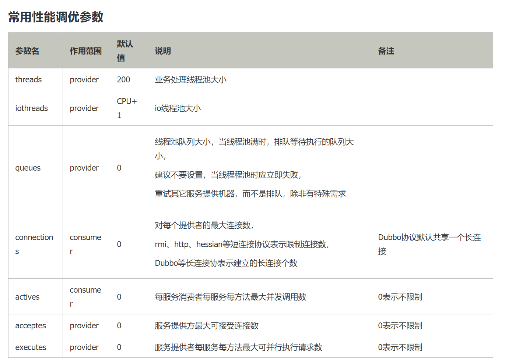

Dubbo和Zookeeper的视频学习：

https://www.bilibili.com/video/av35685648/?p=19


### Container详解

Dubbo的Container详解模块，是一个独立的容器，因为服务通常不需要Tomcat/JBoss等Web容器的特性，没必要用Web容器去加载服务。

​       服务容器只是一个简单的Main方法，并加载一个简单的Spring容器，用于暴露服务。

​     com.alibaba.dubbo.container.Main 是服务启动的主类

我们可以直接在SpringBoot的启动类下直接运行，所以不需要我们用spring-boot-web-starter这样的包启动web服务。

```java
import com.alibaba.dubbo.container.Main;

@SpringBootApplication
public static void main(String[] args){
    ......//启动类
    Main.main(args);
}
```


###  Consumer调用远程APi

第一种方式：

```java
<?xml version="1.0" encoding="UTF-8"?>
<beans xmlns="http://www.springframework.org/schema/beans"
    xmlns:xsi="http://www.w3.org/2001/XMLSchema-instance"
    xmlns:dubbo="http://dubbo.apache.org/schema/dubbo"
    xsi:schemaLocation="http://www.springframework.org/schema/beans        http://www.springframework.org/schema/beans/spring-beans-4.3.xsd        http://dubbo.apache.org/schema/dubbo        http://dubbo.apache.org/schema/dubbo/dubbo.xsd">
 
    <!-- 消费方应用名，用于计算依赖关系，不是匹配条件，不要与提供方一样 -->
    <dubbo:application name="consumer-of-helloworld-app"  />
 
    <!-- 使用multicast广播注册中心暴露发现服务地址 -->
    <dubbo:registry address="multicast://224.5.6.7:1234" />
 
    <!-- 生成远程服务代理，可以和本地bean一样使用demoService -->
    <dubbo:reference id="demoService" interface="org.apache.dubbo.demo.DemoService" />
</beans>
```

第二种方式

```java
@RestController
public class TestController{
    @Reference(version="{你的版本号}")
    DemoService demoService ;
}
```


Dubbo性能调优详解：


https://www.cnblogs.com/cyfonly/p/8987043.html




Kryo为什么比Hessian快

https://www.iteye.com/blog/x-rip-1555344

从序列化后的字节可以看出以下几点：

1、Kryo序列化后比Hessian小很多。（kryo优于hessian）

2、由于Kryo没有将类field的描述信息序列化，所以Kryo需要以自己加载该类的filed。这意味着如果该类没有在kryo中注册，或者该类是第一次被kryo序列化时，kryo需要时间去加载该类（hessian优于kryo）

3、由于2的原因，如果该类已经被kryo加载过，那么kryo保存了其类的信息，就可以很快的将byte数组填入到类的field中,而hessian则需要解析序列化后的byte数组中的field信息，对于序列化过的类，kryo优于hessian。

4、hessian使用了固定长度存储int和long，而kryo则使用的变长，实际中，很大的数据不会经常出现。(kryo优于hessian)

5、hessian将序列化的字段长度写入来确定一段field的结束，而kryo对于String将其最后一位byte+x70用于标识结束（kryo优于hessian）