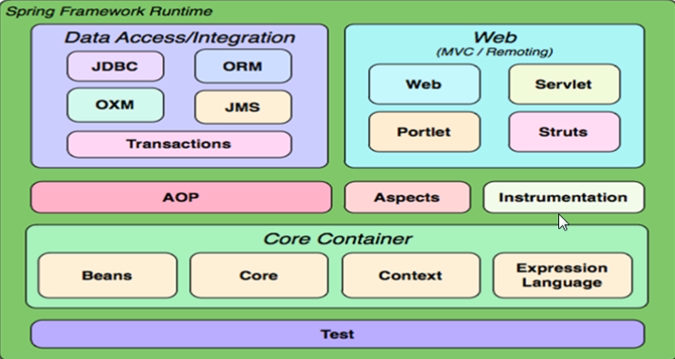
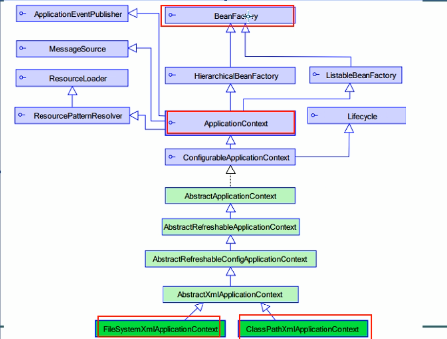
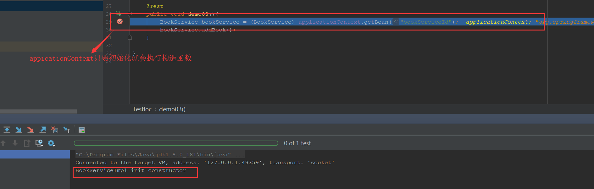
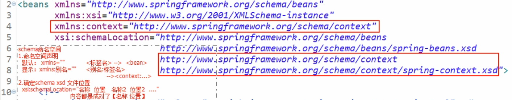

# 第一部分

## 一、Spring的核心

- Spring的核心是IOC（控制反转）和面向切面(AOP)
  - 核心容器 ： beans、core、context、SpEL

  

再创建Spring项目时记得导入4个核心一个依赖

Spring的优点
- 方便解耦，简化开发（高内聚低耦合）
  - **spring就是一个大工厂**，可以将所有对象创建和依赖关系维护，交给Spring管理。
  - Spring工程时用于生产bean，就不用再程序中new出来了
  - 用接口，例如一个IUser，其他实现所有的类都可以用IUser创建，那么我们只需在bean中改变IUser的各种实现类，相当于换了插头的接口，十分方便实现类的更换
 
- AOP编程的支持
  - 可以方便实现对程序进行权限拦截、运行监控等功能

- 方便程序的测试
  - spring对junit4支持，可以通过注解方便的测试Spring程序

- 方便集成各种优秀的跨国家
  - 对各种优秀框架（如：struct、Hibernate、MyBatis、Quartz等）的直接支持
 
- 降低JavaEE API的使用难度
  - 例如对JDBC、JavaMail、远程调用等都提供了封装，使这些API应用难度大大降低。  

## 二、配置文件
Spring 的配置文件applicationContext.xml一般放在classpath下（idea如有其他的classpath可在module中添加source为classpath）

内容就是schema

Spring的配置文件是基于XML格式的，Spring1.0的配置文件采用DTD格式，Spring2.0以后使用Schema的格式，后者让不同类型的配置拥有了自己的命名空间，使配置文件更具有扩展性。


spring头部配置文件详情可以见：https://blog.csdn.net/qq646040754/article/details/81531151


## 三、DI depencency injection

在依赖注入的模式下，创建被调用者得工作不再由调用者来完成，创建被调用者实例的工作通常由Spring容器完成，然后注入调用者。创建对象时，**向类里的属性设置值**

### 1）为什么要实现松耦合
上层调用下层，上层依赖于下层，当下层剧烈变动时上层也要跟着变动，这就会导致模块的复用性降低而且大大提高了开发的成本。

一般情况下抽象的变化概率很小，让用户程序依赖于抽象，实现的细节也依赖于抽象。即使实现细节不断变动，只要抽象不变，客户程序就不需要变化。这大大降低了客户程序与实现细节的耦合度。

### 2）IOC和DI区别

IOC控制反转，把对象创建交给Spring配置
DI依赖注入，向类里面属性注入值
关系，依赖注入不能单独存在，需要在IOC基础上完成操作（bean中的ref）

### 3)依赖注入方式

- 使用set方法注入
- 使用有参构造注入
- 使用接口注入

#### (1) set方法注入

```xml
    <bean id ="school01" class = "com.ioc.SchoolImpl">
        <!--set方法注入属性
    name属性值：类中定义的属性名称，这里是location
    value属性值：设置具体的值，相当于location = "HuNan University"
-->
        <property name="location" value="HuNan University"></property>
    </bean>
```

```java
public class SchoolImpl implements School {

    String location;

    public void setLocation(String location) {
        this.location = location;
    }

    @Override
    public void Register() {
        System.out.println("you have resgisted in "+location);
    }
}

```

#### (2)使用有参构造注入

```java
public class Person {
    private String pname;

    public void setPname(String pname) {
        this.pname = pname;
    }
}
```
```xml
<bean id="user" class="cn.wang.ioc.User">
        <!--构造方法注入属性-->
        <constructor-arg name="pname" value="Tony"></constructor-arg>
</bean>

```

#### (3) 注入对象类型属性

```java
public class UserService {
    // 1.定义UserDao类型属性
    private UserDao userDao;

    // 2.生成set方法
    public void setUserDao(UserDao userDao) {
        this.userDao = userDao;
    }
}
```

```xml
<bean id="userDao" class="cn.wang.property.UserDao">
        <property name="name" value="Tom"></property>
    </bean>
    <bean id="userService" class="cn.wang.property.UserService">
        <!--name属性值：UserService类里的属性名称-->
        <!--ref属性:UserDao类配置bean标签中的id值-->
        <property name="userDao" ref="userDao"></property>
    </bean>
```


## 四、核心API


### 1）BeanFactory
- 是一个工厂，用于生成bean
- 采用延迟加载，第一次getBean时才会初始化bean实例。([懒汉式饿汉式加载相关](https://blog.csdn.net/qq_35098526/article/details/79893628))


### 2）ApplicationContext
- 是Beanfactory的子接口，功能更强大
-  国际化处理、事件传递、Bean自动装配、各种不同应用层
- application初始化时，就会直接生成bean实例
- 


### 3）ClassPathXmlApplicationContext和FileSystemXmlApplicationContext
ClassPathXMLContext：用于加载classpath下载的xml（这个见得多）
FileSystemXmlApplicationContext用于加载指定盘符下的xml（绝对路径），可以通过java web ServletContext.getRealPath()获得指定盘符


## 五、基于XML装配Bean

实例化Bean的方式：
- 默认构造：就是普通的bean
- 静态工厂：自己写个工厂，专门用静态方法生成类实例
- 实例工厂：实例工厂，先new个实例工厂，再用实例工厂生成类实例

详细见：https://blog.csdn.net/small__snail__5/article/details/87903578

1. 默认构造
```<bean id = "" class ="">```必须提供的默认构造

2. 静态工厂：利用自己的工厂生产类
- 常用于与Spring整合其他框架（工具）
- 静态工厂：用于生成实例对象，**所有的方法必须是static**
```<bean id ="" class="工厂全限定类名" factory-method="静态方法">```
```<bean id ="UserService" class="com.package.MyBeanFactory" factory-method="createService">```

3.实例工厂：用自己的实例工厂生产类
- 必须先有工厂实例对象，通过实例对象创建对象，**提供所有的方法必须是“非静态的”**

```xml
<!--创建工厂实例-->
<bean id="myBeanFactory" class="com.package.MyBeanFactory"></bean>
<!--工厂生成实例-->
<bean id="UserService" facotry-bean="myBeanFactoryId" factory-method="createService">
```

## 六、Bean的种类

- 普通bean: 之前操作都是普通bean。```<bean id = "" class="A">```
, spring直接创建A实例，并返回
- FactoryBean：是一个特殊的bean，具有工厂生产对象的能力，只能生成特定的对象。bean必须实现FactoryBean接口，此接口提供方法getObject()用于获得特定的bean。
	<bean id = "" class="">先创建FB实例，使用调用getObject()方法，并返回方法的特定值。
- BeanFactory和FactoryBean的对比
  - beanfactory：生产任意的Bean
  - FactoryBean：特殊的bean，用于生成另一个特定的bean。
  - 详细见https://www.cnblogs.com/aspirant/p/9082858.html

## 七、作用域

用于确定spring创建bean实例的个数
- singleton单例：在IOC容器仅存在一个Bean实例，Bean以单例方式存在，默认值
- prototype：每次从容器中调用Bean时，都会返回一个新的实例，即每次调用getBean()时都相当于执行new XXXBean()

配置信息：
```xml
 <bean id="userSingleton" class="com.scope.UserServiceImp" scope="singleton"/>
```

## 八、生命周期


### 1） 初始化和销毁
- 目标方法执行前和执行后，将进行初始化或销毁
- 初始化一般用来准备数据
- 销毁方法一般用于清理资源。
```xml
<bean id="" class=""  init-method="初始化方法名称" destory-method = "销毁方法名称">
```
我们直接在类中实现void init-method()方法和 destroy-method（）方法配置到bean中就好了

- 销毁方法的执行，容器必须close。```applicationContext.getClass().getMethod("close").invoke(applicationContext);```此方法接口中没有定义，由实现类提供

### 2) BeanPostProcessor后处理bean
- spring提供一种机制，只要实现此接口BeanPostProcessor,并将实现类提供给spring容器，spring容器将自动执行，在初始化方法前执行before()，在初始化方法后执行after()
- factroy hook that allows for custom modification of new bean instances,e.g. checking for marker interfaces or wrapping them with proxies.
- spring提供工厂钩子，用于修改实例对象，可以生成代理对象，是AOP底层
- 
模拟过程：视频学习地址 https://www.bilibili.com/video/av15369076/?p=10
```java
A a = new A();
a = B.before(a);//将a的实例对象传递给后处理bean，可以生成代理对象并返回，就是给a加几个方法，到最后a就多出了几个功能，又不用直接在类A中加方法块代码，方便修饰类
a.init();
a = B.after(a);
a.addUser(); //生成代理对象，目的在目标方法前后执行（例如：开启事务、提交事务）
a.destory()
```
## 九、装配bean的其他简洁方法
### 1）P命名空间【了解】
- 对 setter方法注入进行简化，替换<property>,而是在```<bean p:属性名="普通值">```
- 配置文件头部加入```xmlns:p"http://www.springframework.org/schema/p"```

### 2）SpEL【了解】
- 对<property>进行统一编程，所有的内容都使用value
```<property name = "" value = "#{表达式}">```
#{123}、#{'jack'}数字和字符串
#{beanId} ： 另一个bean引用
#{beanId.propName} ： 可以操作数据属性
#{beanId.toString} : 执行方法
#{T(类).字段|方法}：静态方法或字段

### 3)集合
https://www.cnblogs.com/xiaostudy/p/9534164.html

## 十、注解装配Bean
- 注解：就是一个类，使用@注解名称
- 开发中：使用注解，取代xml配置文件。
- 使用前提，添加命名空间，让spring扫描含有注解的类


### 1）@Component(id) 取代<bean.....>
需要在配置文件中添加<context:component-scan base-package="需要扫描的包"/>

### 2) web开发，提供了3个@Component注解衍生注解（功能一样）
- @Repository:dao层
- @Service: service层
- @Controller：web层

### 3） 依赖注入，可以给私有字段设置，也可以给setter方法设置
- 普通值：@Value("")
- 引用值：
  - 方式1：按照【类型】注入
    - @Autowired：缺点如果一个接口有两个实现类，那么他不知道拿哪一个
  - 方式2：按照【名称】注入
    - @Autowired
    - @Qualifier("名称")
  - 方式3：按照【名称】注入
    - @Resource("名称")

### 4） 生命周期
- 初始化：@PostConstruct
- 销毁： @PreDestroy

### 5) 作用域
- @Scope("prototype")多例

# 第二部分

## 一、AOP
利用AOP可以对业务逻辑的各个部分进行隔离。从而是的业务逻辑各部分之间的耦合度降低，提高程序的可重用性，同时提高了开发效率。
AOP采取**横向抽取**机制，取代了传统**纵向继承**体系重复性代码。
- 横向抽取：组合附属功能，生成代理类
  - 可以织入多个切面，实现
- 纵向继承：继承父类，在添加功能

## 二、AOP实现原理
- 底层采用代理机制实现

## 三、AOP属于
