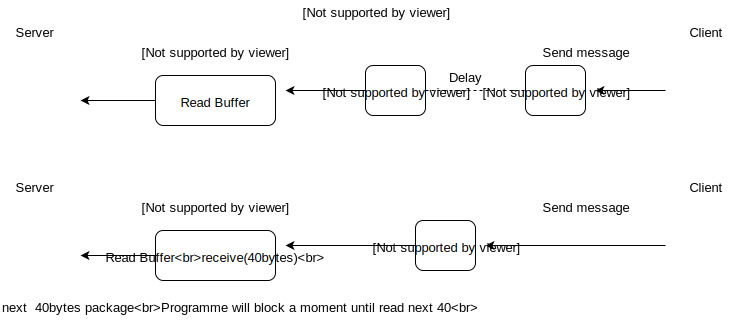
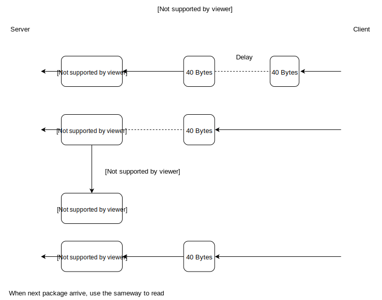

# epoll的理解与应用

## 1 再谈select
### select的I/O复用速度慢的原因
主要分为一下两点：
1. 每次调用select函数后常见的对所有文件描述符的循环语句
2. 每次调用select函数时都需要向该函数传递监视对象信息

以上两点中，第二点的影响是最为巨大的，for循环好歹能够通过程序层面进行优化。而==每次调用select函数时向操作系统传递监视对象信息==！无法通过代码优化解决。

select也有优点，以下情况就可以不拘泥于select还是epoll：
1. 服务器端介入少者
2. 程序具有兼容性

## 2 epoll的出现
epoll祢补了select的缺点，==它可以仅仅向操作系统传递1次监视对象，监视范围或内容发生变化时才只通知发生变化的事项。== 这样就无需每次调用监视函数的时候都向操作系统传递监视对象信息。

epoll优点主要是以下两点：
1. 无需编写以监视状态变化为目的的针对所有文件描述符的循环语句
2. 调用对应于select函数的epoll_wait函数时无需每次传递监视对象信息

### epoll使用介绍

- epoll服务器中需要的三个函数：
`epoll_create`:创建保存epoll文件描述符的空间
`epoll_ctl`:向空间注册并注销文件描述符
`epoll_wait`: 与select函数类似，等待文件描述符发生变化。

注意与select不用，select用fd_set保存监视对象的fd，而epoll直接用epoll_create向系统请求创建保存文件描述符的空间，这些被监视的fd由操作系统保存。

epol通过epoll_event将发生变化的文件描述符单独集中到一起
```
struct epoll_event
{
  __uint32_t events; //要监视的事件
  epoll_data_t data; //记录了文件描述符fd等信息
}
```
```
typedef union epoll_data
{
  void * ptr;
  int fd; // 监视的文件描述符
  __uint32_t u32;
  __uint64_t u64;
}epoll_data_t;
```

### epoll_create
```c
#include<sys/epoll.h>
int epoll_create(int size);
//成功时返回epoll文件描述符，失败时返回-1
```
`size`：epoll实例的大小(仅供操作系统参考)
调用epoll_create函数时创建的文件描述符保存空间称为"epoll例程".

### epoll_ctl
向例程内部注册监视对象文件描述符。
```c
#include<sys/epoll.h>

int epoll_ctl(int epfd, int op, int fd, struct epoll_event * event);
//成功时返回0，失败时返回-1
```
`epfd`:用于注册监视对象的epoll例程的文件描述符。
`op`: 用于指定监视对象的添加、删除或更改文件等操作
`fd`:需注册的监视对象文件描述符
`event`:监视对象的事件类型

举例：`epoll_ctl(A, EPOLL_CTL_ADD, B, C)`,第二个参数EPOLL_CTL_ADD表示添加，此例表示epoll例程A中注册文件描述符B，主要目的时监视参数C中的事件。

关于第二个参数op：
- EPOLL_CTL_ADD:将文件描述符注册到epoll例程
- EPOLL_CTL_DEL:从epoll例程中删除文件描述符
- EPOLL_CTL_MOD:更改注册的文件描述符的关注事件发生情况

第四个参数event，就是前面结构体epoll_event中的events，表示要监视的事件
```c
struct epoll_event event;
···
event.events = EPOLLIN; //发生需要读取数据的情况（事件）时
event.data.fd = sockfd; 
epoll_ctl(epfd, EPOLL_CTL_ADD, sockfd, &event);
···
```
- EPOLLIN:需要读取数据的情况
- EPOLLOUT:输出缓存为空，可以立即发送数据的情况
- EPOLLPRI:收到OOB数据的情况
- EPOLLRDHUP:断开连接或半关闭的情况，这在边缘触发方式下很有用
- EPOLLERR:发生错误的情况
- EPOLLET:以边缘触发的方式得到事件通知
- EPOLLONESHOT:发送一次事件后，相应的文件描述符不再收到事件通知。

### epoll_wait
```c
#include<sys/epoll.h>
int epoll_wait(int epfd, struct epoll_event* events, int maxevents, int timeout)
//成功时返回返回发生事件的文件描述符数量，失败时返回-1
```
`epfd`:表示事件发生监视范围的epoll例程的文件描述符
`events`:保存发生事件的文件描述符集合的结构体地址值
`maxevents`:第二个参数可以保存的最大事件数
`timeout`:以ms为单位的等待时间，传递-1时，一直等待直到事件发生

注意第二个参数，需要分配地址空间
```c
int event_cnt;
struct epoll_event* ep_events;
···
ep_events = malloc(sizeof(struct epoll_event)*EPOLL_SIZE);//EPOLL_SIZE是宏常量
···
event_cnt = epoll_wait(epfd, ep_events, EPOLL_SIZE, -1);
···
```

### 基于epoll的回声端服务器
```c
#include <stdio.h>  
#include <stdlib.h>  
#include <string.h>  
#include <unistd.h>  
#include <arpa/inet.h>  
#include <sys/socket.h>  
#include <sys/epoll.h>
  
#define BUF_SIZE    100
#define EPOLL_SIZE	50
  
void error_handling(char *message);  
  
int main(int argc, char *argv[]){  
    int serv_sock,clnt_sock;  
    char buf[BUF_SIZE];  
    struct sockaddr_in serv_adr;  
    struct sockaddr_in clnt_adr;  
    socklen_t adr_sz;  
    int str_len,i;
    struct epoll_event *ep_events;
    struct epoll_event event;
    int epfd,event_cnt;  

    if(argc != 2){  
        printf("Usage : %s <port>\n",argv[0]);  
        exit(1);  
    }  

    serv_sock = socket(PF_INET,SOCK_STREAM,0);  
    if(serv_sock == -1){  
        error_handling("socket error");  
    }  
  
    memset(&serv_adr,0,sizeof(serv_adr));  
    serv_adr.sin_family=AF_INET;  
    serv_adr.sin_addr.s_addr=htonl(INADDR_ANY);  
    serv_adr.sin_port=htons(atoi(argv[1]));  
  
    if(bind(serv_sock,(struct sockaddr*)&serv_adr,sizeof(serv_adr)) == -1){  
        error_handling("bind() error");  
    }  
  
    if(listen(serv_sock,5) == -1){  //自动生成服务器端套接字（守门员）
        error_handling("listen() error");  
    }  
    
    epfd = epoll_create(EPOLL_SIZE);//创建epoll例程，返回例程的文件描述符
    ep_events = malloc(sizeof(struct epoll_event)*EPOLL_SIZE);
    //用于保存发生事件的文件描述符
    event.events = EPOLLIN;
    event.data.fd = serv_sock;
    epoll_ctl(epfd,EPOLL_CTL_ADD,serv_sock,&event);
    //将serv_sock添加到例程空间中
    while(1){ 
	event_cnt = epoll_wait(epfd,ep_events,EPOLL_SIZE,-1);//如果没有事件发生会阻塞，由于最后一个参数是-1，要一直等到事件发生
    //返回发生事件的文件描述符个数
	if(event_cnt  == -1){
	    puts("epoll wait error");
	    break;
	}

	for(i=0;i<event_cnt;i++){
	    if(ep_events[i].data.fd == serv_sock){
		adr_sz = sizeof(clnt_adr);
        	clnt_sock = accept(serv_sock,(struct sockaddr *)&clnt_adr,&adr_sz);  
		    //处理请求套接字生成
		event.events = EPOLLIN;
		event.data.fd = clnt_sock;
		epoll_ctl(epfd,EPOLL_CTL_ADD,clnt_sock,&event);
		//将发生请求的套接字添加到epoll例程中
		printf("connected client : %d \n", clnt_sock);
	    }else{	//read message，可以发现这个地方它只读取一次，然后没读完的部分会再下一次epoll的循环中继续读取，实现了类似于分时间片读取多个任务的方式。
		//这个地方设计的可能有点啰嗦，不如直接写入，这里先通过读，判断了字符串数据读取的字节数
		str_len = read(ep_events[i].data.fd,buf,BUF_SIZE);
        //将文件描述符的缓冲区里的数据拷贝到buf缓冲文件中
		if(str_len == 0){	//close对方关闭连接发出EOF
		    epoll_ctl(epfd,EPOLL_CTL_DEL,ep_events[i].data.fd,NULL);
			//如果对方关闭连接发出EOF，就将该fd从epoll例程中移除
		    close(ep_events[i].data.fd);//同时关闭该文件描述符对应的套接字
		    printf("closed client %d \n",ep_events[i].data.fd);
		}else{
			write(ep_events[i].data.fd,buf,str_len);	//echo
            //从buf里把数据写入到文件描述符对应的套接字缓冲区里

		}	    
	    }
	}
    }  
    close(serv_sock);  
    close(epfd);
    return 0;  
}  
  
void error_handling(char *message){  
  
    fputs(message,stderr);  
    fputs("\n",stderr);  
    exit(1);  
}
```

## 3 条件触发与边缘触发
### 条件触发
> 只要输入缓存中有数据的存在，那么每一次调用epoll_wait函数，那么只要注册了监听该 输入缓存 EPOLLIN的事件 的套接字fd，操作系统就会一直告诉epoll函数：“啊呀这个套接字fd事情一直在发生啊，你的输入缓存里面还有好多数据等着你去读取呢！”
```c
#include <stdio.h>  
#include <stdlib.h>  
#include <string.h>  
#include <unistd.h>  
#include <arpa/inet.h>  
#include <sys/socket.h>  
#include <sys/epoll.h>
  
#define BUF_SIZE    4 //很重要！每次只读四个字节，故意不读完输入缓存内数据，从而验证这些残留的数据会不会引起操作系统发出信号
#define EPOLL_SIZE	50
  
void error_handling(char *message);  
  
int main(int argc, char *argv[]){  
    int serv_sock,clnt_sock;  
    char buf[BUF_SIZE];  
    struct sockaddr_in serv_adr;  
    struct sockaddr_in clnt_adr;  
    socklen_t adr_sz;  
    int str_len,i;
    struct epoll_event *ep_events;
    struct epoll_event event;
    int epfd,event_cnt;  

    if(argc != 2){  
        printf("Usage : %s <port>\n",argv[0]);  
        exit(1);  
    }  

    serv_sock = socket(PF_INET,SOCK_STREAM,0);  
    if(serv_sock == -1){  
        error_handling("socket error");  
    }  
  
    memset(&serv_adr,0,sizeof(serv_adr));  
    serv_adr.sin_family=AF_INET;  
    serv_adr.sin_addr.s_addr=htonl(INADDR_ANY);  
    serv_adr.sin_port=htons(atoi(argv[1]));  
  
    if(bind(serv_sock,(struct sockaddr*)&serv_adr,sizeof(serv_adr)) == -1){  
        error_handling("bind() error");  
    }  
  
    if(listen(serv_sock,5) == -1){  
        error_handling("listen() error");  
    }  
    
    epfd = epoll_create(EPOLL_SIZE);
    ep_events = malloc(sizeof(struct epoll_event)*EPOLL_SIZE);

    event.events = EPOLLIN;
    event.data.fd = serv_sock;
    epoll_ctl(epfd,EPOLL_CTL_ADD,serv_sock,&event);

    while(1){ 
	event_cnt = epoll_wait(epfd,ep_events,EPOLL_SIZE,-1);

	if(event_cnt  == -1){
	    puts("epoll wait error");
	    break;
	}
//这一句就是用来验证，如果输入缓存内数据没有读完（还有数据的时候），在下一次epoll_wait监听后，epoll会不会阻塞？还存在缓存内的数据会不会引起操作系统发信号给epoll_wait
	puts("return epoll wait");

	for(i=0;i<event_cnt;i++){
	    if(ep_events[i].data.fd == serv_sock){
		adr_sz = sizeof(clnt_adr);
        	clnt_sock = accept(serv_sock,(struct sockaddr *)&clnt_adr,&adr_sz);  
		event.events = EPOLLIN;
		event.data.fd = clnt_sock;
		epoll_ctl(epfd,EPOLL_CTL_ADD,clnt_sock,&event);
		printf("connected client : %d \n", clnt_sock);
	    }else{	//read message
		str_len = read(ep_events[i].data.fd,buf,BUF_SIZE);//每次只读取4字节！故意不读完的！

		if(str_len == 0){	//close
		    epoll_ctl(epfd,EPOLL_CTL_DEL,ep_events[i].data.fd,NULL);
		    close(ep_events[i].data.fd);
		    printf("closed client %d \n",ep_events[i].data.fd);
		}else{
			write(ep_events[i].data.fd,buf,str_len);	//echo


		}	    
	    }
	}
    }  
    close(serv_sock);  
    close(epfd);
    return 0;  
}  
  
void error_handling(char *message){  
  
    fputs(message,stderr);  
    fputs("\n",stderr);  
    exit(1);  
}
```
用echo_client.c 发送消息
```
#gcc echo_client.c -o client
#./client 127.0.0.1 9190
Connected·········
Input message(Q to quit): It's my life
Message from server: It's my life
Input message(Q to quit): Q
```
服务端运行结果
```
return epoll_wait //第一次尝试连接，检查到连接的事件发送
connected client: 5 //连接成功
return epoll_wait // 缓存内有（It's my life）数据，读取It's；
return epoll_wait // 缓存内有（ my life）数据，读取 my ；
return epoll_wait // 缓存内有（life结尾符号），读取life
return epoll_wait // 缓存内有（\0结尾符号），读取\0
return epoll_wait // 最后发送的EOF关闭连接
```

### 边缘触发
#### 通过errno变量验证错误原因
因为相关套接字函数发生错误了一般都只会返回-1，为了在发生错误时提供额外的信息，Linux声明了errno变量

#### 通过fcntl函数，将套接字更改为非阻塞I/O
```c
#include<fcntl.h>

int fcntl(int filedes, int cmd);
//成功时返回cmd参数相关值，失败时返回-1
```
`fliedes`属性更改目标的文件描述符
`cmd`表示函数调用的目的

若希望将文件（套接字）改为非阻塞模式，需要如下两个语句
```
int flag = fcntl(fd, F_GETFL,0);//获取之前设置的属性信息
fcntl(fd, F_SETFL, flag|O_NONBLOCK);//在原有基础上添加非阻塞O_NONBLOCK标志
```

**在边缘触发的方式中，接收数据时仅仅注册一次该事件**
就因为这种特点，*一旦发生输入相关事件，就应该读取输入缓冲中的全部数据*。因此需要验证换从是否为空：（相当于只要来了一条消息就得读取完）。
>read函数返回-1，变量errno中的值为EAGAIN时，说明没有数据可读

注意：以阻塞方式工作的read和write函数有可能引起服务器端的长时间停顿。因此，边缘触发方式中一定要采用非阻塞的read和write函数。



### 边缘触发服务器代码
```c
#include <stdio.h>  
#include <stdlib.h>  
#include <string.h>  
#include <unistd.h>  
#include <arpa/inet.h>  
#include <sys/socket.h>  
#include <sys/epoll.h>
#include <errno.h>
#include <fcntl.h>
  
#define BUF_SIZE    4
#define EPOLL_SIZE	50
  
void error_handling(char *message);  
void setnonblockingmode(int fd);
  
int main(int argc, char *argv[]){  
    int serv_sock,clnt_sock;  
    char buf[BUF_SIZE];  
    struct sockaddr_in serv_adr;  
    struct sockaddr_in clnt_adr;  
    socklen_t adr_sz;  
    int str_len,i;
    struct epoll_event *ep_events;
    struct epoll_event event;
    int epfd,event_cnt;  

    if(argc != 2){  
        printf("Usage : %s <port>\n",argv[0]);  
        exit(1);  
    }  

    serv_sock = socket(PF_INET,SOCK_STREAM,0);  
    if(serv_sock == -1){  
        error_handling("socket error");  
    }  
  
    memset(&serv_adr,0,sizeof(serv_adr));  
    serv_adr.sin_family=AF_INET;  
    serv_adr.sin_addr.s_addr=htonl(INADDR_ANY);  
    serv_adr.sin_port=htons(atoi(argv[1]));  
  
    if(bind(serv_sock,(struct sockaddr*)&serv_adr,sizeof(serv_adr)) == -1){  
        error_handling("bind() error");  
    }  
  
    if(listen(serv_sock,5) == -1){  
        error_handling("listen() error");  
    }  
    
    epfd = epoll_create(EPOLL_SIZE);
    ep_events = malloc(sizeof(struct epoll_event)*EPOLL_SIZE);

    setnonblockingmode(serv_sock);//把套接字设为非阻塞
    event.events = EPOLLIN;
    event.data.fd = serv_sock;
    epoll_ctl(epfd,EPOLL_CTL_ADD,serv_sock,&event);

    while(1){ 
	event_cnt = epoll_wait(epfd,ep_events,EPOLL_SIZE,-1);

	if(event_cnt  == -1){
	    puts("epoll wait error");
	    break;
	}

	puts("return epoll wait");
	for(i=0;i<event_cnt;i++){
	    if(ep_events[i].data.fd == serv_sock){
		adr_sz = sizeof(clnt_adr);
        	clnt_sock = accept(serv_sock,(struct sockaddr *)&clnt_adr,&adr_sz);  
		setnonblockingmode(clnt_sock);
		event.events = EPOLLIN | EPOLLET;//设置成边缘触发
		event.data.fd = clnt_sock;
		epoll_ctl(epfd,EPOLL_CTL_ADD,clnt_sock,&event);//提交监视传输数据的sock
		printf("connected client : %d \n", clnt_sock);
	    }else{	//read message
		while(1){
		    str_len = read(ep_events[i].data.fd,buf,BUF_SIZE);

		    if(str_len == 0){	//close
		    	epoll_ctl(epfd,EPOLL_CTL_DEL,ep_events[i].data.fd,NULL);
		    	close(ep_events[i].data.fd);
		    	printf("closed client %d \n",ep_events[i].data.fd);
		    	break;
		    }else if(str_len < 0){
			if(errno == EAGAIN)
			{//无数据可读
			    break;
			}
		    }else{
			write(ep_events[i].data.fd,buf,str_len);	//echo
		    }
		}	    
	    }
	}
    }  
    close(serv_sock);  
    close(epfd);
    return 0;  
}  
  
void error_handling(char *message){  
  
    fputs(message,stderr);  
    fputs("\n",stderr);  
    exit(1);  
}

void setnonblockingmode(int fd)
{
    int flag = fcntl(fd,F_GETFL,0);//设置成非阻塞形式
    fcntl(fd,F_SETFL,flag | O_NONBLOCK);
}
```
