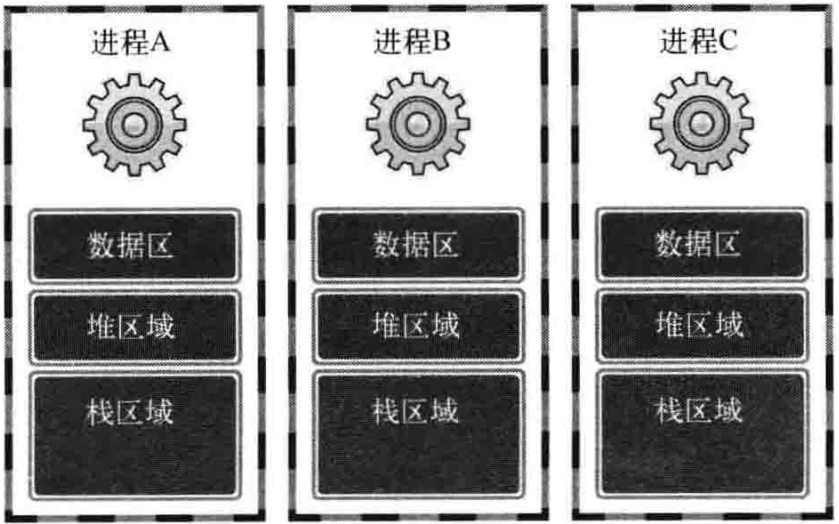

# 理解线程的概念
## 线程的介绍和创建
上下文切换（指进程）：运行程序前需要将相应进程信息读入内存，如果运行经常A后需要紧接着运行进程B，就应该将进程A相关信息移除内存，并读入进程B相关信息。所以上下文切换需要很长的事件，
线程的优点：
- 线程的创建和上下文切换比进程的创建和上下文切换更快
- 线程间交换数据时无需特殊技术

### 线程和进程的差异
进程：在操作系统构成单独执行流的单位
线程：在进程构成单独执行流的单位

每个进程拥有其独立的内存空间



`数据区`：保存全局变量
`堆区域`：向malloc等函数的动态分配提供空间
`栈区域`：函数运行时使用的栈

线程的数据结构

只隔离了栈取域

### 线程的创建
```c
#include<pthread.h>

int pthread_create(pthread_t restrict thread, 
const pthread_attr_t* restrict attr, 
void* (*start_routine)(void*),
void* restrict arg);
//成功时返回0，失败时返回其他值
```
`thread`:保存新创建线程ID的变量地址。线程与进程相同，也需要用于区分不同线程的ID
`attr`:传递线程属性参数，传递NULL表示默认属性线程
`start_routine`:相当于mian函数的函数指针
`arg`:通过第三个参数传递调用函数时包含传递参数信息的变量地址值

thread1.c
```c
#include <stdio.h>
#include <pthread.h>
void *thread_main(void *arg);
 
int main(int argc, char *argv[])
{
    pthread_t t_id;
    int thread_param = 5;
 
    if (pthread_create(&t_id, NULL, thread_main, (void *)&thread_param) != 0)
    {
        puts("pthread_create() error");
        return -1;
    };
    sleep(10); puts("end of main");
    return 0;
}
 
void *thread_main(void *arg)
{
    int i;
    int cnt = *((int *)arg);
    for (i = 0; i < cnt; i++)
    {
        sleep(1); puts("running thread");
    }
    return NULL;
}
```

### 线程的运行流程

以上代码的运行流程图如下


如果不调用Sleep的话，那么进程运行结束后，不管线程内的函数有没有完成，都会被销毁。


解决进程先结束的函数：
```c
#include<pthread.h>
int pthread_join(pthread_t thread, void** status);
//成功时返回0，失败时返回其他值
```
`thread` 该参数值ID的线程终止后才会从函数返回
`status` 保存线程的main函数返回值的指针变量地址值

调用该函数的进程进入等待状态，直到第一个参数为ID的线程终止为止。
调用其后的流程图


## 线程的临界问题
也就是银行问题，多线程的读取操作如果不锁住的话就会发生错误。
### 互斥量
```
#include<pthread.h>
//初始化互斥量
int pthread_mutex_init(pthread_mutex_t* mutex, const pthread_mutexattr_t* attr);
//销毁互斥量
int pthread_mutex_destroy(pthread_mutex_t* mutex);
//成功时返回0，失败时返回其他值。
```
`mutex`:创建互斥量时传递保存互斥量的变量地址值，销毁时传递需要销毁的互斥量地址值
`attr`:传递即将创建的互斥量属性，没有特别需要指定的属性时传递NULL

声明互斥量:`pthread_mutex_t mutex;`

互斥量锁住或释放临界区
```
#include

int pthread_mutex_lock(pthread_mutex_t* mutex);
int pthread_mutex_unlock(pthread_mutex_t* mutex);
//成功时返回0，失败时返回其他值
```
```
pthread_mutex_lock(&mutex)
// 临界区开始
······
// 临界区结束
pthread_mutex_unlock(&mutex)
```

```c
#include<unistd.h>
#include<stdlib.h>
#include<stdio.h>
#include<string.h>
#include<pthread.h>

#define NUM_THREAD 100

long long sum = 0;
pthread_mutex_t mutex;

void* thread_increase(void* arg){
    
    for(int i=0;i<50000000;i++){
    pthread_mutex_lock(&mutex);//临界区
        sum += 1;
    pthread_mutex_unlock(&mutex);  
    }

    return 0;
}

void* thread_decrease(void* arg){
    pthread_mutex_lock(&mutex);//临界区
    for(int i=0;i<50000000;i++){
        sum -= 1;
    }
    pthread_mutex_unlock(&mutex);
    return 0;
}

int main(){
    pthread_mutex_init(&mutex, NULL);
    pthread_t t_id[NUM_THREAD];

    for(int i=0;i<NUM_THREAD;i++){
        if(i%2 == 0){
            pthread_create(&t_id[i], NULL, thread_increase, NULL);
        }
        else{
            pthread_create(&t_id[i], NULL, thread_decrease, NULL);
        }
    }

    for(int i=0;i<NUM_THREAD;i++){
        pthread_join(t_id[i], NULL);
    }

    printf("sum: %lld \n", sum);

    pthread_mutex_destroy(&mutex);
    return 0;
}
```
>上述代码，两个临界区划分的位置不一致。
划分在for循环外能够最大限度减少lock和unlock函数的调用次数，但是却必须等循环结束才能够退出，划分在for循环内的话就不必等for循环全部结束。所以临界区的划分必须取决于不同情况，需程序员自行取舍。

### 信号量
```
#include<semaphore.h>

int sem_init(sem_t* sem, int pshared, unsigned int value);
int sem_destroy(sem_t * sem);
//成功时返回0，失败时返回其他值
```
`sem`:创建信号量时传递保存信号量的变量地址，销毁时传递需要销毁的信息变量地址值。
`pshared`：传递0时，创建只允许1个进程内部使用的信号量。传递其他值时，创建可由多个进程共享的信号量。
`value`：指定新创建的信号量初始值。

```
#include<semaphore.h>

int sem_post(sem_t * sem);//调用+1
int sem_wait(sem_t * sem);//调用-1
//成功时返回0，失败时返回其他值 
```
在信号量为0时，调用sem_wait的函数的线程会进入阻塞状态。

```c
#include<unistd.h>
#include<stdio.h>
#include<stdlib.h>
#include<string.h>
#include<semaphore.h>
#include<pthread.h>

int num = 0;
sem_t sem1,sem2;

void* read(void* arg){
    for(int i=0;i<5;i++){
        sem_wait(&sem1);
        puts("Please input a number:");
        scanf("%d", &num);
        sem_post(&sem2);
    }
    return 0;
}

void* accu(void* arg){
    int sum = 0;
    for(int i=0;i<5;i++){
        sem_wait(&sem2);
        sum += num;
        sem_post(&sem1);
    }

    printf("sum: %d \n", sum);
    return 0;
}

int main(){
    sem_init(&sem1, 0, 1);
    sem_init(&sem2, 0, 0);

    pthread_t t_id[2];
    pthread_create(&t_id[0], NULL, read, NULL);
    pthread_create(&t_id[1], NULL, accu, NULL);

    pthread_join(t_id[0], NULL);
    pthread_join(t_id[1], NULL);

    sem_destroy(&sem1);
    sem_destroy(&sem2);
    return 0;
}
```
##线程的销毁
用以下两种方法之一销毁线程：
- 调用pthread_join函数 //调用时主进程阻塞
- 调用pthread_detach函数 //调用时主进程不阻塞
- 