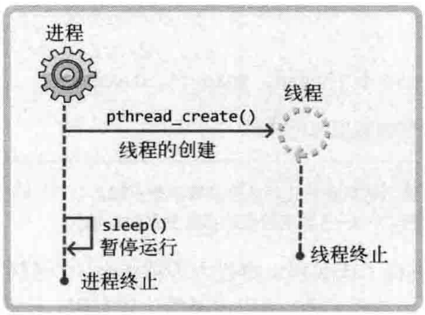

# 理解线程的概念
## 线程的介绍和创建
上下文切换（指进程）：运行程序前需要将相应进程信息读入内存，如果运行经常A后需要紧接着运行进程B，就应该将进程A相关信息移除内存，并读入进程B相关信息。所以上下文切换需要很长的事件，
线程的优点：
- 线程的创建和上下文切换比进程的创建和上下文切换更快
- 线程间交换数据时无需特殊技术

### 线程和进程的差异
进程：在操作系统构成单独执行流的单位
线程：在进程构成单独执行流的单位

每个进程拥有其独立的内存空间


`数据区`：保存全局变量
`堆区域`：向malloc等函数的动态分配提供空间
`栈区域`：函数运行时使用的栈

线程的数据结构

只隔离了栈取域

### 线程的创建
```c
#include<pthread.h>

int pthread_create(pthread_t restrict thread, 
const pthread_attr_t* restrict attr, 
void* (*start_routine)(void*),
void* restrict arg);
//成功时返回0，失败时返回其他值
```
`thread`:保存新创建线程ID的变量地址。线程与进程相同，也需要用于区分不同线程的ID
`attr`:传递线程属性参数，传递NULL表示默认属性线程
`start_routine`:相当于mian函数的函数指针
`arg`:通过第三个参数传递调用函数时包含传递参数信息的变量地址值

thread1.c
```c
#include <stdio.h>
#include <pthread.h>
void *thread_main(void *arg);
 
int main(int argc, char *argv[])
{
    pthread_t t_id;
    int thread_param = 5;
 
    if (pthread_create(&t_id, NULL, thread_main, (void *)&thread_param) != 0)
    {
        puts("pthread_create() error");
        return -1;
    };
    sleep(10); puts("end of main");
    return 0;
}
 
void *thread_main(void *arg)
{
    int i;
    int cnt = *((int *)arg);
    for (i = 0; i < cnt; i++)
    {
        sleep(1); puts("running thread");
    }
    return NULL;
}
```

### 线程的运行流程

以上代码的运行流程图如下



如果不调用Sleep的话，那么进程运行结束后，不管线程内的函数有没有完成，都会被销毁。


解决进程先结束的函数：
```c
#include<pthread.h>
int pthread_join(pthread_t thread, void** status);
//成功时返回0，失败时返回其他值
```
`thread` 该参数值ID的线程终止后才会从函数返回
`status` 保存线程的main函数返回值的指针变量地址值
