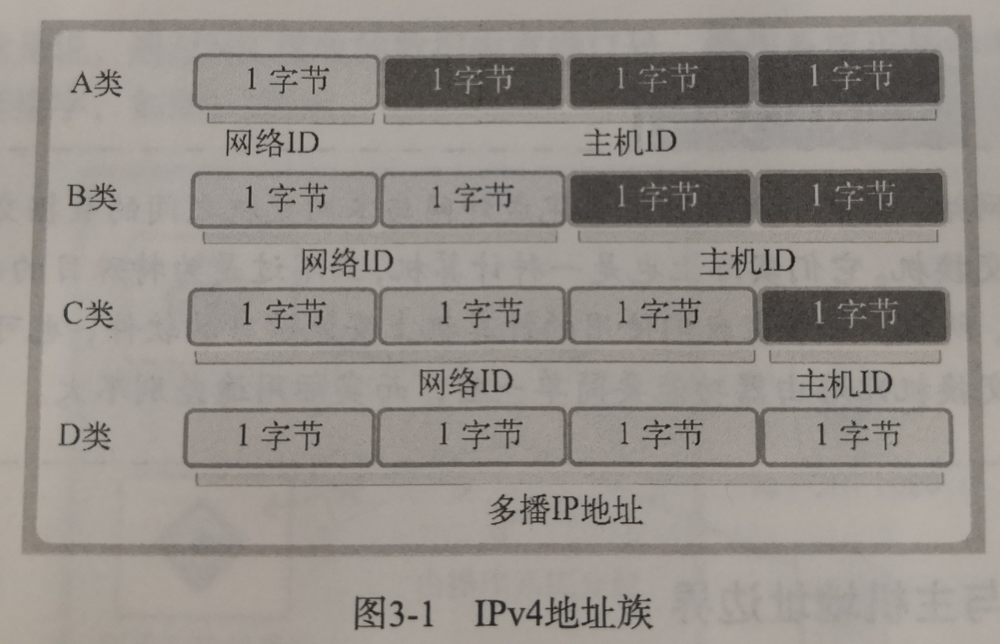

# 分配给套接字的IP地址与端口号
## 网络地址
- IPv4:4字节地址
- IPv6:16字节地址

- A类网络地址首字节范围：0~127
- B类网络地址首字节范围：128~191
- C类网络地址首字节范围：192~223

**端口号：**
 - 一般由16位构成，可分配的端口号范围是0-65535，但是0-1023是知名端口，一般分配给特定的应用程序。
 - 另外如果TCP套接字使用9190端口，则其他TCP套接字就无法使用该端口号，但UDP套接字可以使用。

## 地址信息的表示 
表示IPv4地址的结构体
```
struct sockaddr_in//转化为sockaddr再传给bind函数
{
    sa_family_t sin_family; //地址族
    uint16_t sin_port;      //16位端口号
    struct in_addr sin_addr;//32位IP地址,IPv4:AF_INET,IPv6:AF_INET6(地址族)
    char zero[8];           //不使用
}

struct in_addr
{
    in_addr_t s_addr;   //32位IP地址
}

struct sockaddr
{
    sa_family_t sin_family;
    char sa_data[14];
}
```
分配ip地址和端口号
```bind(serv_sock,(struct sockaddr*)&serv_addr,sizeof(serv_addr))```
## 字节序与网络字节序列
- 大端序（Big Endian）：低位地址存储高位字节
- 小端序(Little Endian)：高位地址存储高位字节(目前主流Intel系列)
- 网络字节序列(Network Byte Order)：统一为大端序

## 字节序列转换(Endian Conversions)
```
unsigned short htons(unsigned short);    //主机字节序->网络字节序（重要：发送到网络）
unsigned short ntohs(unsigned short);    //网络字节序列->主机字节序列
unsigned long htonl(unsigned long);      
unsigned long ntohl(unsigned long);
```
# 网络地址的初始化与分配
## 将字符串信息转换为网络字节序列的整数型
```
#include<arpa/inet.h>

in_addr_t inet_addr(const char* string);
//成功时返回32位大端序列整型数值，失败时返回INADDR_NONE（本书一般用的是这个）

int inet_aton(const char* string, struct in_addr* addr);
//成功时返回true，失败时返回false（本函数可以把结果存入in_addr中），作用同上

char* inet_ntoa(struct in_addr addr);
//作用与上面相同，而且应把结果复制到其他地址上方便长期保存，因为再次调用的结果可能会覆盖原结果
```
## INADDR_ANY
每次创建服务器都要输入ip地址未免显得些许繁琐，此时可以用
```
addr.sin_addr.s_addr = htonl(INADDR_ANY)；
```
自动获取服务器运行的ip地址，服务器优先考虑这种方式，无服务功能的客户端都不需要这样写。

```
    //创建服务器套接字
    int sockServ = socket(PF_INET, SOCK_STREAM, 0);
 
    struct sockaddr_in sockServAddr;
    //地址信息初始化
    memset(&sockServAddr, 0, sizeof(sockServAddr));
    sockServAddr.sin_family = AF_INET;//ipv4
    sockServAddr.sin_addr.s_addr = htonl(INADDR_ANY);//自动分配服务器地址
    sockServAddr.sin_port = htons(atoi(argv[1]));//从命令行读取端口号，将其由string转化为int

    //分配地址信息
    bind(sockServ, (struct sockaddr*)& sockServAddr, sizeof(sockServAddr))
```

