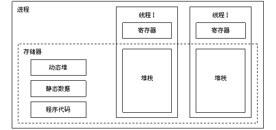

文件类型：
普通文件：二进制和文本文件，文本文件就是unicode和ascii码，二进制如音屏，视频
目录：就是包含一组链接的文件
套接字：网络传输使用

还有一个特殊的文件：管道，用来连接两个进程

linux的文件就是一个m字节的序列

操作系统每打开一个文件，内核就会返回一个小的非负整数，叫做描述符，按顺序编号

linux shell创建的每个进程开始都有三个打开的文件：标准输入（描述符0），标准输出（描述符1）和标准错误（描述符2）

windows和linux的操作系统对于文本的换行符不一样：
linux和mac：是/n
windows: 是 /r/n

c语言中open close read write函数来操作文件（详细见TCP/ip编程）

概述：
进程：本质上是一个正在执行的一个程序，与每个进程相关的是地址空间，地址空间是从某个最小的储存位置到某个最大的储存位置列表

进程表：除了进程自身地址空间的内容以外，与进程所有有关信息的表，是数组或链表结构，方便进程挂起后记录运行的状态，方便恢复。

进程间通信：若一个进程能够创建一个或者多个子进程，合作完成相关作业必须要相互通信

每个进程都有个UID

Shell：操作系统进行系统调用的代码。编辑器、编译器、汇编程序、链接程序、效用程序以及命令解释器等，尽管非常重要，也非常有用，但是他们确实不是操作系统的组成部分。

**系统调用：
**
用户调用系统调用函数时，会执行一个trap指令，把系统从用户状态切换到内核状态，并在内核的一个固定地址开始执行。耗费系统资源
常见的系统调用函数有以下：


在unix中只有fork可以创建进程，子进程相当于创建了父进程的副本，拥有自己独立的的数据结构。

unix的进程将其储存空间划分为三段：正文段（如程序代码），数据段（如变量）、堆栈段

在unix中，每个文件都有一个保护模式。该模式包括针对所有者、组和其他用户的读-写-执行位。chmod系统调用可以改变文件的模式。例如要使一个文件对除了所有者之外的用户只读，可以执行：
chmod("file"，0644)

windows和unix不一样，unix系统调用和系统调用所使用的库之间几乎是一一对应的关系。换句话说每个系统调用就涉及一个被调用库的过程
而windows是提供了win32应用编程接口，程序员用这套过程获得操作系统服务。


# 二、进程与线程



进程是对正在运行程序的一个抽象。
在进程模型中，计算机上所有可运行的软件，通常包括操作系统，被组织成若干顺序进程，简称进程。

进程是资源分配的基本单位，用来管理资源（例如：内存，文件，网络等资源）

进程控制块 (Process Control Block, PCB) 描述进程的基本信息和运行状态，所谓的创建进程和撤销进程，都是指对 PCB 的操作。（PCB是描述进程的数据结构）

进程的四种主要创建方式：
1. 系统初始化
2. 正在运行的程序执行了创建进程的系统调用
3. 用户请求创建一个新进程
4. 一个批处理作业的初始化

启动操作系统时，通常会创建若干个进程。其中有些时前台进程（用户交互），后台进程，以及守护进程。

进程的三种状态：
1. 运行态（该时刻进程实际占用CPU）
2. 就绪态（可运行，但因为其他进程正在运行而暂时停止）
3. 阻塞态（除非某种外部事件发生，否则进程不能运行，例如read等待tcp传输信息）


进程的实现：
操作系统维护着一张表格，即进程表。每个进程占用一个进程表项。
该表项包含了进程状态的重要信息，包括程序计数器、堆栈指针、内存分配状况、所打开文件状态、调度信息，以及上下文切换后和被阻塞后的状态信息保存。从而保证该进程随后能够再次启动，就像从未被中断过一样。

多道程序设计模型：
例如：假设进程用于计算的平均时间是进程在内存中停留时间的20%，那么同时运行5个进程，则CPU将一直满负荷运行。
但是这种假设过于乐观，因为它假设这5个进程不会同时等待I/O.

假设一个进程等待I/O操作的时间与其停留在内存中的时间比为p，则当内存中同时有n个进程时。所有n个进程都在等待IO（此时cpu空转）的概率时p^n。
CPU利用率 = 1 - p^n

## 2.2线程
线程是独立调度的基本单位。

一个进程中可以有多个线程，它们共享进程资源。

QQ 和浏览器是两个进程，浏览器进程里面有很多线程，例如 HTTP 请求线程、事件响应线程、渲染线程等等，线程的并发执行使得在浏览器中点击一个新链接从而发起 HTTP 请求时，浏览器还可以响应用户的其它事件。

线程的优点:
1. 线程比进程更轻量级，更容易创建也更容易撤销。创建一个线程比一个进程要快10~100倍。
2. 多线程处理大量计算和IO处理会更快


## 2.3 进程间的通信

临界区：对共享内存进行访问的程序片段

互斥方案：
1. 屏蔽中断：有进程进入临界区后，屏蔽其他进程进入，直到该进程完成。缺点：该屏蔽只能屏蔽该cpu的进程，多核处理器其他核心的进程也可以访问共享内存
2. 锁变量：设置一个共享（锁）变量，其初始值为0，进程进入后设置为1，当其他进程准备进入读取锁值为1，则阻塞，直到为0后在进入。（0表示临界区没有进程）缺点：如果另一个进程在共享变量修改为1之前就进入了临界区，那么临界区还是会有两个程序。（有人说那么一个程序在修改锁变量为1时再检查一次，这样也不行，因为锁变量是在第二次检查前修改为1还是会出错）


信号量：down为减一，up为加一，再信号量操作完成之前（加一减一的过程），其余进程不得访问信号量

用信号量解决生产者——消费者问题
解释一下：
- empty为0，表示库存是满的（可以这么记忆 !empty(),不为空），生产者不能再生产，大于0表示库存有空间可以继续生产（empty()==true）,生产完毕后库存empty--，full++（full为0时表示仓库是空的，为N的时候表示仓库是满的）
- 至于为什么要在insert_item前加down(&mutex)，是因为要保证insert_item操作的隔离性
- down(&empty)表示可以有多个生产者进程同时生产（注意down的实现过程中就是读取修改时，也就是减一的过程完成前，其他进程无法访问empty）
- down(&empty)一定要放再down(&mutex)前面，

```c
#define N 100
typedef int semaphore;
semaphore mutex = 1;
semaphore empty = N;
semaphore full = 0;

void producer() {
    while(TRUE){
        int item = produce_item(); // 生产一个产品
        // down(&empty) 和 down(&mutex) 不能交换位置，否则造成死锁
        down(&empty); // 记录空缓冲区的数量，这里减少一个产品空间
        down(&mutex); // 互斥锁
        insert_item(item);
        up(&mutex); // 互斥锁
        up(&full); // 记录满缓冲区的数量，这里增加一个产品
    }
}

void consumer() {
    while(TRUE){
        down(&full); // 记录满缓冲区的数量，减少一个产品
        down(&mutex); // 互斥锁
        int item = remove_item();
        up(&mutex); // 互斥锁
        up(&empty); // 记录空缓冲区的数量，这里增加一个产品空间
        consume_item(item);
    }
}

```


