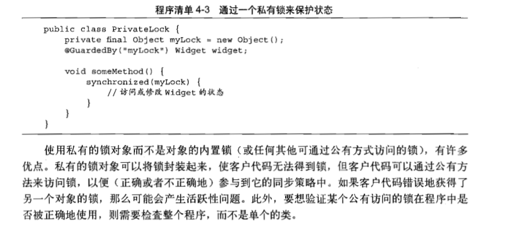
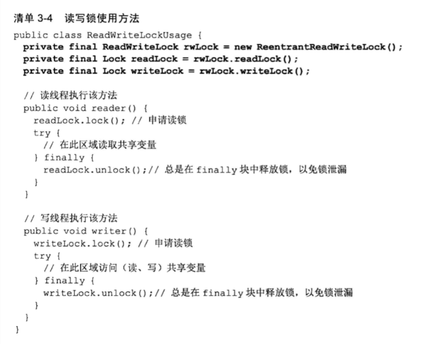

竞态条件：不恰当的执行时序而出现不正确的结果

1. 一个是count++不是线程安全，因为它包含了读取-修改-写入的操作序列

2. 懒加载的这种写法也不是线程安全，因为并发读取null的操作会创建多个实例

```java
@NotThreadSage
public class LazyInitRace{
    private ExpensiveObject instance = null;
    public ExpensiveObject getInstance(){
        if(instance == null)
            instance = new ExpensiveObject();
        return instance;
    }
}
```


3. redis的内存穿透问题和懒加载的情况差不多


线程安全对象AtomicLong类型进行count.incrementAndGet()，在我看啦就是封装了个互斥量:)


内置锁，每个java对象都可以用作一个实现同步的锁。每次只能有一个线程执行内置锁保护的代码块

```
sychronized(lock){
 //lock写this就行，或者只在在方法上syn，一般写在方法块里，不写在方法上，因为同步性能低
}
```


重入：如果一个线程试图获得一个已经由他自己持有的锁，那么这个请求就会成功。避免了子类调用父类方法的死锁

```java
//重入
public class Widget{
    public synchronized void doSomething(){
        ...
    }
}
public class LoggingWidget extends Widget{
    public synchronized void doSomething(){
        System.out.println(toString()+": calling doSomething");
        super.doSomething();
    }
}
```


关于@GuardedBy注解

[用于锁全局变量](https://blog.csdn.net/qudany10061700/article/details/80623956)


volatile变量

java语言提供了一种稍弱的同步机制，即volatile变量，用来确保变量的更新操作通知到其他线程。当变量声明为volatile类型后，编译器与运行时都会注意到这个变量是共享的。因此不会将该变量上的操作与其他内存操作一起重排序。

通常用作某个操作完成，发生中断或者状态的标志。但是使用时要小心，例如它的语义无法保证count++操作的原子性。


Threadlocal

https://www.jianshu.com/p/98b68c97df9b


私有锁





sychronize:被称作监视器或内部锁，java平台任何一个对象自己都带有，是非公平锁，可重入

缺点：只能在自己的方法内锁和释放锁

lock：被称为显示锁，可以用lock创建锁实例，当然也可以用reentrantlock创建可重入锁，unlock解锁一定要放在finally语句块执行，防止锁泄露。可以设置是公平或者非公平锁


在线程使用锁的时间长，以及获取间隔较长时，不建议用非公平锁，最好用公平锁


读写锁的申请方法



只有满足读操作很多，且写操作较少的情况下，用读写锁。


https://blog.csdn.net/ll666634/article/details/78615505并发编程常见面试题


## conCurrentHashMap实现原理

## synchronize和lock锁的区别

## CAS的实现原理及其应用在原子变量的场景

## AQS的原理

## ReentrantLock实现原理

## volatile

## Runnable和Callable的区别（简单）

## 公平锁与非公平锁

## 自旋锁、偏向锁

https://zhuanlan.zhihu.com/p/71156910

## 正确的单例模式

## 重排序导致的读取脏实例的问题以及避免方法

## 阻塞队列的原理及直线

## 信号量

## 条件变量condition作为object.wait()的替代方案

## 倒计时协调器：countDownLatch

一般用于：某个任务需要其他多个线程完成后，才能继续执行。例如zookeeper连接，当发起连接后，主线程count.wati()暂停，等连接线程count-1后得到count为0的状态时，主线程才会继续运行。

具体见https://blog.csdn.net/huang_wu_yao_xin/article/details/82704257

## 线程的中断

只有在线程阻塞或者sleep时，interrupt才能让线程停止。但是可以使用isInterrupt()来判断是否有中断标记

## 线程间的通信：管道、wait等

## 死锁的几种情况

## 线程池的实现与原理

## 异步编程CompletableFuture

https://www.cnblogs.com/happyliu/p/9462703.html


