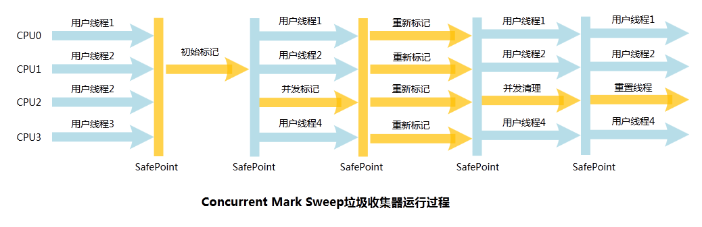

- [一、自动内存管理机制](#%E4%B8%80%E8%87%AA%E5%8A%A8%E5%86%85%E5%AD%98%E7%AE%A1%E7%90%86%E6%9C%BA%E5%88%B6)
  - [1. 程序计数器](#1-%E7%A8%8B%E5%BA%8F%E8%AE%A1%E6%95%B0%E5%99%A8)
  - [2. Java虚拟机栈](#2-java%E8%99%9A%E6%8B%9F%E6%9C%BA%E6%A0%88)
  - [3. 本地方法栈](#3-%E6%9C%AC%E5%9C%B0%E6%96%B9%E6%B3%95%E6%A0%88)
  - [4. Java堆](#4-java%E5%A0%86)
  - [5. 方法区](#5-%E6%96%B9%E6%B3%95%E5%8C%BA)
  - [6. 运行时常量池](#6-%E8%BF%90%E8%A1%8C%E6%97%B6%E5%B8%B8%E9%87%8F%E6%B1%A0)
  - [7. 直接内存](#7-%E7%9B%B4%E6%8E%A5%E5%86%85%E5%AD%98)
  - [对象的访问](#%E5%AF%B9%E8%B1%A1%E7%9A%84%E8%AE%BF%E9%97%AE)
  - [outofmemory实战](#outofmemory%E5%AE%9E%E6%88%98)
    - [1. 堆溢出](#1-%E5%A0%86%E6%BA%A2%E5%87%BA)
    - [2. 栈溢出](#2-%E6%A0%88%E6%BA%A2%E5%87%BA)
    - [3. 关于常量池String的intern()函数](#3-%E5%85%B3%E4%BA%8E%E5%B8%B8%E9%87%8F%E6%B1%A0string%E7%9A%84intern%E5%87%BD%E6%95%B0)
- [二、垃圾回收器](#%E4%BA%8C%E5%9E%83%E5%9C%BE%E5%9B%9E%E6%94%B6%E5%99%A8)
  - [1. 判断程序是否可回收](#1-%E5%88%A4%E6%96%AD%E7%A8%8B%E5%BA%8F%E6%98%AF%E5%90%A6%E5%8F%AF%E5%9B%9E%E6%94%B6)
    - [1) 引用计数算法](#1-%E5%BC%95%E7%94%A8%E8%AE%A1%E6%95%B0%E7%AE%97%E6%B3%95)
    - [2) 可达性分析算法](#2-%E5%8F%AF%E8%BE%BE%E6%80%A7%E5%88%86%E6%9E%90%E7%AE%97%E6%B3%95)
    - [3) 引用类型](#3-%E5%BC%95%E7%94%A8%E7%B1%BB%E5%9E%8B)
      - [1. 强引用（Strong Reference）](#1-%E5%BC%BA%E5%BC%95%E7%94%A8strong-reference)
      - [2. 软引用（Soft Reference）](#2-%E8%BD%AF%E5%BC%95%E7%94%A8soft-reference)
      - [3. 弱引用（Weak Reference）](#3-%E5%BC%B1%E5%BC%95%E7%94%A8weak-reference)
      - [4. 虚引用（Phantom Reference）](#4-%E8%99%9A%E5%BC%95%E7%94%A8phantom-reference)
      - [5. finalize()](#5-finalize)
    - [4）方法区回收](#4%E6%96%B9%E6%B3%95%E5%8C%BA%E5%9B%9E%E6%94%B6)
    - [5) 垃圾回收算法](#5-%E5%9E%83%E5%9C%BE%E5%9B%9E%E6%94%B6%E7%AE%97%E6%B3%95)
  - [2. 垃圾收集器](#2-%E5%9E%83%E5%9C%BE%E6%94%B6%E9%9B%86%E5%99%A8)
    - [1) Serial收集器](#1-serial%E6%94%B6%E9%9B%86%E5%99%A8)
    - [2) ParNew](#2-parnew)
    - [3) Parallel Scavenge](#3-parallel-scavenge)
    - [4）Serial Old](#4serial-old)
    - [5) Parallel Old](#5-parallel-old)
    - [5） CMS](#5-cms)
    - [6） G1](#6-g1)
  - [3. 内存回收策略](#3-%E5%86%85%E5%AD%98%E5%9B%9E%E6%94%B6%E7%AD%96%E7%95%A5)
    - [1. 什么时候进行Minor GC，Full GC](#1-%E4%BB%80%E4%B9%88%E6%97%B6%E5%80%99%E8%BF%9B%E8%A1%8Cminor-gcfull-gc)
    - [2. 内存分配策略](#2-%E5%86%85%E5%AD%98%E5%88%86%E9%85%8D%E7%AD%96%E7%95%A5)
      - [1. 对象优先在 Eden 分配](#1-%E5%AF%B9%E8%B1%A1%E4%BC%98%E5%85%88%E5%9C%A8-eden-%E5%88%86%E9%85%8D)
      - [2. 大对象直接进入老年代](#2-%E5%A4%A7%E5%AF%B9%E8%B1%A1%E7%9B%B4%E6%8E%A5%E8%BF%9B%E5%85%A5%E8%80%81%E5%B9%B4%E4%BB%A3)
      - [3. 长期存活的对象进入老年代](#3-%E9%95%BF%E6%9C%9F%E5%AD%98%E6%B4%BB%E7%9A%84%E5%AF%B9%E8%B1%A1%E8%BF%9B%E5%85%A5%E8%80%81%E5%B9%B4%E4%BB%A3)
      - [4. 动态对象年龄判定](#4-%E5%8A%A8%E6%80%81%E5%AF%B9%E8%B1%A1%E5%B9%B4%E9%BE%84%E5%88%A4%E5%AE%9A)
      - [5. 空间分配担保](#5-%E7%A9%BA%E9%97%B4%E5%88%86%E9%85%8D%E6%8B%85%E4%BF%9D)
    - [3. Full GC 的触发条件](#3-full-gc-%E7%9A%84%E8%A7%A6%E5%8F%91%E6%9D%A1%E4%BB%B6)
- [三、类文件结构](#%E4%B8%89%E7%B1%BB%E6%96%87%E4%BB%B6%E7%BB%93%E6%9E%84)
    - [1. 魔数](#1-%E9%AD%94%E6%95%B0)
    - [2. 常量池](#2-%E5%B8%B8%E9%87%8F%E6%B1%A0)
    - [3. 访问标志access_flag](#3-%E8%AE%BF%E9%97%AE%E6%A0%87%E5%BF%97accessflag)
    - [4. 类索引、父类索引与接口索引](#4-%E7%B1%BB%E7%B4%A2%E5%BC%95%E7%88%B6%E7%B1%BB%E7%B4%A2%E5%BC%95%E4%B8%8E%E6%8E%A5%E5%8F%A3%E7%B4%A2%E5%BC%95)
    - [5. 字段表集合](#5-%E5%AD%97%E6%AE%B5%E8%A1%A8%E9%9B%86%E5%90%88)
    - [6. 方法表集合](#6-%E6%96%B9%E6%B3%95%E8%A1%A8%E9%9B%86%E5%90%88)
    - [7. 属性表集合](#7-%E5%B1%9E%E6%80%A7%E8%A1%A8%E9%9B%86%E5%90%88)
- [四、类加载过程](#%E5%9B%9B%E7%B1%BB%E5%8A%A0%E8%BD%BD%E8%BF%87%E7%A8%8B)
  - [类的生命周期](#%E7%B1%BB%E7%9A%84%E7%94%9F%E5%91%BD%E5%91%A8%E6%9C%9F)
  - [类初始化时机](#%E7%B1%BB%E5%88%9D%E5%A7%8B%E5%8C%96%E6%97%B6%E6%9C%BA)
    - [1. 主动引用](#1-%E4%B8%BB%E5%8A%A8%E5%BC%95%E7%94%A8)
    - [2. 被动引用](#2-%E8%A2%AB%E5%8A%A8%E5%BC%95%E7%94%A8)
  - [类加载过程](#%E7%B1%BB%E5%8A%A0%E8%BD%BD%E8%BF%87%E7%A8%8B)
    - [1.加载](#1%E5%8A%A0%E8%BD%BD)
    - [2. 验证](#2-%E9%AA%8C%E8%AF%81)
    - [3. 准备](#3-%E5%87%86%E5%A4%87)
    - [4. 解析](#4-%E8%A7%A3%E6%9E%90)
      - [什么是符号引用和直接引用？](#%E4%BB%80%E4%B9%88%E6%98%AF%E7%AC%A6%E5%8F%B7%E5%BC%95%E7%94%A8%E5%92%8C%E7%9B%B4%E6%8E%A5%E5%BC%95%E7%94%A8)
    - [5. 初始化](#5-%E5%88%9D%E5%A7%8B%E5%8C%96)
  - [类加载器](#%E7%B1%BB%E5%8A%A0%E8%BD%BD%E5%99%A8)
    - [1. 类与类加载器](#1-%E7%B1%BB%E4%B8%8E%E7%B1%BB%E5%8A%A0%E8%BD%BD%E5%99%A8)
    - [2. 类加载器分类](#2-%E7%B1%BB%E5%8A%A0%E8%BD%BD%E5%99%A8%E5%88%86%E7%B1%BB)
    - [3. 双亲委派模型](#3-%E5%8F%8C%E4%BA%B2%E5%A7%94%E6%B4%BE%E6%A8%A1%E5%9E%8B)
# 一、自动内存管理机制

## 1. 程序计数器
- 程序计数器是一块较小的内存空间，字节码解释器通过改变计数器的值来选取下一条需要执行的字节码指令。（分支、循环、跳转、异常处理）
- 线程私有，确保线程切换后能恢复到正确的位置
- 如果执行native方法，计数器值为空

## 2. Java虚拟机栈
- 线程私有
- 每个方法执行时都会创建一个栈帧，包含：
a)局部变量表b)操作数栈c)动态链接d)方法出口
>  - 局部变量表:编译期可知的基本数据类型(int byte long...)、对象引用(reference)、return的类型。---其中除了double和long占两个局部变量空间slot，其他都是一
## 3. 本地方法栈
- 本地方法一般是用其它语言（C、C++ 或汇编语言等）编写的，并且被编译为基于本机硬件和操作系统的程序，对待这些方法需要特别处理。
- 本地方法栈与 Java 虚拟机栈类似，它们之间的区别只不过是本地方法栈为本地方法服务。
## 4. Java堆
- 存放对象实例，所有对象实例存放在此处
- 不连续内存，逻辑上连续即可，可以扩展
## 5. 方法区
- 类信息class_info
- 常量
- 静态变量
- 编译器编译后的代码等数据（字节码）

## 6. 运行时常量池
- 类文件的常量池->字面量和符号引用
- 编译后的直接引用
- 并编译期才产生，运行期调用String的intern()函数会产生

## 7. 直接内存
- 不是运行时数据区的一部分
- 例如NIO，基于通道(Channel)与缓冲(Buffer)的I/O方式，他可以直接使用Nativeh函数直接分配堆外内存，然后通过储存在Java堆中的DirectByteBuffer对象作为这块内存的引用进行操作。在一些操作中避免在Native堆和java堆中频繁引用数据
- 受到本机内存（RAM）限制，如果java堆过大，导致直接内存过小，便会溢出。
## 对象的访问


## outofmemory实战
### 1. 堆溢出
```java
import java.util.ArrayList;
import java.util.List;
/* VM conf:-Xms20m -Xmx20m -XX:+HeapDumpOnOutOfMemoryError*/
//设置最小和最大值为20m，那么堆就不会自动扩展了
public class HeapOverflow {
    static class OOMObject {
    }
    public static void main(String[] args) {
        List<OOMObject> list = new ArrayList<OOMObject>();
        while (true) {
            list.add(new OOMObject());
        }
    }
}
```
输出结果
```
java.lang.OutOfMemoryError: Java heap space
Dumping heap to java_pid15340.hprof ...
Heap dump file created [28226884 bytes in 0.155 secs]
Exception in thread "main" java.lang.OutOfMemoryError: Java heap space
	at java.util.Arrays.copyOf(Arrays.java:3210)
	at java.util.Arrays.copyOf(Arrays.java:3181)
	at java.util.ArrayList.grow(ArrayList.java:265)
	at java.util.ArrayList.ensureExplicitCapacity(ArrayList.java:239)
	at java.util.ArrayList.ensureCapacityInternal(ArrayList.java:231)
	at java.util.ArrayList.add(ArrayList.java:462)
	at HeapOverflow.main(HeapOverflow.java:14)

Process finished with exit code 1

```
情况分析：
- 内存泄漏，可以用Jprofiler查看GC Roots的相关联，是如何与GCroot相连，导致无法回收
- 如不存在泄漏，检查堆参数-Xms -Xmx,是否可以调大

### 2. 栈溢出
Java虚拟机定义了两种栈异常
- 如果线程请求的栈深度大于虚拟机所允许的最大深度，将抛出stackoverflowerror的异常
- 如果虚拟机在扩展栈时，无法分配到足够的内存空间，则会抛出outofmemoryerror的异常

单线程测试基本上都是stackoverflowerror异常（下面代码）
栈溢出测试的两种方法：
- 使用-Xss参数减少栈内存的容量。结果：抛出StackOverflow异常，异常出现时堆栈深度相应缩小(内存小了容纳的栈也小了)
- 定义了大量的本地变量，增大方法帧中本地变量表的长度。异常出现时堆栈深度相应缩小(栈帧变大了容纳的栈也小了)

```java
public class JavaJVMStackSOF {
    /*VM Args: -Xss128k
    * 设置了栈内存的容量 */
    private int stackLength = 1;
    public void stackLeak() {
        stackLength++;
        stackLeak();
    }
    public static void main(String[] args) throws Throwable {
        JavaJVMStackSOF oom = new JavaJVMStackSOF();
        try {
            oom.stackLeak();
        } catch (Throwable e) {
            System.out.println("stacklenth = " + oom.stackLength);
            throw e;
        }
    }
}
```
输出结果
```
stacklenth = 997
Exception in thread "main" java.lang.StackOverflowError
	at JavaJVMStackSOF.stackLeak(JavaJVMStackSOF.java:9)
	at JavaJVMStackSOF.stackLeak(JavaJVMStackSOF.java:10)
	at JavaJVMStackSOF.stackLeak(JavaJVMStackSOF.java:10)
```

### 3. 关于常量池String的intern()函数
实例代码
```java
public class RuntimeConstantPoolOOM {

    public static void main(String[] args){
        String  str1 = new StringBuilder("计算机").append("软件").toString();
        System.out.println(str1.intern() == str1);

        String str2 = new StringBuilder("ja").append("va").toString();
        System.out.println(str2.intern() == str2);
    }

}
```
其中intern的实例常量池中没有，在1.6版本以前都是从堆复制到常量池，1.7之后都是复制堆的引用到常量池(详见[intern函数详解](https://www.runoob.com/java/java-string-intern.html))
所以1.7的输出结果
```
true
false
```
# 二、垃圾回收器
## 1. 判断程序是否可回收
**程序计数器**、**虚拟机栈和本地方法栈**这三个区域属于线程私有的，只存在于线程的生命周期内，线程结束之后也会消失，因此不需要对这三个区域进行垃圾回收。垃圾回收主要是针对 Java **堆和方法区**进行。
### 1) 引用计数算法
**描述**：给对象中添加一个引用计数器每当有一个地方引用它时，计数器就加1；当引用失效时，计数器值就减1；任何时刻计数器为0的对象就是不可能在被使用的。

**缺陷**：很难解决对象间相互循环引用的问题。
```java
public class ReferenceCountingGC {
    public Object instance = null;
    private static final int _1MB = 1024*1024;
    private byte[] bigSize = new byte[2*_1MB];
    public static void testGC(){
        ReferenceCountingGC objA = new ReferenceCountingGC();
        ReferenceCountingGC objB = new ReferenceCountingGC();
        objA = null;
        objB = null;
        System.gc();
    }
}
```

### 2) 可达性分析算法
**描述**：通过 GC Roots 作为起始点进行搜索，能够到达到的对象都是存活的，不可达的对象可被回收。
**可作为GC-Roots的对象：**
- 虚拟机栈（栈帧中的本地变量表）中引用的对象。
- 方法区中静态属性引用的对象。
- 方法区中常量引用的对象。
- 本地方法栈中 JNI （即一般说的 Native 方法）引用的对象


### 3) 引用类型
#### 1. 强引用（Strong Reference）
被强引用关联的对象不会被回收。

使用 new 一个新对象的方式来创建强引用。

```java
Object obj = new Object();
```

#### 2. 软引用（Soft Reference）
被软引用关联的对象只有在内存不够的情况下才会被回收。

使用 SoftReference 类来创建软引用。

这一点可以很好地用来解决OOM的问题，并且这个特性很适合用来实现缓存：比如网页缓存、图片缓存等。

```java
Object obj = new Object();
SoftReference<Object> sf = new SoftReference<Object>(obj);
obj = null;  // 使对象只被软引用关联
```

#### 3. 弱引用（Weak Reference）
被弱引用关联的对象一定会被回收，也就是说它只能存活到下一次垃圾回收发生之前。

使用 WeakReference 类来实现弱引用。

> 如果这个对象是偶尔的使用，并且希望在使用时随时就能获取到，但又不想影响此对象的垃圾收集，那么你应该用 Weak Reference 来记住此对象。

```java
Object obj = new Object();
WeakReference<Object> wf = new WeakReference<Object>(obj);
obj = null;
```

#### 4. 虚引用（Phantom Reference）
又称为幽灵引用或者幻影引用。一个对象是否有虚引用的存在，完全不会对其生存时间构成影响，也无法通过虚引用取得一个对象。

为一个对象设置虚引用关联的唯一目的就是能在这个对象被回收时收到一个系统通知。

使用 PhantomReference 来实现虚引用。
```java
Object obj = new Object();
PhantomReference<Object> pf = new PhantomReference<Object>(obj);
obj = null;
```

#### 5. finalize()
当一个对象可被回收时，如果需要执行该对象的 finalize() 方法，那么就有可能通过在该方法中让对象重新被引用，从而实现自救。自救只能进行一次，如果回收的对象之前调用了 finalize() 方法自救，后面回收时不会调用 finalize() 方法。

如果对象没有实现父类Object的finalize()方法，那么当其可被回收时，就直接回收了，无法自救。

尽量不要使用

### 4）方法区回收
Java虚拟机规范中确实说过可以不要求虚拟机在方法区实现垃圾收集，而且在方法区中进行垃圾收集的 “性价比” 一般比较低：在堆中，尤其在新生代中，常规的应用一次垃圾收集一般可以回收 70% ~ 95%的空间，而永久代的垃圾收集效率远低于此。

永久代的垃圾收集主要回收两部分：**废弃常量** 和 **无用的类**。
- 回收废弃常量与回收 Java 堆中的对象非常类似。
- 要判定一个类是否是 “无用的类” 的条件相对苛刻许多。类需要同时满足下面3个条件才能算 “无用的类”
  - 该类的所有实例都已经被回收。
  - 加载该类的 ClassLoader 已经被回收。
  - 该类对应的 java.lang.Class 对象没有在任何地方被引用，无法在任何地方通过反射访问该类的方法。

在大量使用反射、动态代理、GGLib 等 ByteCode 框架、动态生成 Jsp 以及 OSGI 这类频繁自定义 ClassLoader 的场景都需要虚拟机具备类卸载的功能，以保证永久代不会溢出。

### 5) 垃圾回收算法
[详解地址](https://github.com/frank-lam/fullstack-tutorial/blob/master/notes/JavaArchitecture/05-Java%E8%99%9A%E6%8B%9F%E6%9C%BA.md#3-%E5%9E%83%E5%9C%BE%E6%94%B6%E9%9B%86%E7%AE%97%E6%B3%95%E5%9E%83%E5%9C%BE%E5%A4%84%E7%90%86%E6%96%B9%E6%B3%95)


## 2. 垃圾收集器


[具体请见连接](https://github.com/frank-lam/fullstack-tutorial/blob/master/notes/JavaArchitecture/05-Java%E8%99%9A%E6%8B%9F%E6%9C%BA.md#4-%E5%9E%83%E5%9C%BE%E6%94%B6%E9%9B%86%E5%99%A8)
以下是简介
### 1) Serial收集器
**简介**：它是单线程的收集器，只会使用一个线程进行垃圾收集工作。

**优点**：简单高效，对于单个 CPU 环境来说，由于没有线程交互的开销，因此拥有最高的单线程收集效率。

**缺点**：停顿时间过久

**应用场景**：它是 Client 模式下的默认新生代收集器，因为在用户的桌面应用场景下，分配给虚拟机管理的内存一般来说不会很大。Serial 收集器收集几十兆甚至一两百兆的新生代停顿时间可以控制在一百多毫秒以内，只要不是太频繁，这点停顿是可以接受的。

### 2) ParNew
**简介**：它是serial收集器的多线程版本。

**应用场景**:
- 是 Server 模式下的虚拟机首选新生代收集器，除了性能原因外，主要是因为除了 Serial 收集器，只有它能与 CMS 收集器配合工作。
-  JDK1.5中使用 CMS 来收集老年代的时候，新生代只能选择 ParNew 或者 Serial 收集器中的一个。

### 3)  Parallel Scavenge
**简介**：arallel Scavenge 收集器是一个新生代收集器，它也是使用复制算法的收集器，又是并行的多线程收集器。

**与 ParNew 的不同之处**：
- 其它收集器关注点是尽可能缩短垃圾收集时用户线程的停顿时间（响应时间），而它的目标是达到一个可控制的吞吐量，它被称为**吞吐量优先收集器**。

> 吞吐量指 CPU 用于运行用户代码的时间占总时间的比值
> 
> 吞吐量 = 运行用户代码时间 / (运行用户代码时间 + 垃圾收集时间)


使新生代空间变小，垃圾回收变得频繁，导致吞吐量下降，最后停顿时间下降（总的垃圾回收过程是不变的，这里相当于把垃圾回收过程不断的拆分成小过程，增加了每次调用垃圾回收器的时间，而总回收过程的时间是不变的）。

可以通过一个开关参数打卡 GC 自适应的调节策略（GC Ergonomics），就不需要手工指定新生代的大小（-Xmn）、Eden 和 Survivor 区的比例、晋升老年代对象年龄等细节参数了。虚拟机会根据当前系统运行情况收集性能监控信息，动态调整这些参数，以提供最合适的停顿时间或最大的吞吐量，这种调节方式称为**GC自适应的调节策略**（GC Ergonomiscs） 。

### 4）Serial Old
**简介**：Serial Old 是 Serial 收集器的老年代版本，它同样是一个单线程收集器，使用 ”标记-整理“ 算法。
**主要用途**：作为CMS收集器的后备预案，在并发手机发生Concurrent Mode Failure（担保失败时）使用。


### 5) Parallel Old
**简介**：是parallel scavenge收集器的老年代版本，使用多线程和“标记——整理”算法。

### 5） CMS
**简介**：CMS（Concurrent Mark Sweep），Mark Sweep 指的是 标记 - 清除 算法。CMS 是一款优秀的收集器，主要优点：并发收集、低停顿，Sun公司也称之为并发低停顿收集器（Concurrent Low Pause Collection）。




**特点**：并发手机，低停顿。

**分为以下四个流程**：
- **初始标记**：仅仅只是标记一下 GC Roots 能直接关联到的对象，速度很快，需要停顿。(单线程)
- 并发标记：进行 GC Roots Tracing 的过程，它在整个回收过程中耗时最长，不需要停顿。
- **重新标记**：为了修正并发标记期间因用户程序继续运作而导致标记产生变动的那一部分对象的标记记录，需要停顿。（多线程）
- 并发清除：不需要停顿。

在整个过程中耗时最长的并发标记和并发清除过程中，收集器线程都可以与用户线程一起工作，不需要进行停顿。

**缺陷**：
- 吞吐量低：低停顿时间是以牺牲吞吐量为代价的，导致 CPU 利用率不够高（因为并发过程中总有一条线程进行标记或清除，特别当cpu数量少于4的时候，对cpu影响明显）。

- 无法处理浮动垃圾，可能出现 Concurrent Mode Failure。浮动垃圾是指并发清除阶段由于用户线程继续运行而产生的垃圾，这部分垃圾只能到下一次 GC 时才能进行回收。由于浮动垃圾的存在，因此需要预留出一部分内存，意味着 CMS 收集不能像其它收集器那样等待老年代快满的时候再回收。如果预留的内存不够存放浮动垃圾，就会出现 Concurrent Mode Failure，这时虚拟机将临时启用 Serial Old 来替代 CMS。

- 标记 - 清除算法导致的空间碎片，往往出现老年代空间剩余，但无法找到足够大连续空间来分配当前对象，不得不提前触发一次 Full GC。

  - CMS 提供了一个开关参数 -XX:+UseCMSCompactAtFullCollection（默认开启），用于在 CMS 收集器顶不住要进行 Full GC 时开启内存碎片的合并整理过程，内存整理的过程是无法并发的。
  
   - 参数 -XX:CMSFullGCsBeforeCompaction 用于设置执行多少次不压缩的 Full GC后，跟着来以此带压缩的，（默认值为0）

### 6） G1
[详解](https://github.com/frank-lam/fullstack-tutorial/blob/master/notes/JavaArchitecture/05-Java%E8%99%9A%E6%8B%9F%E6%9C%BA.md#7-g1)


## 3. 内存回收策略
### 1. 什么时候进行Minor GC，Full GC
- **Minor GC**：发生在新生代上，因为新生代对象存活时间很短，因此 Minor GC 会频繁执行，执行的速度一般也会比较快。
新生代中的垃圾收集动作，采用的是复制算法
对于较大的对象，在 Minor GC 的时候可以直接进入老年代

- **Full GC**：发生在老年代上，老年代对象其存活时间长，因此 Full GC 很少执行，执行速度会比 Minor GC 慢很多。
  - Full GC 是发生在老年代的垃圾收集动作，采用的是 标记-清除/整理 算法。
  - 由于老年代的对象几乎都是在 Survivor 区熬过来的，不会那么容易死掉。因此 Full GC 发生的次数不会有 Minor GC 那么频繁，并且 Time(Full GC)>Time(Minor GC)


### 2. 内存分配策略

#### 1. 对象优先在 Eden 分配
大多数情况下，对象在新生代 Eden 区分配，当 Eden 区空间不够时，发起 Minor GC。

#### 2. 大对象直接进入老年代
大对象是指需要连续内存空间的对象，最典型的大对象是那种很长的字符串以及数组。

经常出现大对象会提前触发垃圾收集以获取足够的连续空间分配给大对象。

-XX:PretenureSizeThreshold，大于此值的对象直接在老年代分配，避免在 Eden 区和 Survivor 区之间的大量内存复制。

#### 3. 长期存活的对象进入老年代
为对象定义年龄计数器，对象在 Eden 出生并经过 Minor GC 依然存活，将移动到 Survivor 中，并且年龄设为1岁，每熬过一次Minor GC年龄就增加 1 岁，增加到一定年龄则移动到老年代中。

-XX:MaxTenuringThreshold 用来定义年龄的阈值。

#### 4. 动态对象年龄判定
虚拟机并不是永远地要求对象的年龄必须达到 MaxTenuringThreshold 才能晋升老年代，**如果在 Survivor 中相同年龄所有对象大小的总和大于 Survivor 空间的一半**，则年龄大于或等于该年龄的对象可以直接进入老年代，无需等到 MaxTenuringThreshold 中要求的年龄。

#### 5. 空间分配担保
在发生 Minor GC 之前，虚拟机先检查老年代最大可用的连续空间是否大于新生代所有对象总空间，如果条件成立的话，那么 Minor GC 可以确认是安全的。

如果不成立的话虚拟机会查看 HandlePromotionFailure 设置值是否允许担保失败，如果允许那么就会继续检查老年代最大可用的连续空间是否大于历次晋升到老年代对象的**平均大小**，如果大于，将尝试着进行一次 Minor GC；如果小于，或者 HandlePromotionFailure 设置不允许冒险，那么就要进行一次 Full GC。

一般HandlePromotionFailure都会允许冒险

### 3. Full GC 的触发条件

对于 Minor GC，其触发条件非常简单，当 Eden 空间满时，就将触发一次 Minor GC。

而 Full GC 则相对复杂，有以下条件：

1. 调用 System.gc()
只是建议虚拟机执行 Full GC，但是虚拟机不一定真正去执行。不建议使用这种方式，而是让虚拟机管理内存。

2. 老年代空间不足
老年代空间不足的常见场景为前文所讲的大对象直接进入老年代、长期存活的对象进入老年代等。

> 为了避免以上原因引起的 Full GC，应当尽量不要创建过大的对象以及数组。除此之外，可以通过 -Xmn 虚拟机参数调大新生代的大小，让对象尽量在新生代被回收掉，不进入老年代。还可以通过 -XX:MaxTenuringThreshold 调大对象进入老年代的年龄，让对象在新生代多存活一段时间。

3. 空间分配担保失败
使用复制算法的 Minor GC 需要老年代的内存空间作担保，如果担保失败会执行一次 Full GC。

4. JDK 1.7 及以前的永久代空间不足
在 JDK 1.7 及以前，HotSpot 虚拟机中的方法区是用永久代实现的，永久代中存放的为一些 Class 的信息、常量、静态变量等数据。

> 当系统中要加载的类、反射的类和调用的方法较多时，永久代可能会被占满，在未配置为采用 CMS GC 的情况下也会执行 Full GC。如果经过 Full GC 仍然回收不了，那么虚拟机会抛出 java.lang.OutOfMemoryError。

为避免以上原因引起的 Full GC，可采用的方法为增大永久代空间或转为使用 CMS GC。

5. Concurrent Mode Failure
执行 CMS GC 的过程中同时有对象要放入老年代，而此时老年代空间不足（可能是 GC 过程中浮动垃圾过多导致暂时性的空间不足），便会报 Concurrent Mode Failure 错误，并触发 Full GC。


# 三、类文件结构
**简介**：
Class文件格式采用一种类似于C语言结构体的伪结构来储存数据：表和无符号数

- 无符号数：属于基本数据类型，以u1,u2,u4,u8来表示1个字节、2个字节、4个字节和8个字节的无符号数。
- 表：是由多个无符号数或者其他表作为数据项构成的复合结构数据。

类型 | 名称 |  数量  
-|-|-
u4 | magic魔数 | 1 |
u2 | minor_version次版本号 | 1 |
u2 | major_version主版本号 | 1 |
u2 | constant_pool_count常量池常量数目 | 1|
cp_info | constant_pool常量池| constant_pool_count-1|
u2 | access_flags类或接口访问标志| 1|
u2 | this_class类索引| 1|
u2 | super_class父类索引| 1|
u2 | interfaces_count接口数目|1|
u2 | interfaces接口索引|interfaces_count|
u2 | fields_count字段数目|1|
filed_info | fileds字段表|fields_count|
u2 | methods_count方法数目| 1|
method_info | methods方法表|methods_count|
u2 | attributes_count属性数目|1|
attribute_info | arributes属性表|attributes_count|

### 1. 魔数
- 每个Class文件的头4个字节称为魔数，用来确认这个文件是否能够被虚拟机接收的Class文件（0xCAFEBABE）
> 很多文件储存标准都用魔数来进行身份识别，例如gif和jpeg。主要是基于安全考虑，因为基于扩展名来识别的话，而扩展名可以被修改，存在隐患。

### 2. 常量池
**简介**：
常量池是占用Class文件空间最大的数据项目之一，由于常量池中常量的数目是不确定的，所以需要一个constant_pool_count来记录常量数目。

**常量池中两大类常量**：
- 字面量（文本字符串和final常量等）
- 符号引用
  - 类和接口的全限定名
  - 字段(简单说就是变量)的名称和描述符(数据类型String、int等）
  - 方法名称和描述符（数据返回类型，括号内参数列表）

### 3. 访问标志access_flag
用于标识一些类或者接口层次的访问信息。

包括：
- 是类还是接口 ：“class, interface”;
- 是否为public 
- 是否为final
- 是否为abstract
等

### 4. 类索引、父类索引与接口索引
- 类索引：引用确定这个类的全限定名
- 父类索引：父类的全限定名，由于java不允许多重继承，所以只有一个
- 接口索引：由于接口可以实现多个，所以之前有一个接口计数器，当计数器为0时，后面的索引表不再占用任何字节。

### 5. 字段表集合
**简介**：
用于描述接口或者**类**中声明的变量。

字段包括类级变量（static）和实例级变量

包括的信息有：
1. 字段的作用域(public, private, protect)
2. 实列变量还是类级变量（static？）
3. 可变性（final）
4. 并发可见性（volatile）
5. 可否被序列化
6. 字段数据类型（基本类型、对象、类型）
7. 字段名称

**注意**：
字段表中不会列出从超类或者父类接口中继承而来的字段。

### 6. 方法表集合
- 包括访问标志（access_flag）、名称索引(name_index)、描述符索引（descriptor_index）、属性表集合(attributes)
- 方法里的代码，经过编译器编译成字节码后，存放在方法属性表集合中的一个“Code”的属性里面
- 如果父类方法在子类方法中没有被重写，方法表中不会出现来自父类的方法信息。


### 7. 属性表集合
由于属性太多只简单介绍两个

1. code属性： 
Java程序方法体中的代码经过javac编译器处理后，最终变为字节码指令储存在Code属性内。但是接口和抽象类中的方法就不存在Code属性。
2. ConstantValue属性： 
只有被Static关键字修饰的变量才可以使用这项属性，对于非Static类型的变量的赋值是在实例构造器<init\>方法中进行的；而对于static的类变量，则有两种方式可以选择：在类构造器<clinit\>方法中或者使用ConstantValue属性。
> 目前Sun Javac编译器的选择是：如果同时使用final和static来修饰一个变量，且这个变量的数据类型是基本类型或者String的话，就生成ConstantValue属性来初始化。如果没有被final修饰的话，或者不是基本类型或者String的话，就选择在<clinit\>方法中进行初始化。

# 四、类加载过程
虚拟机把描述类的数据从 Class 文件加载到内存，并对数据进行校验、转换解析和初始化，最终形成可以被虚拟机直接使用的 Java 类型，这就是虚拟机类加载机制。（类是在运行期间动态加载的）

## 类的生命周期


包括以下 7 个阶段：

**加载（Loading）**
**验证（Verification）**
**准备（Preparation）**
**解析（Resolution）**
**初始化（Initialization）**
使用（Using）
卸载（Unloading）

- 其中加粗的五个部分是**类加载的全部过程**

- 其中加载、验证、准备、初始化、卸载的顺序是固定的

- 其中解析过程在某些情况下可以在初始化阶段之后再开始，这是为了支持 Java 的动态绑定。

## 类初始化时机
### 1. 主动引用
虚拟机规范中并没有强制约束何时进行加载，但是规范严格规定了有且只有下列五种情况必须对类进行初始化（加载、验证、准备都会随之发生）：

- 遇到 new、getstatic、putstatic、invokestatic 这四条字节码指令时，如果类没有进行过初始化，则必须先触发其初始化。最常见的生成这 4 条指令的场景是：
  - 使用 new 关键字实例化对象的时候；
  - 读取或设置一个类的静态字段（被 final 修饰、已在编译期把结果放入常量池的静态字段除外）的时候；
  - 以及调用一个类的静态方法的时候。

- 使用 java.lang.reflect 包的方法对类进行反射调用的时候，如果类没有进行初始化，则需要先触发其初始化。
  
- 当初始化一个类的时候，如果发现其父类还没有进行过初始化，则需要先触发其父类的初始化。
  
- 当虚拟机启动时，用户需要指定一个要执行的主类（包含 main() 方法的那个类），虚拟机会先初始化这个主类；
  
- 当使用 JDK 1.7 的动态语言支持时，如果一个 java.lang.invoke.MethodHandle 实例最后的解析结果为 REF_getStatic, REF_putStatic, REF_invokeStatic 的方法句柄，并且这个方法句柄所对应的类没有进行过初始化，则需要先触发其初始化；————————简而言之，使用现代化反射时，反射到的方法所在类没初始化就会初始化这个类。
  
### 2. 被动引用
以上 5 种场景中的行为称为对一个类进行主动引用。除此之外，所有引用类的方式都不会触发初始化，称为被动引用。被动引用的常见例子包括：

- 通过子类引用父类的静态字段，不会导致子类初始化。
```java
System.out.println(SubClass.value);  // value 字段在 SuperClass 中定义了static 
```

- 通过数组定义来引用类，不会触发此类的初始化。该过程会对数组类进行初始化，数组类是一个由虚拟机自动生成的、直接继承自 Object 的子类，其中包含了数组的属性和方法。

```java
SuperClass[] sca = new SuperClass[10];
```

- 常量在编译阶段会存入调用类的常量池中，本质上并没有直接引用到定义常量的类，因此不会触发定义常量的类的初始化。

```java
System.out.println(ConstClass.HELLOWORLD); //被static和final修饰或者是String
```

## 类加载过程 

包含了加载、验证、准备、解析和初始化这 5 个阶段。

### 1.加载

加载是类加载的一个阶段，注意不要混淆。

加载过程完成以下三件事：

- 通过一个类的全限定名来获取定义此类的二进制字节流
- 将这个字节流所代表的**静态存储结构**（static）转化为方法区的运行时存储结构
- 在内存中生成一个代表这个类的 Class 对象，作为方法区这个类的各种数据的访问入口

加载源（其中二进制字节流可以从以下方式中获取）：

- 文件：从 ZIP 包读取，这很常见，最终成为日后 JAR、EAR、WAR 格式的基础。
- 网络：从网络中获取，这种场景最典型的应用是 Applet。
- 计算生成一个二进制流：运行时计算生成，这种场景使用得最多得就是动态代理技术，在 java.lang.reflect.Proxy 中，就是用了 ProxyGenerator.generateProxyClass 的代理类的二进制字节流。
- 由其他文件生成：由其他文件生成，典型场景是 JSP 应用，即由 JSP 文件生成对应的 Class 类。
- 数据库：从数据库读取，这种场景相对少见，例如有些中间件服务器（如 SAP Netweaver）可以选择把程序安装到数据库中来完成程序代码在集群间的分发。

### 2. 验证
**目的**：确保 Class 文件的字节流中包含的信息符合当前虚拟机的要求，并且不会危害虚拟机自身的安全。

如果不进行输入字节流的检查（Class字节流不一定是java源码编译而来），对其完全信任的话，很可能会因为载入了有害的字节流而导致系统崩溃，例如数组越界。

- 文件格式验证：验证字节流是否符合 Class 文件格式的规范，并且能被当前版本的虚拟机处理。
  - 是否以 0xCAFEBABE 开头，前四个字节为魔数
  - 版本号是否合理，如：JDK1.8（52.0）、JDK1.7（51.0）
  
- 元数据验证：对字节码描述的信息进行语义分析，以保证其描述的信息符合 Java 语言规范的要求。

  - 是否有父类-继
  - 继承了 final 类？
  - 非抽象类实现了所有的抽象方法

- 字节码验证（很复杂）：通过数据流和控制流分析，确保程序语义是合法、符合逻辑的。

  - 运行检查，保证方法体中类型转化有效
  - 栈数据类型和操作码数据参数吻合，不能操作栈放了int，而加载按long
  - 跳转指令指定到合理的位置，不会跳到方法体以外的字节码指令上
  
- 符号引用验证：发生在虚拟机将符号引用转换为直接引用的时候，对类自身以外（常量池中的各种符号引用）的信息进行匹配性校验。
  - 常量池中描述类是否存在
  - 访问的方法或字段是否存在且有足够的权限private，protect


### 3. 准备

准备阶段正式为**类变量**分配内存并设置变量的初始值。这些变量使用的内存都将在方法区中进行分配。类变量是被 static 修饰的变量，准备阶段为类变量分配内存并设置初始值，使用的是方法区的内存。

!!! *实例变量不会在这阶段分配内存，它将会在对象实例化时随着对象一起分配在堆中*。注意，实例化不是类加载的一个过程，类加载发生在所有实例化操作之前，并且**类加载只进行一次，实例化可以进行多次**。

初始值一般为 0 值，例如下面的类变量 value 被初始化为 0 而不是 123，在初始化的 <clinit\> 中才会被设置为1。


```java
public static int value = 123;
```
对于 static final 类型，在准备阶段就会被赋上正确的值

```java
public static final int value = 123;
```

### 4. 解析
解析阶段是虚拟机将**常量池**的符号引用替换为直接引用的过程

- 类或接口的解析
- 字段解析
- 类方法解析
- 接口方法解析
  
#### 什么是符号引用和直接引用？

- **符号引用**：符号引用是一组符号来描述所引用的目标对象，符号可以是任何形式的字面量，只要使用时能无歧义地定位到目标即可。符号引用与虚拟机实现的内存布局无关，引用的目标对象并不一定已经加载到内存中。
- **直接引用**：直接引用可以是直接指向目标对象的指针、相对偏移量或是一个能间接定位到目标的句柄。直接引用是与虚拟机内存布局实现相关的，同一个符号引用在不同虚拟机实例上翻译出来的直接引用一般不会相同，如果有了直接引用，那引用的目标必定已经在内存中存在。

符号引用就是字符串，这个字符串包含足够的信息，以供实际使用时可以找到相应的位置。你比如说某个方法的符号引用，如：“java/io/PrintStream.println:(Ljava/lang/String;)V”。里面有类的信息，方法名，方法参数等信息。

```java
public static void main(){
    String s = "abc";//s就是符号引用
    System.out.println("s = "+s);
}//解析时会转化为直接引用，指向"abc"的指针。
```

当第一次运行时，要根据字符串的内容，到该类的方法表中搜索这个方法。*运行一次之后，符号引用会被替换为直接引用*，下次就不用搜索了。直接引用就是偏移量，通过偏移量虚拟机可以直接在该类的内存区域中找到方法字节码的起始位置。

### 5. 初始化
初始化阶段才真正开始执行类中定义的 Java 程序代码。初始化阶段即虚拟机执行类构造器 <clinit\>() 方法的过程。

在准备阶段，类变量已经赋过一次系统要求的初始值0，而在初始化阶段，根据程序员通过程序制定的主观计划去初始化类变量和其它资源。

<clinit\>() 方法具有以下特点：

- 是由编译器自动收集类中所有类变量的赋值动作和静态语句块中的语句合并产生的，编译器收集的顺序由语句在源文件中出现的顺序决定。特别注意的是，静态语句块只能访问到定义在它之前的类变量，定义在它之后的类变量只能赋值，不能访问。例如以下代码：
```java
public class Test {
    static {
        i = 0;                // 给变量赋值可以正常编译通过
        System.out.print(i);  // 这句编译器会提示“非法向前引用”
    }
    static int i = 1;
}
```
- 与类的构造函数（或者说实例构造器 <init\>()）不同，不需要显式的调用父类的构造器。虚拟机会自动保证在子类的 <clinit>() 方法运行之前，父类的 <clinit\>() 方法已经执行结束。因此虚拟机中第一个执行 <clinit\>() 方法的类肯定为 java.lang.Object。
  
- 由于父类的 <clinit\>() 方法先执行，也就意味着父类中定义的静态语句块要优先于子类的变量赋值操作。例如以下代码：
```java
static class Parent {
    public static int A = 1;
    static {
        A = 2;
    }
}

static class Sub extends Parent {
    public static int B = A;
}

public static void main(String[] args) {
     System.out.println(Sub.B);  // 2
}
```
- <clinit\>() 方法对于类或接口不是必须的，如果一个类中不包含静态语句块，也没有对类变量的赋值操作，编译器可以不为该类生成 <clinit\>() 方法。
  
- 接口中不可以使用静态语句块，但仍然有类变量初始化的赋值操作，因此接口与类一样都会生成 <clinit\>() 方法。但接口与类不同的是，执行接口的 <clinit\>() 方法不需要先执行父接口的 <clinit\>() 方法。只有当父接口中定义的变量使用时，父接口才会初始化。另外，接口的实现类在初始化时也一样不会执行接口的 <clinit\>() 方法。
- 虚拟机会保证一个类的 <clinit\>() 方法在多线程环境下被正确的加锁和同步，如果多个线程同时初始化一个类，只会有一个线程执行这个类的 <clinit\>() 方法，其它线程都会阻塞等待，直到活动线程执行 <clinit\>() 方法完毕。如果在一个类的 <clinit\>() 方法中有耗时的操作，就可能造成多个线程阻塞，在实际过程中此种阻塞很隐蔽。

## 类加载器

虚拟机设计团队把类加载阶段中的 “通过一个类的全限定名来获取描述此类的二进制字节流（即字节码）” 这个动作放到 Java 虚拟机外部去实现，以便让应用程序自己决定如何去获取所需要的类（通过一个类的全限之名获取描述此类的二进制字节流）。实现这个动作的代码模块称为 “**类加载器**”。

### 1. 类与类加载器
两个类相等：只有被同一个类加载器加载的类才可能会相等。相同的字节码被不同的类加载器加载的类不相等。

这里的相等，包括类的 Class 对象的 equals() 方法、isAssignableFrom() 方法、isInstance() 方法的返回结果为 true，也包括使用 instanceof 关键字做对象所属关系判定结果为 true。

### 2. 类加载器分类
从 Java 虚拟机的角度来讲，只存在以下两种不同的类加载器：

- **启动类加载器**（Bootstrap ClassLoader），这个类加载器用 C++ 实现，是虚拟机自身的一部分；
- **所有其他类的加载器**，这些类由 Java 实现，独立于虚拟机外部，并且全都继承自抽象类 java.lang.ClassLoader。
  
从 Java 开发人员的角度看，类加载器可以划分得更细致一些：

- **启动类加载器**（Bootstrap ClassLoader）
  - 此类加载器负责将存放在 <JAVA_HOME>\lib 目录中的，或者被 -Xbootclasspath 参数所指定的路径中的，并且是虚拟机识别的（仅按照文件名识别，如 rt.jar，名字不符合的类库即使放在 lib 目录中也不会被加载）类库加载到虚拟机内存中（例如java.lang.Object）。启动类加载器无法被 Java 程序直接引用，用户在编写自定义类加载器时，如果需要把加载请求委派给启动类加载器，直接使用 null 代替即可。
- **扩展类加载器**（Extension ClassLoader）
  - 这个类加载器是由 ExtClassLoader（sun.misc.Launcher$ExtClassLoader）实现的。它负责将 JAVA_HOME/lib/ext 或者被 java.ext.dir 系统变量所指定路径中的所有类库加载到内存中，开发者可以直接使用扩展类加载器。
- **应用程序类加载器**（Application ClassLoader）
  - 这个类加载器是由 AppClassLoader（sun.misc.Launcher$AppClassLoader）实现的。由于这个类加载器是 ClassLoader 中的 getSystemClassLoader() 方法的返回值，因此一般称为**系统类加载器**。*它负责加载用户类路径（ClassPath）上所指定的类库，开发者可以直接使用这个类加载器，如果应用程序中没有自定义过自己的类加载器，一般情况下这个就是程序中默认的类加载器*。
- **自定义类加载器**
  - 载器步骤：
    - 定义一个类，继承 ClassLoader
    - 重写 loadClass 方法
    - 实例化 Class 对象
  - 自定义类加载器的优势
    - 类加载器是 Java 语言的一项创新，也是 Java 语言流行的重要原因之一，它最初的设计是为了满足 java applet 的需求而开发出来的
    - 高度的灵活性
    - 通过自定义类加载器可以实现热部署
    - 代码加密

### 3. 双亲委派模型
- 为什么要使用双亲委派模型？
  - 主要是为了避免重复加载的问题：不同的类加载器加载不同路径的类文件，如果加载不了那么就由子类加载器加载

JVM 如何加载一个类的过程，双亲委派模型中有哪些方法有没有可能父类加载器和子类加载器，加载同一个类？如果加载同一个类，该使用哪一个类？

- **双亲委派机制图**
  


这里类加载器之间的父子关系一般不会以继承的关系来实现，而是都使用组合关系来复用加载器的代码。

- **双亲委派概念**
  - 如果一个类加载器收到了类加载的请求，它首先不会自己去尝试加载这个类，而是把这个请求委派给父类加载器去完成，每一个层次的加载器都是如此，因此所有的类加载请求都会传给顶层的启动类加载器，只有当父加载器反馈自己无法完成该加载请求（该加载器的搜索范围中没有找到对应的类）时，子加载器才会尝试自己去加载。

- **加载器**
  - 启动（Bootstrap）类加载器：是用本地代码实现的类装入器，它负责将 <Java_Runtime_Home>/lib下面的类库加载到内存中（比如rt.jar）。由于引导类加载器涉及到虚拟机本地实现细节，开发者无法直接获取到启动类加载器的引用，所以不允许直接通过引用进行操作。
  - 标准扩展（Extension）类加载器：是由 Sun 的 ExtClassLoader（sun.misc.Launcher$ExtClassLoader）实现的。它负责将< Java_Runtime_Home >/lib/ext或者由系统变量 java.ext.dir指定位置中的类库加载到内存中。开发者可以直接使用标准扩展类加载器。
  - 系统（System）类加载器：由 Sun 的  AppClassLoader（sun.misc.Launcher$AppClassLoader）实现的。它负责将系统类路径（CLASSPATH）中指定的类库加载到内存中。开发者可以直接使用系统类加载器。除了以上列举的三种类加载器，还有一种比较特殊的类型 — 线程上下文类加载器。
  
  
- 如果加载同一个类，该使用哪一个类？
  - 父类的