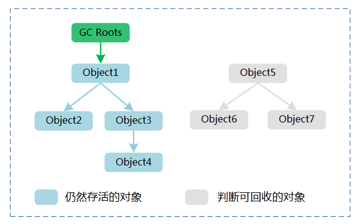

# 一、自动内存管理机制

## 1. 程序计数器
- 程序计数器是一块较小的内存空间，字节码解释器通过改变计数器的值来选取下一条需要执行的字节码指令。（分支、循环、跳转、异常处理）
- 线程私有，确保线程切换后能恢复到正确的位置
- 如果执行native方法，计数器值为空

## 2. Java虚拟机栈
- 线程私有
- 每个方法执行时都会创建一个栈帧，包含：
a)局部变量表b)操作数栈c)动态链接d)方法出口
>  - 局部变量表:编译期可知的基本数据类型(int byte long...)、对象引用(reference)、return的类型。---其中除了double和long占两个局部变量空间slot，其他都是一
## 3. 本地方法栈
- 本地方法一般是用其它语言（C、C++ 或汇编语言等）编写的，并且被编译为基于本机硬件和操作系统的程序，对待这些方法需要特别处理。
- 本地方法栈与 Java 虚拟机栈类似，它们之间的区别只不过是本地方法栈为本地方法服务。
## 4. Java堆
- 存放对象实例，所有对象实例存放在此处
- 不连续内存，逻辑上连续即可，可以扩展
## 5. 方法区
- 类信息class_info
- 常量
- 静态变量
- 编译器编译后的代码等数据（字节码）

## 6. 运行时常量池
- 类文件的常量池->字面量和符号引用
- 编译后的直接引用
- 并编译期才产生，运行期调用String的intern()函数会产生

## 7. 直接内存
- 不是运行时数据区的一部分
- 例如NIO，基于通道(Channel)与缓冲(Buffer)的I/O方式，他可以直接使用Nativeh函数直接分配堆外内存，然后通过储存在Java堆中的DirectByteBuffer对象作为这块内存的引用进行操作。在一些操作中避免在Native堆和java堆中频繁引用数据
- 受到本机内存（RAM）限制，如果java堆过大，导致直接内存过小，便会溢出。
## 对象的访问


## outofmemory实战
### 1. 堆溢出
```java
import java.util.ArrayList;
import java.util.List;
/* VM conf:-Xms20m -Xmx20m -XX:+HeapDumpOnOutOfMemoryError*/
//设置最小和最大值为20m，那么堆就不会自动扩展了
public class HeapOverflow {
    static class OOMObject {
    }
    public static void main(String[] args) {
        List<OOMObject> list = new ArrayList<OOMObject>();
        while (true) {
            list.add(new OOMObject());
        }
    }
}
```
输出结果
```
java.lang.OutOfMemoryError: Java heap space
Dumping heap to java_pid15340.hprof ...
Heap dump file created [28226884 bytes in 0.155 secs]
Exception in thread "main" java.lang.OutOfMemoryError: Java heap space
	at java.util.Arrays.copyOf(Arrays.java:3210)
	at java.util.Arrays.copyOf(Arrays.java:3181)
	at java.util.ArrayList.grow(ArrayList.java:265)
	at java.util.ArrayList.ensureExplicitCapacity(ArrayList.java:239)
	at java.util.ArrayList.ensureCapacityInternal(ArrayList.java:231)
	at java.util.ArrayList.add(ArrayList.java:462)
	at HeapOverflow.main(HeapOverflow.java:14)

Process finished with exit code 1

```
情况分析：
- 内存泄漏，可以用Jprofiler查看GC Roots的相关联，是如何与GCroot相连，导致无法回收
- 如不存在泄漏，检查堆参数-Xms -Xmx,是否可以调大

### 2. 栈溢出
Java虚拟机定义了两种栈异常
- 如果线程请求的栈深度大于虚拟机所允许的最大深度，将抛出stackoverflowerror的异常
- 如果虚拟机在扩展栈时，无法分配到足够的内存空间，则会抛出outofmemoryerror的异常

单线程测试基本上都是stackoverflowerror异常（下面代码）
栈溢出测试的两种方法：
- 使用-Xss参数减少栈内存的容量。结果：抛出StackOverflow异常，异常出现时堆栈深度相应缩小(内存小了容纳的栈也小了)
- 定义了大量的本地变量，增大方法帧中本地变量表的长度。异常出现时堆栈深度相应缩小(栈帧变大了容纳的栈也小了)

```java
public class JavaJVMStackSOF {
    /*VM Args: -Xss128k
    * 设置了栈内存的容量 */
    private int stackLength = 1;
    public void stackLeak() {
        stackLength++;
        stackLeak();
    }
    public static void main(String[] args) throws Throwable {
        JavaJVMStackSOF oom = new JavaJVMStackSOF();
        try {
            oom.stackLeak();
        } catch (Throwable e) {
            System.out.println("stacklenth = " + oom.stackLength);
            throw e;
        }
    }
}
```
输出结果
```
stacklenth = 997
Exception in thread "main" java.lang.StackOverflowError
	at JavaJVMStackSOF.stackLeak(JavaJVMStackSOF.java:9)
	at JavaJVMStackSOF.stackLeak(JavaJVMStackSOF.java:10)
	at JavaJVMStackSOF.stackLeak(JavaJVMStackSOF.java:10)
```

### 3. 关于常量池String的intern()函数
实例代码
```java
public class RuntimeConstantPoolOOM {

    public static void main(String[] args){
        String  str1 = new StringBuilder("计算机").append("软件").toString();
        System.out.println(str1.intern() == str1);

        String str2 = new StringBuilder("ja").append("va").toString();
        System.out.println(str2.intern() == str2);
    }

}
```
其中intern的实例常量池中没有，在1.6版本以前都是从堆复制到常量池，1.7之后都是复制堆的引用到常量池(详见[intern函数详解](https://www.runoob.com/java/java-string-intern.html))
所以1.7的输出结果
```
true
false
```
# 二、垃圾回收器
## 1. 判断程序是否可回收
**程序计数器**、**虚拟机栈和本地方法栈**这三个区域属于线程私有的，只存在于线程的生命周期内，线程结束之后也会消失，因此不需要对这三个区域进行垃圾回收。垃圾回收主要是针对 Java **堆和方法区**进行。
### 1) 引用计数算法
**描述**：给对象中添加一个引用计数器每当有一个地方引用它时，计数器就加1；当引用失效时，计数器值就减1；任何时刻计数器为0的对象就是不可能在被使用的。

**缺陷**：很难解决对象间相互循环引用的问题。
```java
public class ReferenceCountingGC {
    public Object instance = null;
    private static final int _1MB = 1024*1024;
    private byte[] bigSize = new byte[2*_1MB];
    public static void testGC(){
        ReferenceCountingGC objA = new ReferenceCountingGC();
        ReferenceCountingGC objB = new ReferenceCountingGC();
        objA = null;
        objB = null;
        System.gc();
    }
}
```

### 2) 可达性分析算法
**描述**：通过 GC Roots 作为起始点进行搜索，能够到达到的对象都是存活的，不可达的对象可被回收。
**可作为GC-Roots的对象：**
- 虚拟机栈（栈帧中的本地变量表）中引用的对象。
- 方法区中静态属性引用的对象。
- 方法区中常量引用的对象。
- 本地方法栈中 JNI （即一般说的 Native 方法）引用的对象


### 3) 引用类型
#### 1. 强引用（Strong Reference）
被强引用关联的对象不会被回收。

使用 new 一个新对象的方式来创建强引用。

```java
Object obj = new Object();
```

#### 2. 软引用（Soft Reference）
被软引用关联的对象只有在内存不够的情况下才会被回收。

使用 SoftReference 类来创建软引用。

这一点可以很好地用来解决OOM的问题，并且这个特性很适合用来实现缓存：比如网页缓存、图片缓存等。

```java
Object obj = new Object();
SoftReference<Object> sf = new SoftReference<Object>(obj);
obj = null;  // 使对象只被软引用关联
```

#### 3. 弱引用（Weak Reference）
被弱引用关联的对象一定会被回收，也就是说它只能存活到下一次垃圾回收发生之前。

使用 WeakReference 类来实现弱引用。

> 如果这个对象是偶尔的使用，并且希望在使用时随时就能获取到，但又不想影响此对象的垃圾收集，那么你应该用 Weak Reference 来记住此对象。

```java
Object obj = new Object();
WeakReference<Object> wf = new WeakReference<Object>(obj);
obj = null;
```

#### 4. 虚引用（Phantom Reference）
又称为幽灵引用或者幻影引用。一个对象是否有虚引用的存在，完全不会对其生存时间构成影响，也无法通过虚引用取得一个对象。

为一个对象设置虚引用关联的唯一目的就是能在这个对象被回收时收到一个系统通知。

使用 PhantomReference 来实现虚引用。
```java
Object obj = new Object();
PhantomReference<Object> pf = new PhantomReference<Object>(obj);
obj = null;
```

#### 5. finalize()
当一个对象可被回收时，如果需要执行该对象的 finalize() 方法，那么就有可能通过在该方法中让对象重新被引用，从而实现自救。自救只能进行一次，如果回收的对象之前调用了 finalize() 方法自救，后面回收时不会调用 finalize() 方法。

如果对象没有实现父类Object的finalize()方法，那么当其可被回收时，就直接回收了，无法自救。

尽量不要使用

### 4）方法区回收
Java虚拟机规范中确实说过可以不要求虚拟机在方法区实现垃圾收集，而且在方法区中进行垃圾收集的 “性价比” 一般比较低：在堆中，尤其在新生代中，常规的应用一次垃圾收集一般可以回收 70% ~ 95%的空间，而永久代的垃圾收集效率远低于此。

永久代的垃圾收集主要回收两部分：**废弃常量** 和 **无用的类**。
- 回收废弃常量与回收 Java 堆中的对象非常类似。
- 要判定一个类是否是 “无用的类” 的条件相对苛刻许多。类需要同时满足下面3个条件才能算 “无用的类”
  - 该类的所有实例都已经被回收。
  - 加载该类的 ClassLoader 已经被回收。
  - 该类对应的 java.lang.Class 对象没有在任何地方被引用，无法在任何地方通过反射访问该类的方法。

在大量使用反射、动态代理、GGLib 等 ByteCode 框架、动态生成 Jsp 以及 OSGI 这类频繁自定义 ClassLoader 的场景都需要虚拟机具备类卸载的功能，以保证永久代不会溢出。

### 5) 垃圾回收算法
[详解地址](https://github.com/frank-lam/fullstack-tutorial/blob/master/notes/JavaArchitecture/05-Java%E8%99%9A%E6%8B%9F%E6%9C%BA.md#3-%E5%9E%83%E5%9C%BE%E6%94%B6%E9%9B%86%E7%AE%97%E6%B3%95%E5%9E%83%E5%9C%BE%E5%A4%84%E7%90%86%E6%96%B9%E6%B3%95)

# 类文件结构

