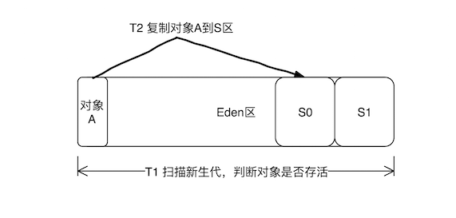
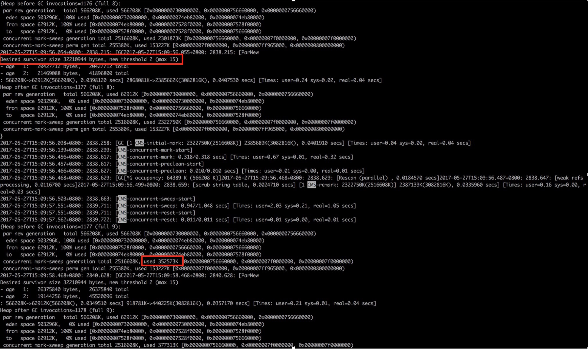
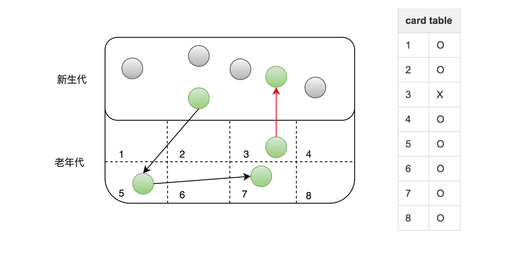

- [深入理解Java虚拟机调优](#%E6%B7%B1%E5%85%A5%E7%90%86%E8%A7%A3java%E8%99%9A%E6%8B%9F%E6%9C%BA%E8%B0%83%E4%BC%98)
  - [1.案例一：高性能硬件上的程序部署策略](#1%E6%A1%88%E4%BE%8B%E4%B8%80%E9%AB%98%E6%80%A7%E8%83%BD%E7%A1%AC%E4%BB%B6%E4%B8%8A%E7%9A%84%E7%A8%8B%E5%BA%8F%E9%83%A8%E7%BD%B2%E7%AD%96%E7%95%A5)
  - [- 相同程序在64位JDK消耗的内存一般比32位JDK大，这是由于指针膨胀。](#%E7%9B%B8%E5%90%8C%E7%A8%8B%E5%BA%8F%E5%9C%A864%E4%BD%8Djdk%E6%B6%88%E8%80%97%E7%9A%84%E5%86%85%E5%AD%98%E4%B8%80%E8%88%AC%E6%AF%9432%E4%BD%8Djdk%E5%A4%A7%E8%BF%99%E6%98%AF%E7%94%B1%E4%BA%8E%E6%8C%87%E9%92%88%E8%86%A8%E8%83%80)
  - [2. 案例二： 堆外内存导致的溢出错误](#2-%E6%A1%88%E4%BE%8B%E4%BA%8C-%E5%A0%86%E5%A4%96%E5%86%85%E5%AD%98%E5%AF%BC%E8%87%B4%E7%9A%84%E6%BA%A2%E5%87%BA%E9%94%99%E8%AF%AF)
- [美团技术团队关于虚拟机优化案例](#%E7%BE%8E%E5%9B%A2%E6%8A%80%E6%9C%AF%E5%9B%A2%E9%98%9F%E5%85%B3%E4%BA%8E%E8%99%9A%E6%8B%9F%E6%9C%BA%E4%BC%98%E5%8C%96%E6%A1%88%E4%BE%8B)
  - [案例一 Major GC和Minor GC频繁](#%E6%A1%88%E4%BE%8B%E4%B8%80-major-gc%E5%92%8Cminor-gc%E9%A2%91%E7%B9%81)
    - [确定目标](#%E7%A1%AE%E5%AE%9A%E7%9B%AE%E6%A0%87)
    - [优化](#%E4%BC%98%E5%8C%96)
    - [优化结果](#%E4%BC%98%E5%8C%96%E7%BB%93%E6%9E%9C)
    - [小结](#%E5%B0%8F%E7%BB%93)
    - [更多思考](#%E6%9B%B4%E5%A4%9A%E6%80%9D%E8%80%83)
  - [案例一 Major GC和Minor GC频繁](#%E6%A1%88%E4%BE%8B%E4%B8%80-major-gc%E5%92%8Cminor-gc%E9%A2%91%E7%B9%81-1)
    - [确定目标](#%E7%A1%AE%E5%AE%9A%E7%9B%AE%E6%A0%87-1)
    - [优化](#%E4%BC%98%E5%8C%96-1)
    - [优化结果](#%E4%BC%98%E5%8C%96%E7%BB%93%E6%9E%9C-1)
    - [小结](#%E5%B0%8F%E7%BB%93-1)
    - [更多思考](#%E6%9B%B4%E5%A4%9A%E6%80%9D%E8%80%83-1)

# 深入理解Java虚拟机调优
## 1.案例一：高性能硬件上的程序部署策略
**案例简介：**

一个15万PV/天左右的在线文档类型网站最近更换了硬件系统，新的硬件为4个CPU、16GB物理内存，操作系统为64位CentOs5.4。

管理员为了尽量利用硬件资源选用了64位的JDK1.5，并通过-Xms和-Xms参数将Java堆固定在12GB，使用了一段时间后发现了网站经常不定期出现长时间失去响应的情况。

**分析：**

1. 监控服务器运行状况后发现网站失去响应是由GC停顿导致的，虚拟机运行在Server模式下，默认使用吞吐量优先收集器，回收12GB的堆，一次full CG的停顿时间高达14秒。
2. 由于程序设计的关系，访问文档时要把文档从磁盘提取到内存中，导致内存中出现很多由文档序列化产生的大对象，很多大对象由于新生代eden大小阈值设置的原因，直接进入了老年代，即使有12GB的堆，内存也很快就被消耗殆尽。由此导致每隔十几分钟出现十几秒的停顿。

**解决方案**:

调整方案为建立5个32位JDK的逻辑集群，每个进程按2GB内存计算，占用了10GB内存。考虑到用户对响应速度比较关心，并且文档服务的主要压力集中在磁盘和内存的访问，cpu资源敏感度低，因此改为CMS垃圾回收器。

**高性能部署方案**：
- 通过64位JDK来使用大内存
- 使用若干个32位虚拟机建立逻辑集群来利用硬件资源

1. 通过64位JDK来使用大内存

这种部署方式，一定要注意在分配的堆内存够大的情况下，应用程序的Full CG频率要低，特别是对于用户交互性强、对停顿时间敏感的系统。

可以在深夜执行定时任务触发full CG或者重启服务器来保持内存可用空间在一个稳定水平。

对于这种超大堆部署的网站，只要代码写的合理，网站响应速度还是有保障的。

但这种部署方式必须考虑以下问题：
- 内存回收导致长时间的停顿
- 现阶段，64位JDK的性能测试普遍低于32位JDK
- 需要保持程序足够稳定，因为产生的堆溢出快照Dump文件有十几GB，难以分析
- 相同程序在64位JDK消耗的内存一般比32位JDK大，这是由于指针膨胀。
---
2. 使用若干个32位虚拟机建立逻辑集群来利用硬件资源

优点就不说了
主要是缺点：
- 尽量避免节点竞争全局的资源，最典型的就是磁盘竞争，如果各个节点同时访问某个磁盘文件，尤其是并发写操作，容易导致IO异常。
- 很难最高效的利用某些资源池，比如连接池，一般都是在各个节点建立自己独立的连接池，这样很有可能导致一些节点池满了，而另一些节点仍有较多的空余。
- 各个节点收到32位系统的内存限制，也就是windows平台中每个进程只能使用2GB的内存，考虑到内存额外的内存开销，堆一般最多只能开到1.5GB。在某些linux系统中，可以提升至3GB至接近4GB的内存。
- 大量使用本地缓冲的应用（如大量使用HashMap作为K/V缓存），在逻辑集群中会造成较大的内存浪费，因为每个逻辑节点上都会有一份缓存，这时候可以考虑把本地缓存改为集中式缓存。

## 2. 案例二： 堆外内存导致的溢出错误
**案例简介**：

一个学校的小型项目：基于B/S的电子考试系统，测试期间发现服务端不定时抛出内存溢出异常，服务器不一定每一次都会出现异常，网站管理员尝试过把堆开到最大，而32位系统最多到1.6GB就基本无法在加大了，而且开大了基本没有效果，抛出内存溢出异常更加频繁。

**分析**：

此服务器使用32位windows平台的限制是2GB，其中划分了1.6GB给JAVA堆，而Direct Memory内存并没有算入1.6GB的内存之内。因此它最大也只能在剩余的0.4GB空间中分出一部分。

关键：DirectMemory不能像新生代、老年代那样，只能通过老年代满了后Full CG，然后顺便的清理直接内存的废弃对象。否则它只能等派出内存溢出，然后catch掉，在catch块中执行System.gc()。如果虚拟机不执行gc，那么就只能眼睁睁自己抛出内存溢出异常。

由于这个项目用来大量的NIO操作，需要使用到DirectMemory内存

**注意**：

以下区域还会占用较多的内存：
- Direct Memory：内存不足抛出OutOfMemoryError
- 线程堆栈： 内存不足抛出StackOverflowError（无法分配新的栈帧）
- Socket缓存区：Receive和Send两个缓存区分别占大约37KB和25KB内存。连接多的话也会耗内存，如果无法分配，则会抛出IOException：too many open files异常
- JNI（java native interface）代码：调用本地库分配的内存也不再堆中。
- 虚拟机和GC：虚拟机、GC的代码执行也要消耗一定的内存。

# 美团技术团队关于虚拟机优化案例
[具体详细链接](https://tech.meituan.com/2017/12/29/jvm-optimize.html)
## 案例一 Major GC和Minor GC频繁
### 确定目标
服务情况：Minor GC每分钟100次 ，Major GC每4分钟一次，单次Minor GC耗时25ms，单次Major GC耗时200ms，接口响应时间50ms。

由于这个服务要求低延时高可用，结合上文中提到的GC对服务响应时间的影响，计算可知由于Minor GC的发生，12.5%的请求响应时间会增加，其中8.3%的请求响应时间会增加25ms，可见当前GC情况对响应时间影响较大。

（50ms+25ms）× 100次/60000ms = 12.5%，50ms × 100次/60000ms = 8.3% 。

优化目标：降低TP99、TP90时间。

### 优化
首先优化Minor GC频繁问题。通常情况下，由于新生代空间较小，Eden区很快被填满，就会导致频繁Minor GC，因此可以通过增大新生代空间来降低Minor GC的频率。例如在相同的内存分配率的前提下，新生代中的Eden区增加一倍，Minor GC的次数就会减少一半。

这时很多人有这样的疑问，扩容Eden区虽然可以减少Minor GC的次数，但会增加单次Minor GC时间么？根据上面公式，如果单次Minor GC时间也增加，很难保证最后的优化效果。我们结合下面情况来分析，单次Minor GC时间主要受哪些因素影响？是否和新生代大小存在线性关系？ 首先，单次Minor GC时间由以下两部分组成：T1（扫描新生代）和 T2（复制存活对象到Survivor区）如下图。（注：这里为了简化问题，我们认为T1只扫描新生代判断对象是否存活的时间，其实该阶段还需要扫描部分老年代，后面案例中有详细描述。）

- 扩容前：新生代容量为R ，假设对象A的存活时间为750ms，Minor GC间隔500ms，那么本次Minor GC时间= T1（扫描新生代R）+T2（复制对象A到S）。

- 扩容后：新生代容量为2R ，对象A的生命周期为750ms，那么Minor GC间隔增加为1000ms，此时Minor GC对象A已不再存活，不需要把它复制到Survivor区，那么本次GC时间 = 2 × T1（扫描新生代R），没有T2复制时间。

可见，扩容后，Minor GC时增加了T1（扫描时间），但省去T2（复制对象）的时间，更重要的是对于虚拟机来说，**复制对象的成本要远高于扫描成本**，所以，**单次Minor GC时间更多取决于GC后存活对象的数量，而非Eden区的大小**。因此如果堆中短期对象很多，那么扩容新生代，单次Minor GC时间不会显著增加。下面需要确认下服务中对象的生命周期分布情况：

通过上图GC日志中两处红色框标记内容可知： 1. new threshold = 2（动态年龄判断，对象的晋升年龄阈值为2），对象仅经历2次Minor GC后就晋升到老年代，这样老年代会迅速被填满，直接导致了频繁的Major GC。 2. Major GC后老年代使用空间为300M+，意味着此时绝大多数(86% = 2G/2.3G)的对象已经不再存活，也就是说生命周期长的对象占比很小。

由此可见，服务中存在大量短期临时对象，扩容新生代空间后，Minor GC频率降低，对象在新生代得到充分回收，只有生命周期长的对象才进入老年代。这样老年代增速变慢，Major GC频率自然也会降低。

### 优化结果
通过扩容新生代为为原来的三倍，单次Minor GC时间增加小于5ms，频率下降了60%，服务响应时间TP90，TP99都下降了10ms+，服务可用性得到提升。

调整前：

调整后：

### 小结
如何选择各分区大小应该依赖应用程序中**对象生命周期的分布情况：如果应用存在大量的短期对象，应该选择较大的年轻代；如果存在相对较多的持久对象，老年代应该适当增大**。

### 更多思考
关于上文中提到晋升年龄阈值为2，很多同学有疑问，为什么设置了MaxTenuringThreshold=15，对象仍然仅经历2次Minor GC，就晋升到老年代？这里涉及到“动态年龄计算”的概念。

动态年龄计算虚拟机并不是永远地要求对象的年龄必须达到 MaxTenuringThreshold 才能晋升老年代，如果在 Survivor 中相同年龄所有对象大小的总和大于 Survivor 空间的一半，则年龄大于或等于该年龄的对象可以直接进入老年代，无需等到 MaxTenuringThreshold 中要求的年龄。

JVM引入动态年龄计算，主要基于如下两点考虑：

如果固定按照MaxTenuringThreshold设定的阈值作为晋升条件：
-  a）MaxTenuringThreshold设置的过大，原本应该晋升的对象一直停留在Survivor区，直到Survivor区溢出，一旦溢出发生，Eden+Svuvivor中对象将不再依据年龄**全部提升到老年代**，这样对象老化的机制就失效了。 
-  b）MaxTenuringThreshold设置的过小，“过早晋升”即对象不能在新生代充分被回收，**大量短期对象被晋升到老年代**，老年代空间迅速增长，引起频繁的Major GC。分代回收失去了意义，严重影响GC性能。

总结来说，为了更好的适应不同程序的内存情况，虚拟机并不总是要求对象年龄必须达到Maxtenuringthreshhold再晋级老年代。

## 案例一 Major GC和Minor GC频繁
### 确定目标
GC日志显示，高峰期CMS在重标记（Remark）阶段耗时1.39s。Remark阶段是Stop-The-World（以下简称为STW）的，即在执行垃圾回收时，Java应用程序中除了垃圾回收器线程之外其他所有线程都被挂起，意味着在此期间，用户正常工作的线程全部被暂停下来，这是低延时服务不能接受的。本次优化目标是降低Remark时间。

### 优化
回顾cms GC四个过程
- 初始标记Init-mark：仅仅只是标记一下 GC Roots 能直接关联到的对象，速度很快，需要停顿。
- 并发标记Concurrent-mark：进行 GC Roots Tracing 的过程，它在整个回收过程中耗时最长，不需要停顿。
- 重新标记Remark：为了修正并发标记期间因用户程序继续运作而导致标记产生变动的那一部分对象的标记记录，需要停顿。
- 并发清除：不需要停顿。

remark并发标记阶段：必须扫描整个堆来判断对象是否存活，而不仅仅是老年代。所以当年轻代中”不可达对象“没有被minorCG清理时，remark照样会标记他们，而标记这样的年轻代会浪费很多时间

新生代中对象的特点是“朝生夕灭”，这样如果Remark前执行一次Minor GC，大部分对象就会被回收。CMS就采用了这样的方式，在Remark前增加了一个可中断的并发预清理（CMS-concurrent-abortable-preclean），该阶段主要工作仍然是并发标记对象是否存活，只是这个过程可被中断。此阶段在Eden区使用超过2M时启动，当然2M是默认的阈值，可以通过参数修改。如果此阶段执行时等到了Minor GC，那么上述灰色对象将被回收，Reamark阶段需要扫描的对象就少了。

除此之外CMS为了避免这个阶段没有等到Minor GC而陷入无限等待，提供了参数CMSMaxAbortablePrecleanTime ，默认为5s，含义是如果可中断的预清理执行超过5s，不管发没发生Minor GC，都会中止此阶段，进入Remark。 根据GC日志红色标记2处显示，可中断的并发预清理执行了5.35s，超过了设置的5s被中断，期间没有等到Minor GC ，所以Remark时新生代中仍然有很多对象。

对于这种情况，**CMS提供CMSScavengeBeforeRemark参数，用来保证Remark前强制进行一次Minor GC**。

### 优化结果
经过增加CMSScavengeBeforeRemark参数，单次执行时间>200ms的GC停顿消失，从监控上观察，GCtime和业务波动保持一致，不再有明显的毛刺。

### 小结
通过案例分析了解到，由于跨代引用的存在，CMS在Remark阶段必须扫描整个堆，同时为了避免扫描时新生代有很多对象，增加了可中断的预清理阶段用来等待Minor GC的发生。只是该阶段有时间限制，如果超时等不到Minor GC，Remark时新生代仍然有很多对象，我们的调优策略是，通过参数强制Remark前进行一次Minor GC，从而降低Remark阶段的时间。

### 更多思考
案例中只涉及老年代GC，其实新生代GC存在同样的问题，即老年代可能持有新生代对象引用，**所以Minor GC时也必须扫描老年代**。

JVM是如何避免Minor GC时扫描全堆的？ 经过统计信息显示，老年代持有新生代对象引用的情况不足1%，根据这一特性JVM引入了卡表（card table）来实现这一目的。如下图所示：

卡表的具体策略是将老年代的空间分成大小为512B的若干张卡（card）。卡表本身是单字节数组，数组中的每个元素对应着一张卡，当发生老年代引用新生代时，虚拟机将该卡对应的卡表元素设置为适当的值。如上图所示，卡表3被标记为脏（卡表还有另外的作用，标识并发标记阶段哪些块被修改过），之后Minor GC时通过扫描卡表就可以很快的识别哪些卡中存在老年代指向新生代的引用。这样虚拟机**通过空间换时间的方式，避免了全堆扫描**。