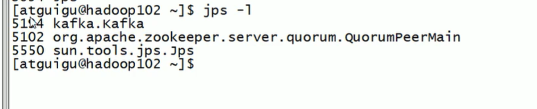

[TOC]


# 1.linux的安装

先去下载一个linux的镜像文件

安装时注意以下几点：

设置NAT为虚拟机的网络连接方式：

1. nat是一个网关代理，将内网与外网链接
2. nat的网络地址在我的机器为192.168.100.2，用于连接主机ip传送网络，在windows的网络适配器中vm8的ipv4属性中设置。
3. 虚拟机vm8的主机ip为192.168.100.1（第一个ip地址都是传送网络的地址，并不是第一个可用子网），子网掩码为255.255.255.0
4. 我自己虚拟机linux的ip设置为192.168.100.10,在0~255之间
5. 虚拟机有个vm1的ip为192.168.254.0因该是虚拟机更新配置用的地址。。。。

- 这里再说以下网络的知识，向上面这种子网配置，第一个子网可用ip地址是192.168.254.1,传送网络的地址是192.168.254.0，最后一个地址是192.168.254.255是一个广播地址。

磁盘的配置见：https://blog.csdn.net/u011857683/article/details/80949245

网络配置见：https://blog.csdn.net/BokeyGeGe/article/details/78631328

### 网络配置地址

cd /etc/sysconfig/network-scripts/ifcfg-enth33

修改完毕后 ```service network restart```启动服务

### 基本工具

gpm记得安装，不然没有鼠标，安装后还要systemctl start gpm


### 主机访问linux内网web地址

https://www.cnblogs.com/foreverlin/p/10163756.html


```jps -l```



