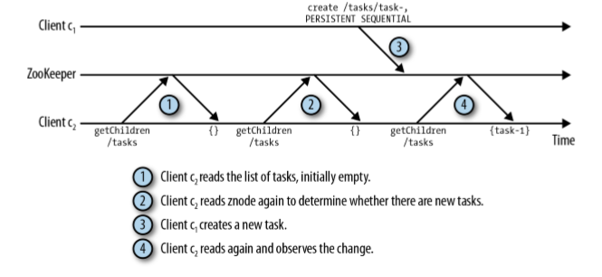

zookeeper以树形的文件结构运行

### 空节点：

> the absence of a master znode means that no master is currently elected.


### znode只储存二进制文件：

>  Znodes may or may not contain data. If a znode contains any data, the data is stored as a byte array. The exact format of the byte array is specific to each application, and ZooKeeper does not directly provide support to parse it. Serialization packages such as Protocol Buffers, Thrift, Avro, and MessagePack 

### zookeeper api:

The ZooKeeper API exposes the following operations: create /path data Creates a znode named with /path and containing data

```shell
delete /path #Deletes the znode /path
exists /path #Checks whether /path exists
setData /path #data Sets the data of znode /path to data
getData /path #Returns the data in /path
getChildren /path #Returns the list of children under /path
```

### zookeeper 节点四种模式

 persistent,

ephemeral

 persistent_sequential

 ephemeral_sequential

### 观察与通知

一般同步性做法：观察者一直观察，那么代价就会很昂贵



zookeeper使用通知机制，客户端2设置观察某个文件夹，当zookeeper这个文件夹改变时，zookeeper就会发来通知给客户端2。


 A client can set a watch for ：

changes to the data of a znode

changes to the children of a znode

a znode being created or deleted


### 每个znode都有一个版本号

它随着每次数据变化⽽⾃增。两个API 操作可以有条件地执行：setData和delete。这两个调⽤以版本号作为转⼊参 数，只有当转⼊参数的版本号与服务器上的版本号⼀致时调⽤才会成功。 


### zookeepeer集群配置文件

```shell
tickTime=2000 
initLimit=10 
syncLimit=5 
dataDir=./data 
clientPort=2181 #客户端连接接口
#服务器名=服务器地址:各服务器通信端口:选举端口
server.1=127.0.0.1:2222:2223 
server.2=127.0.0.1:3333:3334 
server.3=127.0.0.1:4444:4445

```


### 用zookeeper实现分布式锁

“锁🔒”可以看作zookeeper下面的一个znode

如果一台机器要获得锁，那么就建立一个/lock文件的znode，从而获得分布式锁。其他机器查看zookeeper有没有/lock这个znode，如果有的话就阻塞，只当/lock被删除（也就是锁释放）

> 考虑到这台获得锁的机器会宕机，那么这个/lock应该为临时znode，以防宕机后无法释放锁。宕机后让连接session消失，从而临时znode也会被释放