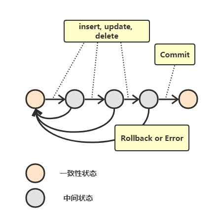
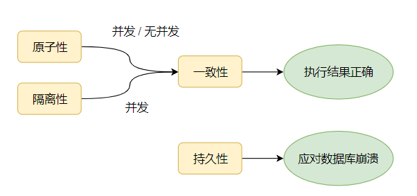
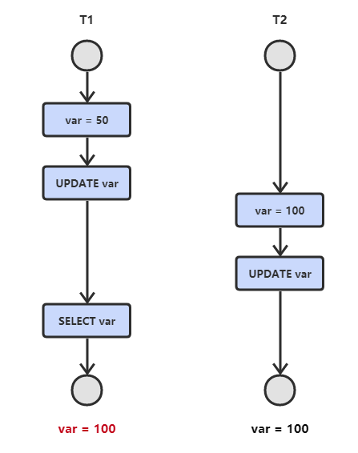

- [简介](#%E7%AE%80%E4%BB%8B)
  - [1. mysql 架构](#1-mysql-%E6%9E%B6%E6%9E%84)
  - [2. 并发控制](#2-%E5%B9%B6%E5%8F%91%E6%8E%A7%E5%88%B6)
    - [1 悲观锁](#1-%E6%82%B2%E8%A7%82%E9%94%81)
      - [读锁、写锁](#%E8%AF%BB%E9%94%81%E5%86%99%E9%94%81)
    - [2 乐观锁](#2-%E4%B9%90%E8%A7%82%E9%94%81)
    - [3 锁的粒度](#3-%E9%94%81%E7%9A%84%E7%B2%92%E5%BA%A6)
      - [表锁和行级锁](#%E8%A1%A8%E9%94%81%E5%92%8C%E8%A1%8C%E7%BA%A7%E9%94%81)
    - [4 死锁](#4-%E6%AD%BB%E9%94%81)
  - [3. 事务](#3-%E4%BA%8B%E5%8A%A1)
    - [1. 什么是事务](#1-%E4%BB%80%E4%B9%88%E6%98%AF%E4%BA%8B%E5%8A%A1)
    - [AUTOCOMMIT](#autocommit)
    - [2. 数据库ACID](#2-%E6%95%B0%E6%8D%AE%E5%BA%93acid)
      - [1. 原子性（Atomicity）](#1-%E5%8E%9F%E5%AD%90%E6%80%A7atomicity)
      - [2. 一致性（Consistency）](#2-%E4%B8%80%E8%87%B4%E6%80%A7consistency)
      - [3. 隔离性（Isolation）](#3-%E9%9A%94%E7%A6%BB%E6%80%A7isolation)
      - [4. 持久性（Durability）](#4-%E6%8C%81%E4%B9%85%E6%80%A7durability)
  - [4. 隔离级别！](#4-%E9%9A%94%E7%A6%BB%E7%BA%A7%E5%88%AB)
    - [并发一致性问题](#%E5%B9%B6%E5%8F%91%E4%B8%80%E8%87%B4%E6%80%A7%E9%97%AE%E9%A2%98)
      - [1.丢失修改（两个事务同时update）](#1%E4%B8%A2%E5%A4%B1%E4%BF%AE%E6%94%B9%E4%B8%A4%E4%B8%AA%E4%BA%8B%E5%8A%A1%E5%90%8C%E6%97%B6update)
      - [2.脏读（两个事务其中一个rollback，并没有提交）](#2%E8%84%8F%E8%AF%BB%E4%B8%A4%E4%B8%AA%E4%BA%8B%E5%8A%A1%E5%85%B6%E4%B8%AD%E4%B8%80%E4%B8%AArollback%E5%B9%B6%E6%B2%A1%E6%9C%89%E6%8F%90%E4%BA%A4)
      - [3.不可重复读（两个事务一个更新，一个读两次）](#3%E4%B8%8D%E5%8F%AF%E9%87%8D%E5%A4%8D%E8%AF%BB%E4%B8%A4%E4%B8%AA%E4%BA%8B%E5%8A%A1%E4%B8%80%E4%B8%AA%E6%9B%B4%E6%96%B0%E4%B8%80%E4%B8%AA%E8%AF%BB%E4%B8%A4%E6%AC%A1)
      - [4. 幻读（两个事务，一个事务读两次行数，一个事务插入一行）](#4-%E5%B9%BB%E8%AF%BB%E4%B8%A4%E4%B8%AA%E4%BA%8B%E5%8A%A1%E4%B8%80%E4%B8%AA%E4%BA%8B%E5%8A%A1%E8%AF%BB%E4%B8%A4%E6%AC%A1%E8%A1%8C%E6%95%B0%E4%B8%80%E4%B8%AA%E4%BA%8B%E5%8A%A1%E6%8F%92%E5%85%A5%E4%B8%80%E8%A1%8C)
    - [事务隔离级别](#%E4%BA%8B%E5%8A%A1%E9%9A%94%E7%A6%BB%E7%BA%A7%E5%88%AB)
      - [1. 串行化 (Serializable)](#1-%E4%B8%B2%E8%A1%8C%E5%8C%96-serializable)
      - [2. 可重复读 (Repeated Read)](#2-%E5%8F%AF%E9%87%8D%E5%A4%8D%E8%AF%BB-repeated-read)
      - [3. 读已提交 (Read Committed)](#3-%E8%AF%BB%E5%B7%B2%E6%8F%90%E4%BA%A4-read-committed)
      - [4. 读未提交 (Read Uncommitted)](#4-%E8%AF%BB%E6%9C%AA%E6%8F%90%E4%BA%A4-read-uncommitted)
# 简介
## 1. mysql 架构


- 第一层：客户端：  连接处理、授权认证、安全等
- 第二层：
  - 解析器：　sql请求发送到server端，需要经过解析器生成内部的数据结构对象，以方便进行优化和生成执行计划。解析器主要做了两件事情，词法分析和语法分析。
  - 查询缓存：用来缓存我们所执行的SELECT语句以及该语句的结果集
  - 优化器：发现执行SQL查询的最佳方案

## 2. 并发控制
### 1 悲观锁
#### 读锁、写锁
- 共享锁（读锁）：是共享的，相互不阻塞。多个客户可在同一时刻同时读取统一资源。
```sql
SELECT * from TABLE where id = 1  lock in share mode;
```
- 排他锁（写锁）：是排他的，一个写锁可以阻塞其他的写锁和读锁。可以保证同一时间只有一个用户修改数据，并且其他人无法读取和修改
```sql
select status from TABLE where id=1 for update;
```
写锁的优先级比表锁高

### 2 乐观锁
用数据版本(Version)记录机制实现的。mysql大多数事务型引擎都实现了MVCC多版本控制，而且只在**重复读**和**提交读**执行

MVCC时行级锁的一个变种，他在很多情况下避免了加锁操作，因此开销更低。虽然实现机制有所不同，但是大多数都实现了非阻塞的读操作，写操作也只用锁定必要的行，

为数据增加一个版本标识Version字段来实现。当读取数据时，讲version的字段一同读取出来，每更新一次version值+1。

在重复读隔离级别下：
- select：
  - InnoDB只查找版本号早于当前事务版本的数据行，可以确保事务读取的行，要么是事务开始前已经存在的，要么是事务自身插入后或修改过的。
  - 行的删除版本号要么是未定义（表示没被删除），要么是大于当前事务版本号（表示此事务结束后才被删除）
- Insert：
    - InnoDB为新插入的行保存当前事务版本号作为行版本号
- DELETE：
    - InnoDB为删除的每一行保存当前版本号作为删除标识号
- UPDATE：
    - InnoDB先插入新记录的行并标识当前版本号，原来的行不删除，而是把原来的行标识号改为删除标识号，与此事务版本号相同。 

### 3 锁的粒度
#### 表锁和行级锁
- 表锁：开销非常的小，但是会锁定整张表。使用的是写锁。例如用Alter Table之类的语句都是用的表锁。
- 行级锁：可以最大程度的支持并发处理，同时也带来了最大的锁开销。InnoDB实现了行级锁。

### 4 死锁

死锁（Deadlock） 所谓死锁：是指两个或两个以上的进程在执行过程中，因争夺资源而造成的一种互相等待的现象，若无外力作用，它们都将无法推进下去。此时称系统处于死锁状态或系统产生了死锁，这些永远在互相等待的进程称为死锁进程。由于资源占用是互斥的，当某个进程提出申请资源后，使得有关进程在无外力协助下，永远分配不到必需的资源而无法继续运行，这就产生了一种特殊现象死锁。
举例：
```sql
//affair1
START TRANSACTION
UPDATE StockPrice SET close = 45.50 where stock_id = 4 and date ='2002-05-01';
UPDATE StockPrice SET close = 19.8 where stock_id = 3 and date ='2002-05-02';
COMMIT;

//affair2
START TRANSACTION
UPDATE StockPrice SET close = 20.12 where stock_id = 3 and date ='2002-05-01';
UPDATE StockPrice SET close = 47.2 where stock_id = 4 and date ='2002-05-02';
COMMIT;
```

如果凑巧，两个事务都同时执行了第一条UPDATE，都锁定了该行，那么都要执行第二条sql时发现互相锁定了，即死锁。

解决死锁的几个方法：

- **第一种**
1. 查询是否锁表
```sql
show OPEN TABLES where In_use > 0;
```  
2. 查询进程（如果您有SUPER权限，您可以看到所有线程。否则，您只能看到您自己的线程）
```sql
show processlist
```
3. 杀死进程id（就是上面命令的id列）
```sql
kill id
```

- **第二种**
1. 查看当前的事务
```sql
SELECT * FROM INFORMATION_SCHEMA.INNODB_TRX;
```
2. 查看当前锁定的事务
```sql
SELECT * FROM INFORMATION_SCHEMA.INNODB_LOCKS;
```
3. 查看当前等锁的事务
```sql
SELECT * FROM INFORMATION_SCHEMA.INNODB_LOCK_WAITS;
```
4. 杀死进程
```sql
kill 进程ID
```

## 3. 事务
### 1. 什么是事务


事务指的是满足 ACID 特性的一组操作，可以通过 Commit 提交一个事务，也可以使用 Rollback 进行回滚。

### AUTOCOMMIT
MySQL 默认采用自动提交模式。也就是说，如果不显式使用 START TRANSACTION 语句来开始一个事务，那么每个查询都会被当做一个事务自动提交

### 2. 数据库ACID
#### 1. 原子性（Atomicity）

　　原子性是指事务是一个不可分割的工作单位，事务中的操作要么全部成功，要么全部失败。比如在同一个事务中的SQL语句，要么全部执行成功，要么全部执行失败。

回滚可以用日志来实现，日志记录着事务所执行的修改操作，在回滚时反向执行这些修改操作即可。

#### 2. 一致性（Consistency）

　　事务必须使数据库从一个一致性状态变换到另外一个一致性状态。以转账为例子，A向B转账，假设转账之前这两个用户的钱加起来总共是2000，那么A向B转账之后，不管这两个账户怎么转，A用户的钱和B用户的钱加起来的总额还是2000，这个就是事务的一致性。

#### 3. 隔离性（Isolation）

　　隔离性是当多个用户并发访问数据库时，比如操作同一张表时，数据库为每一个用户开启的事务，不能被其他事务的操作所干扰，多个并发事务之间要相互隔离。

　　即要达到这么一种效果：对于任意两个并发的事务 T1 和 T2，在事务 T1 看来，T2 要么在 T1 开始之前就已经结束，要么在 T1 结束之后才开始，这样每个事务都感觉不到有其他事务在并发地执行。

#### 4. 持久性（Durability）

　　一旦事务提交，则其所做的修改将会永远保存到数据库中。即使系统发生崩溃，事务执行的结果也不能丢失。

　　可以通过数据库备份和恢复来实现，在系统发生奔溃时，使用备份的数据库进行数据恢复。



## 4. 隔离级别！
### 并发一致性问题
#### 1.丢失修改（两个事务同时update）
　 T1 和 T2 两个事务都对一个数据进行修改，T1 先修改，T2 随后修改，T2 的修改覆盖了 T1 的修改。



原本T1的查询结果为50，现在变成100了！

#### 2.脏读（两个事务其中一个rollback，并没有提交）
（针对未提交数据）如果一个事务中对数据进行了更新，但**事务还没有提交**，另一个事务可以 “看到” 该事务没有提交的更新结果，这样造成的问题就是，如果第一个事务回滚，那么，第二个事务在此之前所 “看到” 的数据就是一笔脏数据。 （**脏读又称无效数据读出。一个事务读取另外一个事务还没有提交的数据叫脏读**。 ）

**解决办法**：把数据库的事务隔离级别调整到READ_COMMITTED


#### 3.不可重复读（两个事务一个更新，一个读两次）
　　是指在一个事务内，多次读同一数据。在这个事务还没有结束时，另外一个事务也访问该同一数据。那么，在第一个事务中的两次读数据之间，由于第二个事务的修改，那么第一个事务两次读到的的数据可能是不一样的。这样在一个事务内两次读到的数据是不一样的，因此称为是不可重复读。（同时操作，事务1分别读取事务2操作时和提交后的数据，读取的记录内容不一致。**不可重复读是指在同一个事务内，两个相同的查询返回了不同的结果**。 ）


#### 4. 幻读（两个事务，一个事务读两次行数，一个事务插入一行）
　事务 T1 读取一条指定的 Where 子句所返回的结果集，然后 T2 事务新插入一行记录，这行记录恰好可以满足T1 所使用的查询条件。然后 T1 再次对表进行检索，但又看到了 T2 插入的数据。 （**和可重复读类似<修改丢失>，但是事务 T2 的数据操作仅仅是插入和删除，不是修改数据，读取的记录数量前后不一致**）


### 事务隔离级别

#### 1. 串行化 (Serializable)

　　所有事务一个接着一个的执行，这样可以避免幻读 (phantom read)，对于基于锁来实现并发控制的数据库来说，串行化要求在执行范围查询的时候，需要获取范围锁，如果不是基于锁实现并发控制的数据库，则检查到有违反串行操作的事务时，需回滚该事务。

#### 2. 可重复读 (Repeated Read)

　　所有被 Select 获取的数据都不能被修改，这样就可以避免一个事务前后读取数据不一致的情况。但是却没有办法控制幻读，因为这个时候其他事务不能更改所选的数据，但是可以增加数据，即前一个事务有读锁但是没有范围锁，为什么叫做可重复读等级呢？那是因为该等级解决了下面的不可重复读问题。

　　引申：现在主流数据库都使用 MVCC 并发控制，使用之后RR（可重复读）隔离级别下是不会出现幻读的现象。

#### 3. 读已提交 (Read Committed)

　　被读取的数据可以被其他事务修改，这样可能导致不可重复读。也就是说，事务读取的时候获取读锁，但是在读完之后立即释放(不需要等事务结束)，而写锁则是事务提交之后才释放，释放读锁之后，就可能被其他事务修改数据。该等级也是 SQL Server 默认的隔离等级。

#### 4. 读未提交 (Read Uncommitted)

　　最低的隔离等级，允许其他事务看到没有提交的数据，会导致脏读。

隔离级别|脏读|不可重复读|幻读
-|-|-|-
串行化|❌|❌|❌
可重复读|❌|❌|✔
读已提交|❌|✔|✔
读未提交|✔|✔|✔
