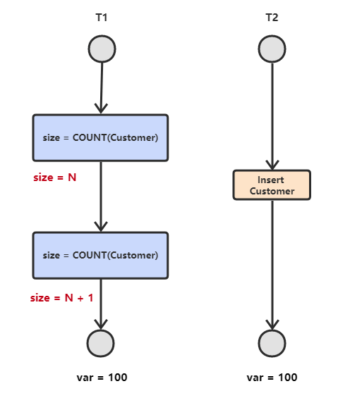
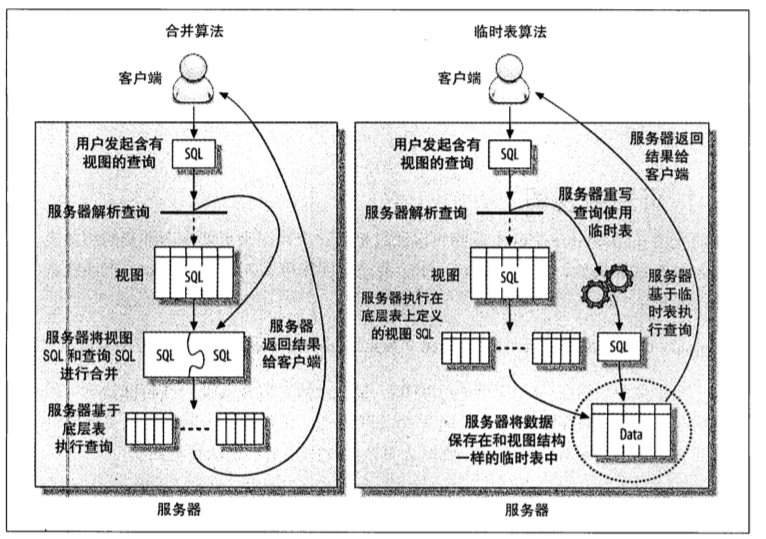

- [一、简介](#%E4%B8%80%E7%AE%80%E4%BB%8B)
  - [1. mysql 架构](#1-mysql-%E6%9E%B6%E6%9E%84)
  - [2. 并发控制](#2-%E5%B9%B6%E5%8F%91%E6%8E%A7%E5%88%B6)
    - [1 悲观锁](#1-%E6%82%B2%E8%A7%82%E9%94%81)
      - [读锁、写锁](#%E8%AF%BB%E9%94%81%E5%86%99%E9%94%81)
    - [2 乐观锁](#2-%E4%B9%90%E8%A7%82%E9%94%81)
    - [3 锁的粒度](#3-%E9%94%81%E7%9A%84%E7%B2%92%E5%BA%A6)
      - [表锁和行级锁](#%E8%A1%A8%E9%94%81%E5%92%8C%E8%A1%8C%E7%BA%A7%E9%94%81)
    - [4 死锁](#4-%E6%AD%BB%E9%94%81)
  - [3. 事务](#3-%E4%BA%8B%E5%8A%A1)
    - [1. 什么是事务](#1-%E4%BB%80%E4%B9%88%E6%98%AF%E4%BA%8B%E5%8A%A1)
    - [AUTOCOMMIT](#autocommit)
    - [2. 数据库ACID](#2-%E6%95%B0%E6%8D%AE%E5%BA%93acid)
      - [1. 原子性（Atomicity）](#1-%E5%8E%9F%E5%AD%90%E6%80%A7atomicity)
      - [2. 一致性（Consistency）](#2-%E4%B8%80%E8%87%B4%E6%80%A7consistency)
      - [3. 隔离性（Isolation）](#3-%E9%9A%94%E7%A6%BB%E6%80%A7isolation)
      - [4. 持久性（Durability）](#4-%E6%8C%81%E4%B9%85%E6%80%A7durability)
  - [4. 隔离级别！](#4-%E9%9A%94%E7%A6%BB%E7%BA%A7%E5%88%AB)
    - [并发一致性问题](#%E5%B9%B6%E5%8F%91%E4%B8%80%E8%87%B4%E6%80%A7%E9%97%AE%E9%A2%98)
      - [1.丢失修改（两个事务同时update）](#1%E4%B8%A2%E5%A4%B1%E4%BF%AE%E6%94%B9%E4%B8%A4%E4%B8%AA%E4%BA%8B%E5%8A%A1%E5%90%8C%E6%97%B6update)
      - [2.脏读（两个事务其中一个rollback，并没有提交）](#2%E8%84%8F%E8%AF%BB%E4%B8%A4%E4%B8%AA%E4%BA%8B%E5%8A%A1%E5%85%B6%E4%B8%AD%E4%B8%80%E4%B8%AArollback%E5%B9%B6%E6%B2%A1%E6%9C%89%E6%8F%90%E4%BA%A4)
      - [3.不可重复读（两个事务一个更新，一个读两次）](#3%E4%B8%8D%E5%8F%AF%E9%87%8D%E5%A4%8D%E8%AF%BB%E4%B8%A4%E4%B8%AA%E4%BA%8B%E5%8A%A1%E4%B8%80%E4%B8%AA%E6%9B%B4%E6%96%B0%E4%B8%80%E4%B8%AA%E8%AF%BB%E4%B8%A4%E6%AC%A1)
      - [4. 幻读（两个事务，一个事务读两次行数，一个事务插入一行）](#4-%E5%B9%BB%E8%AF%BB%E4%B8%A4%E4%B8%AA%E4%BA%8B%E5%8A%A1%E4%B8%80%E4%B8%AA%E4%BA%8B%E5%8A%A1%E8%AF%BB%E4%B8%A4%E6%AC%A1%E8%A1%8C%E6%95%B0%E4%B8%80%E4%B8%AA%E4%BA%8B%E5%8A%A1%E6%8F%92%E5%85%A5%E4%B8%80%E8%A1%8C)
    - [事务隔离级别](#%E4%BA%8B%E5%8A%A1%E9%9A%94%E7%A6%BB%E7%BA%A7%E5%88%AB)
      - [1. 串行化 (Serializable)](#1-%E4%B8%B2%E8%A1%8C%E5%8C%96-serializable)
      - [2. 可重复读 (Repeated Read)](#2-%E5%8F%AF%E9%87%8D%E5%A4%8D%E8%AF%BB-repeated-read)
      - [3. 读已提交 (Read Committed)](#3-%E8%AF%BB%E5%B7%B2%E6%8F%90%E4%BA%A4-read-committed)
      - [4. 读未提交 (Read Uncommitted)](#4-%E8%AF%BB%E6%9C%AA%E6%8F%90%E4%BA%A4-read-uncommitted)
  - [5. 储存引擎](#5-%E5%82%A8%E5%AD%98%E5%BC%95%E6%93%8E)
    - [1. MyISAM](#1-myisam)
      - [特性](#%E7%89%B9%E6%80%A7)
      - [应用场景](#%E5%BA%94%E7%94%A8%E5%9C%BA%E6%99%AF)
    - [2. InnoDB](#2-innodb)
      - [特性](#%E7%89%B9%E6%80%A7-1)
      - [应用场景](#%E5%BA%94%E7%94%A8%E5%9C%BA%E6%99%AF-1)
    - [两者区别](#%E4%B8%A4%E8%80%85%E5%8C%BA%E5%88%AB)
      - [区别：](#%E5%8C%BA%E5%88%AB)
      - [应用场景：](#%E5%BA%94%E7%94%A8%E5%9C%BA%E6%99%AF)
- [二、Schema与数据类型优化](#%E4%BA%8Cschema%E4%B8%8E%E6%95%B0%E6%8D%AE%E7%B1%BB%E5%9E%8B%E4%BC%98%E5%8C%96)
  - [1. 选择优化的数据类型](#1-%E9%80%89%E6%8B%A9%E4%BC%98%E5%8C%96%E7%9A%84%E6%95%B0%E6%8D%AE%E7%B1%BB%E5%9E%8B)
  - [2. 数据类型](#2-%E6%95%B0%E6%8D%AE%E7%B1%BB%E5%9E%8B)
    - [整数](#%E6%95%B4%E6%95%B0)
    - [实数类型](#%E5%AE%9E%E6%95%B0%E7%B1%BB%E5%9E%8B)
    - [字符串类型](#%E5%AD%97%E7%AC%A6%E4%B8%B2%E7%B1%BB%E5%9E%8B)
    - [时间和日期](#%E6%97%B6%E9%97%B4%E5%92%8C%E6%97%A5%E6%9C%9F)
    - [BLOB和TEXT类型](#blob%E5%92%8Ctext%E7%B1%BB%E5%9E%8B)
  - [3.范式和反范式](#3%E8%8C%83%E5%BC%8F%E5%92%8C%E5%8F%8D%E8%8C%83%E5%BC%8F)
    - [范式](#%E8%8C%83%E5%BC%8F)
      - [范式的优点：](#%E8%8C%83%E5%BC%8F%E7%9A%84%E4%BC%98%E7%82%B9)
      - [范式化的缺点：](#%E8%8C%83%E5%BC%8F%E5%8C%96%E7%9A%84%E7%BC%BA%E7%82%B9)
    - [反范式化](#%E5%8F%8D%E8%8C%83%E5%BC%8F%E5%8C%96)
      - [优点](#%E4%BC%98%E7%82%B9)
      - [缺点](#%E7%BC%BA%E7%82%B9)
  - [4. 缓存表和汇总表](#4-%E7%BC%93%E5%AD%98%E8%A1%A8%E5%92%8C%E6%B1%87%E6%80%BB%E8%A1%A8)
- [三、索引](#%E4%B8%89%E7%B4%A2%E5%BC%95)
    - [1. 索引使用的场景](#1-%E7%B4%A2%E5%BC%95%E4%BD%BF%E7%94%A8%E7%9A%84%E5%9C%BA%E6%99%AF)
    - [2. B-Tree与B+Tree索引](#2-b-tree%E4%B8%8Ebtree%E7%B4%A2%E5%BC%95)
      - [B-Tree原理](#b-tree%E5%8E%9F%E7%90%86)
      - [B+树原理](#b%E6%A0%91%E5%8E%9F%E7%90%86)
    - [3. 哈希索引](#3-%E5%93%88%E5%B8%8C%E7%B4%A2%E5%BC%95)
    - [4.R-Tree(空间索引和全文索引)](#4r-tree%E7%A9%BA%E9%97%B4%E7%B4%A2%E5%BC%95%E5%92%8C%E5%85%A8%E6%96%87%E7%B4%A2%E5%BC%95)
    - [R-Tree](#r-tree)
    - [全文索引](#%E5%85%A8%E6%96%87%E7%B4%A2%E5%BC%95)
    - [5. 索引分类](#5-%E7%B4%A2%E5%BC%95%E5%88%86%E7%B1%BB)
    - [6. 索引的特点、优点、缺点](#6-%E7%B4%A2%E5%BC%95%E7%9A%84%E7%89%B9%E7%82%B9%E4%BC%98%E7%82%B9%E7%BC%BA%E7%82%B9)
      - [特点](#%E7%89%B9%E7%82%B9)
      - [优点](#%E4%BC%98%E7%82%B9-1)
    - [缺点](#%E7%BC%BA%E7%82%B9-1)
    - [7. 高性能索引策略](#7-%E9%AB%98%E6%80%A7%E8%83%BD%E7%B4%A2%E5%BC%95%E7%AD%96%E7%95%A5)
      - [前缀索引和索引的选择性](#%E5%89%8D%E7%BC%80%E7%B4%A2%E5%BC%95%E5%92%8C%E7%B4%A2%E5%BC%95%E7%9A%84%E9%80%89%E6%8B%A9%E6%80%A7)
    - [8. 索引的使用条件](#8-%E7%B4%A2%E5%BC%95%E7%9A%84%E4%BD%BF%E7%94%A8%E6%9D%A1%E4%BB%B6)
    - [9. 为什么用B+树做索引而不用B-树或红黑树](#9-%E4%B8%BA%E4%BB%80%E4%B9%88%E7%94%A8b%E6%A0%91%E5%81%9A%E7%B4%A2%E5%BC%95%E8%80%8C%E4%B8%8D%E7%94%A8b-%E6%A0%91%E6%88%96%E7%BA%A2%E9%BB%91%E6%A0%91)
    - [10.联合索引（多列索引）](#10%E8%81%94%E5%90%88%E7%B4%A2%E5%BC%95%E5%A4%9A%E5%88%97%E7%B4%A2%E5%BC%95)
      - [1. 什么是联合索引](#1-%E4%BB%80%E4%B9%88%E6%98%AF%E8%81%94%E5%90%88%E7%B4%A2%E5%BC%95)
      - [2. 创建索引](#2-%E5%88%9B%E5%BB%BA%E7%B4%A2%E5%BC%95)
    - [13.InnoDB和MyIsam索引的区别](#13innodb%E5%92%8Cmyisam%E7%B4%A2%E5%BC%95%E7%9A%84%E5%8C%BA%E5%88%AB)
      - [MyIsam](#myisam)
      - [innoDB的数据分布](#innodb%E7%9A%84%E6%95%B0%E6%8D%AE%E5%88%86%E5%B8%83)
    - [14.覆盖索引](#14%E8%A6%86%E7%9B%96%E7%B4%A2%E5%BC%95)
- [四、Mysql高级特性](#%E5%9B%9Bmysql%E9%AB%98%E7%BA%A7%E7%89%B9%E6%80%A7)
  - [1.分区表](#1%E5%88%86%E5%8C%BA%E8%A1%A8)
    - [如何使用分区表](#%E5%A6%82%E4%BD%95%E4%BD%BF%E7%94%A8%E5%88%86%E5%8C%BA%E8%A1%A8)
  - [2. 分库分表](#2-%E5%88%86%E5%BA%93%E5%88%86%E8%A1%A8)
    - [1.垂直切分](#1%E5%9E%82%E7%9B%B4%E5%88%87%E5%88%86)
    - [2. 水平切分](#2-%E6%B0%B4%E5%B9%B3%E5%88%87%E5%88%86)
    - [3. Sharding 策略](#3-sharding-%E7%AD%96%E7%95%A5)
    - [4. Sharding 存在的问题及解决方案](#4-sharding-%E5%AD%98%E5%9C%A8%E7%9A%84%E9%97%AE%E9%A2%98%E5%8F%8A%E8%A7%A3%E5%86%B3%E6%96%B9%E6%A1%88)
  - [3.主从复制与读写分离](#3%E4%B8%BB%E4%BB%8E%E5%A4%8D%E5%88%B6%E4%B8%8E%E8%AF%BB%E5%86%99%E5%88%86%E7%A6%BB)
    - [主从复制](#%E4%B8%BB%E4%BB%8E%E5%A4%8D%E5%88%B6)
    - [读写分离](#%E8%AF%BB%E5%86%99%E5%88%86%E7%A6%BB)
  - [4. 视图](#4-%E8%A7%86%E5%9B%BE)
    - [视图的更新](#%E8%A7%86%E5%9B%BE%E7%9A%84%E6%9B%B4%E6%96%B0)
- [五、查询性能优化](#%E4%BA%94%E6%9F%A5%E8%AF%A2%E6%80%A7%E8%83%BD%E4%BC%98%E5%8C%96)
  - [1. 使用 Explain 进行分析](#1-%E4%BD%BF%E7%94%A8-explain-%E8%BF%9B%E8%A1%8C%E5%88%86%E6%9E%90)
  - [2. 优化数据访问](#2-%E4%BC%98%E5%8C%96%E6%95%B0%E6%8D%AE%E8%AE%BF%E9%97%AE)
  - [3. 重构查询方式](#3-%E9%87%8D%E6%9E%84%E6%9F%A5%E8%AF%A2%E6%96%B9%E5%BC%8F)
    - [1. 切分大查询](#1-%E5%88%87%E5%88%86%E5%A4%A7%E6%9F%A5%E8%AF%A2)
    - [2. 分解大连接查询](#2-%E5%88%86%E8%A7%A3%E5%A4%A7%E8%BF%9E%E6%8E%A5%E6%9F%A5%E8%AF%A2)
- [高性能MySQL实践](#%E9%AB%98%E6%80%A7%E8%83%BDmysql%E5%AE%9E%E8%B7%B5)
  - [1. 如何解决秒杀的性能问题和超卖的讨论](#1-%E5%A6%82%E4%BD%95%E8%A7%A3%E5%86%B3%E7%A7%92%E6%9D%80%E7%9A%84%E6%80%A7%E8%83%BD%E9%97%AE%E9%A2%98%E5%92%8C%E8%B6%85%E5%8D%96%E7%9A%84%E8%AE%A8%E8%AE%BA)
    - [解决方案1](#%E8%A7%A3%E5%86%B3%E6%96%B9%E6%A1%881)
    - [解决方案2](#%E8%A7%A3%E5%86%B3%E6%96%B9%E6%A1%882)
    - [解决方案3](#%E8%A7%A3%E5%86%B3%E6%96%B9%E6%A1%883)
# 一、简介
## 1. mysql 架构


- 第一层：客户端：  连接处理、授权认证、安全等
- 第二层：
  - 解析器：　sql请求发送到server端，需要经过解析器生成内部的数据结构对象，以方便进行优化和生成执行计划。解析器主要做了两件事情，词法分析和语法分析。
  - 查询缓存：用来缓存我们所执行的SELECT语句以及该语句的结果集
  - 优化器：发现执行SQL查询的最佳方案

## 2. 并发控制
### 1 悲观锁
#### 读锁、写锁
- 共享锁（读锁）：是共享的，相互不阻塞。多个客户可在同一时刻同时读取统一资源。
```sql
SELECT * from TABLE where id = 1  lock in share mode;
```
- 排他锁（写锁）：是排他的，一个写锁可以阻塞其他的写锁和读锁。可以保证同一时间只有一个用户修改数据，并且其他人无法读取和修改
```sql
select status from TABLE where id=1 for update;
```
写锁的优先级比表锁高

### 2 乐观锁
用数据版本(Version)记录机制实现的。mysql大多数事务型引擎都实现了MVCC多版本控制，而且只在**重复读**和**提交读**执行

MVCC时行级锁的一个变种，他在很多情况下避免了加锁操作，因此开销更低。虽然实现机制有所不同，但是大多数都实现了非阻塞的读操作，写操作也只用锁定必要的行，

为数据增加一个版本标识Version字段来实现。当读取数据时，讲version的字段一同读取出来，每更新一次version值+1。

在重复读隔离级别下：
- select：
  - InnoDB只查找版本号早于当前事务版本的数据行，可以确保事务读取的行，要么是事务开始前已经存在的，要么是事务自身插入后或修改过的。
  - 行的删除版本号要么是未定义（表示没被删除），要么是大于当前事务版本号（表示此事务结束后才被删除）
- Insert：
    - InnoDB为新插入的行保存当前事务版本号作为行版本号
- DELETE：
    - InnoDB为删除的每一行保存当前版本号作为删除标识号
- UPDATE：
    - InnoDB先插入新记录的行并标识当前版本号，原来的行不删除，而是把原来的行标识号改为删除标识号，与此事务版本号相同。 

### 3 锁的粒度
#### 表锁和行级锁
- 表锁：开销非常的小，但是会锁定整张表。使用的是写锁。例如用Alter Table之类的语句都是用的表锁。
- 行级锁：可以最大程度的支持并发处理，同时也带来了最大的锁开销。InnoDB实现了行级锁。

### 4 死锁

死锁（Deadlock） 所谓死锁：是指两个或两个以上的进程在执行过程中，因争夺资源而造成的一种互相等待的现象，若无外力作用，它们都将无法推进下去。此时称系统处于死锁状态或系统产生了死锁，这些永远在互相等待的进程称为死锁进程。由于资源占用是互斥的，当某个进程提出申请资源后，使得有关进程在无外力协助下，永远分配不到必需的资源而无法继续运行，这就产生了一种特殊现象死锁。
举例：
```sql
//affair1
START TRANSACTION
UPDATE StockPrice SET close = 45.50 where stock_id = 4 and date ='2002-05-01';
UPDATE StockPrice SET close = 19.8 where stock_id = 3 and date ='2002-05-02';
COMMIT;

//affair2
START TRANSACTION
UPDATE StockPrice SET close = 20.12 where stock_id = 3 and date ='2002-05-01';
UPDATE StockPrice SET close = 47.2 where stock_id = 4 and date ='2002-05-02';
COMMIT;
```

如果凑巧，两个事务都同时执行了第一条UPDATE，都锁定了该行，那么都要执行第二条sql时发现互相锁定了，即死锁。

解决死锁的几个方法：

- **第一种**
1. 查询是否锁表
```sql
show OPEN TABLES where In_use > 0;
```  
2. 查询进程（如果您有SUPER权限，您可以看到所有线程。否则，您只能看到您自己的线程）
```sql
show processlist
```
3. 杀死进程id（就是上面命令的id列）
```sql
kill id
```

- **第二种**
1. 查看当前的事务
```sql
SELECT * FROM INFORMATION_SCHEMA.INNODB_TRX;
```
2. 查看当前锁定的事务
```sql
SELECT * FROM INFORMATION_SCHEMA.INNODB_LOCKS;
```
3. 查看当前等锁的事务
```sql
SELECT * FROM INFORMATION_SCHEMA.INNODB_LOCK_WAITS;
```
4. 杀死进程
```sql
kill 进程ID
```

## 3. 事务
### 1. 什么是事务


事务指的是满足 ACID 特性的一组操作，可以通过 Commit 提交一个事务，也可以使用 Rollback 进行回滚。

### AUTOCOMMIT
MySQL 默认采用自动提交模式。也就是说，如果不显式使用 START TRANSACTION 语句来开始一个事务，那么每个查询都会被当做一个事务自动提交

### 2. 数据库ACID
#### 1. 原子性（Atomicity）

　　原子性是指事务是一个不可分割的工作单位，事务中的操作要么全部成功，要么全部失败。比如在同一个事务中的SQL语句，要么全部执行成功，要么全部执行失败。

回滚可以用日志来实现，日志记录着事务所执行的修改操作，在回滚时反向执行这些修改操作即可。

#### 2. 一致性（Consistency）

　　事务必须使数据库从一个一致性状态变换到另外一个一致性状态。以转账为例子，A向B转账，假设转账之前这两个用户的钱加起来总共是2000，那么A向B转账之后，不管这两个账户怎么转，A用户的钱和B用户的钱加起来的总额还是2000，这个就是事务的一致性。

#### 3. 隔离性（Isolation）

　　隔离性是当多个用户并发访问数据库时，比如操作同一张表时，数据库为每一个用户开启的事务，不能被其他事务的操作所干扰，多个并发事务之间要相互隔离。

　　即要达到这么一种效果：对于任意两个并发的事务 T1 和 T2，在事务 T1 看来，T2 要么在 T1 开始之前就已经结束，要么在 T1 结束之后才开始，这样每个事务都感觉不到有其他事务在并发地执行。

#### 4. 持久性（Durability）

　　一旦事务提交，则其所做的修改将会永远保存到数据库中。即使系统发生崩溃，事务执行的结果也不能丢失。

　　可以通过数据库备份和恢复来实现，在系统发生奔溃时，使用备份的数据库进行数据恢复。


## 4. 隔离级别！
### 并发一致性问题
#### 1.丢失修改（两个事务同时update）
　 T1 和 T2 两个事务都对一个数据进行修改，T1 先修改，T2 随后修改，T2 的修改覆盖了 T1 的修改。


原本T1的查询结果为50，现在变成100了！

#### 2.脏读（两个事务其中一个rollback，并没有提交）
（针对未提交数据）如果一个事务中对数据进行了更新，但**事务还没有提交**，另一个事务可以 “看到” 该事务没有提交的更新结果，这样造成的问题就是，如果第一个事务回滚，那么，第二个事务在此之前所 “看到” 的数据就是一笔脏数据。 （**脏读又称无效数据读出。一个事务读取另外一个事务还没有提交的数据叫脏读**。 ）

**解决办法**：把数据库的事务隔离级别调整到READ_COMMITTED


#### 3.不可重复读（两个事务一个更新，一个读两次）
　　是指在一个事务内，多次读同一数据。在这个事务还没有结束时，另外一个事务也访问该同一数据。那么，在第一个事务中的两次读数据之间，由于第二个事务的修改，那么第一个事务两次读到的的数据可能是不一样的。这样在一个事务内两次读到的数据是不一样的，因此称为是不可重复读。（同时操作，事务1分别读取事务2操作时和提交后的数据，读取的记录内容不一致。**不可重复读是指在同一个事务内，两个相同的查询返回了不同的结果**。 ）


#### 4. 幻读（两个事务，一个事务读两次行数，一个事务插入一行）
　事务 T1 读取一条指定的 Where 子句所返回的结果集，然后 T2 事务新插入一行记录，这行记录恰好可以满足T1 所使用的查询条件。然后 T1 再次对表进行检索，但又看到了 T2 插入的数据。 （**和可重复读类似<修改丢失>，但是事务 T2 的数据操作仅仅是插入和删除，不是修改数据，读取的记录数量前后不一致**）



### 事务隔离级别

#### 1. 串行化 (Serializable)

　　所有事务一个接着一个的执行，这样可以避免幻读 (phantom read)，对于基于锁来实现并发控制的数据库来说，串行化要求在执行范围查询的时候，需要获取范围锁，如果不是基于锁实现并发控制的数据库，则检查到有违反串行操作的事务时，需回滚该事务。

#### 2. 可重复读 (Repeated Read)

　　所有被 Select 获取的数据都不能被修改，这样就可以避免一个事务前后读取数据不一致的情况。但是却没有办法控制幻读，因为这个时候其他事务不能更改所选的数据，但是可以增加数据，即前一个事务有读锁但是没有范围锁，为什么叫做可重复读等级呢？那是因为该等级解决了下面的不可重复读问题。

　　引申：现在主流数据库都使用 MVCC 并发控制，使用之后RR（可重复读）隔离级别下是不会出现幻读的现象。

#### 3. 读已提交 (Read Committed)

　　被读取的数据可以被其他事务修改，这样可能导致不可重复读。也就是说，事务读取的时候获取读锁，但是在读完之后立即释放(不需要等事务结束)，而写锁则是事务提交之后才释放，释放读锁之后，就可能被其他事务修改数据。该等级也是 SQL Server 默认的隔离等级。

#### 4. 读未提交 (Read Uncommitted)

　　最低的隔离等级，允许其他事务看到没有提交的数据，会导致脏读。

隔离级别|脏读|不可重复读|幻读
-|-|-|-
串行化|❌|❌|❌
可重复读|❌|❌|✔
读已提交|❌|✔|✔
读未提交|✔|✔|✔

## 5. 储存引擎

### 1. MyISAM

MySQL 5.5 版本之前的默认存储引擎，在 5.0 以前最大表存储空间最大 4G，5.0 以后最大 256TB。

Myisam 存储引擎由 .myd（数据）和 .myi（索引文件）组成，.frm文件存储表结构（所以存储引擎都有）

#### 特性

- 并发性和锁级别 （对于读写混合的操作不好，为表级锁，写入和读互斥）
- 表损坏修复
- Myisam 表支持的索引类型（全文索引）
- Myisam 支持表压缩（压缩后，此表为只读，不可以写入。使用 myisampack 压缩）
#### 应用场景

- 没有事务
- 只读类应用（插入不频繁，查询非常频繁）
- 空间类应用（唯一支持空间函数的引擎）
- 做很多 count 的计算

### 2. InnoDB

MySQL 5.5 及之后版本的默认存储引擎

#### 特性

- InnoDB为事务性存储引擎
- 完全支持事物的 ACID 特性
- Redo log （实现事务的持久性） 和 Undo log（为了实现事务的原子性，存储未完成事务log，用于回滚）
- InnoDB支持行级锁
- 行级锁可以最大程度的支持并发
- 行级锁是由存储引擎层实现的

#### 应用场景

- 可靠性要求比较高，或者要求事务
- 表更新和查询都相当的频繁，并且行锁定的机会比较大的情况。

### 两者区别

#### 区别：

- MyISAM 不支持外键，而 InnoDB 支持
- MyISAM 是非事务安全型的，而 InnoDB 是事务安全型的。
- MyISAM 锁的粒度是表级，而 InnoDB 支持行级锁定。
- MyISAM 支持全文类型索引，而 InnoDB 不支持全文索引。
- MyISAM 相对简单，所以在效率上要优于 InnoDB，小型应用可以考虑使用 MyISAM。
- MyISAM 表是保存成文件的形式，在跨平台的数据转移中使用 MyISAM 存储会省去不少的麻烦。
- InnoDB 表比 MyISAM 表更安全，可以在保证数据不会丢失的情况下，切换非事务表到事务表（alter table tablename type=innodb）。

#### 应用场景：

- MyISAM 管理非事务表。它提供高速存储和检索，以及全文搜索能力。如果应用中需要执行大量的 SELECT 查询，那么 MyISAM 是更好的选择。

- InnoDB 用于事务处理应用程序，具有众多特性，包括 ACID 事务支持。如果应用中需要执行大量的 INSERT 或 UPDATE 操作，则应该使用 InnoDB，这样可以提高多用户并发操作的性能。


# 二、Schema与数据类型优化

## 1. 选择优化的数据类型
- **更小的通常更好**：一般情况下尽量使用可以正确储存数据的最小数据类型。因为他们占用更少的内存、磁盘和cpu缓存，并且处理时需要的cpu周期也更少。

- **简单就好**：简单的数据类型的操作通常需要更少的CPU周期。例如：应用DATE而不是String储存日期，IP地址应该用整形而不是STRING。

- **避免使用NULL**：
    - MySQL难以优化含NULL的列。NULL使得索引、索引统计、值的比较更为复杂。
    - NULL列MySQL要经过特殊处理，会占用更多的储存空间
    - NULL列被索引时都要额外的一个字节记录
    - 在MyIsam甚至还会把固定大小索引变为可变大小索引。

## 2. 数据类型

### 整数

类型|	存储|	存储|	最小值|	最大值|
-|-|-|-|-|-
|-|byte|	bit|	signed|	signed
TINYINT|	1	|8	|-2^7 = -128|	2^7-1 = 127
SMALLINT|	2|	16		
MEDIUMINT	|3|	24		
INT	|4	|32	|-2^31 = -2147483648|	231-1 = 2147483647
BIGINT	|8	|64		

TINYINT, SMALLINT, MEDIUMINT, INT, BIGINT 分别使用 8, 16, 24, 32, 64 位存储空间，一般情况下越小的列越好。

INT(11) 中的数字只是规定了交互工具显示字符的个数，对于存储和计算来说是没有意义的。

MySQL整数计算一般都是使用64位的BIGINT，即使在32位环境也是如此。

### 实数类型

FLOAT（4字节） 和 DOUBLE（8字节） 为浮点类型，DECIMAL 为高精度小数类型。CPU 原生支持浮点运算，但是不支持 DECIMAl 类型的计算，因此 DECIMAL 的计算比浮点类型需要更高的代价。

FLOAT、DOUBLE 和 DECIMAL 都可以指定列宽，例如 DECIMAL(18, 9) 表示总共 18 位，取 9 位存储小数部分，剩下 9 位存储整数部分。

### 字符串类型
主要有 CHAR 和 VARCHAR 两种类型，一种是定长的，一种是变长的。

VARCHAR 这种变长类型能够节省空间，因为只需要存储必要的内容。但是在执行 UPDATE 时可能会使行变得比原来长，当超出一个页所能容纳的大小时，就要执行额外的操作。MyISAM 会将行拆成不同的片段存储，而 InnoDB 则需要分裂页来使行放进页内。而且VARCHAR列大于255字节时用2字节储存长度，小于等于用1字节储存长度。

VARCHAR 会保留字符串末尾的空格，而 CHAR 会删除。

一般字符串的列最大长度大于平均长度很多时，且列的跟新很少。则用VARCHAR是合适的。

### 时间和日期
MySQL 提供了两种相似的日期时间类型：DATATIME 和 TIMESTAMP。

- DATATIME

能够保存从 1001 年到 9999 年的日期和时间，精度为秒，使用 8 字节的存储空间。

它与时区无关。

默认情况下，MySQL 以一种可排序的、无歧义的格式显示 DATATIME 值，例如“2008-01-16 22:37:08”，这是 ANSI 标准定义的日期和时间表示方法。

- TIMESTAMP

和 UNIX 时间戳相同，保存从 1970 年 1 月 1 日午夜（格林威治时间）以来的秒数，使用 4 个字节，只能表示从 1970 年 到 2038 年。

它和时区有关，也就是说一个时间戳在不同的时区所代表的具体时间是不同的。

MySQL 提供了 FROM_UNIXTIME() 函数把 UNIX 时间戳转换为日期，并提供了 UNIX_TIMESTAMP() 函数把日期转换为 UNIX 时间戳。

默认情况下，如果插入时没有指定 TIMESTAMP 列的值，会将这个值设置为当前时间。

应该尽量使用 TIMESTAMP，因为它比 DATETIME 空间效率更高。

### BLOB和TEXT类型

BLOB和TEXT都是为储存很大的数据而设计的字符串类型，分别采用二进制和字符方式储存。

当BLOB和TEXT值太大时，InnoDB会使用专门的“外部”储存区域来进行储存。

MySQL对于BLOB和TEXT列进行排序和其他类不同，它只对每个列的最前max_sort_length字节而不是整个字符串做排序。也可以使用 ORDER BY SUSTRING(col , len)

一般要避免使用

## 3.范式和反范式

### 范式

- 第一范式：属性不可分
- 第二范式：属性完全依赖于主键（主键列没有冗余）
- 第三范式：消除传递依赖

#### 范式的优点：

- 范式的更新操作通常比反范式快
- 当数据很好的范式化后，很少有重复数据，所以只需修改少量数据
- 范式化的表通常更小
- 很少的冗余说明更少需要DISTINCT或者GROUP BY语句

#### 范式化的缺点：

- 通常需要关联。代价昂贵，也会是一些索引策略无效

### 反范式化

#### 优点

- 可以很好的避免关联：如果不需要关联表，则对大部分查询最差的情况——即使表没有使用索引——是全表扫描。当数据比内存大时这就比关联要快得多，这样避免了随机IO的次数。

#### 缺点

- 数据更新操作代价大
- 数据冗余过多


实际应用当中都是范式化和反范式化混用的。
例如：

> 在实际的网站中，可以在user表和message表中都储存account_type字段（账户类型）而不是完全的反范式化。这避免了完全范式化的插入和删除问题。因为当消息表为空时，也不会丢失用户的类型信息。这样也不会把user_message表搞得太大。有利于获取数据。


## 4. 缓存表和汇总表

- 缓存表：表示储存那些可以比较简单的从schema其他表中获取数据的表。（但是每次获取的速度比较慢）。能加速查询优化。可能就是临时表？？？
- 汇总表：保存的时使用Group By语句聚合数据的表。
    - 例如在一个很繁忙的网站不可能实时维护一个计数器。可以每小时生成一张汇总表，比实时维护计数器要高效的多。缺点是并不是很精确，但也可以解决。
    
    创建汇总表
    ```sql
    Create Table message_per_hour(
      hour DATETIME NOT NULL;
      countSum INT UNSIGNED NOT NULL;
      PRIMARY KEY(hour)

    );
    ```
    要精确查询24小时消息的发送数量可以这样做。比如现在时间时15:30，
    - 第一步：在原表查询 15：30-15：00 半小时的消息数量c1
    - 第二步：在汇总表查询 前日16：00-今日 15:00 23小时的消息数目c2
    - 第三步：在原表查询 前日 15：30 - 前日 16：00 半个小时的消息数目c3
    - c1+c2+c3即可


# 三、索引

### 1. 索引使用的场景

索引能够轻易将查询性能提升几个数量级。

- 对于非常小的表、大部分情况下简单的全表扫描比建立索引更高效。
- 对于中到大型的表，索引就非常有效。
- 但是对于特大型的表，建立和维护索引的代价将会随之增长。这种情况下，需要用到一种技术可以直接区分出需要查询的一组数据，而不是一条记录一条记录地匹配，例如可以使用分区技术。

索引是在存储引擎层实现的，而不是在服务器层实现的，所以不同存储引擎具有不同的索引类型和实现。

### 2. B-Tree与B+Tree索引

#### B-Tree原理


定义一条数据记录为一个二元组 [key, data]，B-Tree 是满足下列条件的数据结构：

- 所有叶节点具有相同的深度，也就是说 B-Tree 是平衡的；
- 一个节点中的 key 从左到右非递减排列；
- 如果某个指针的左右相邻 key 分别是 keyi 和 keyi+1，且不为 null，则该指针指向节点的（所有 key ≥ keyi） 且（key ≤ keyi+1）。

查找算法：首先在根节点进行二分查找，如果找到则返回对应节点的 data，否则在相应区间的指针指向的节点递归进行查找。

由于插入删除新的数据记录会破坏 B-Tree 的性质，因此在插入删除时，需要对树进行一个分裂、合并、旋转等操作以保持 B-Tree 性质。

#### B+树原理


与 B-Tree 相比，B+Tree 有以下不同点：

- 每个节点的指针上限为 2d 而不是 2d+1（d 为节点的出度）；
- 内节点不存储 data，只存储 key；
- 叶子节点不存储指针。

**顺序访问指针**


一般在数据库系统或文件系统中使用的 B+Tree 结构都在经典 B+Tree 基础上进行了优化，在叶子节点增加了顺序访问指针，做这个优化的目的是为了提高区间访问的性能。


**主索引和辅助索引**

主索引：

主索引的叶子节点 data 域记录着完整的数据记录，这种索引方式被称为聚簇索引。因为无法把数据行存放在两个不同的地方，所以一个表只能有一个聚簇索引。


- 一般主键值就是b树的Key
- 最好按主键顺序插入值，如果不是按主键顺序插入，则插入后用OPTIMIZE TABLE命令重新组织一下表，防止页分裂占太多空间，所以尽量不要使用UUID。
- 数据不连续的表，用聚簇索引可能会导致全表扫描变慢


辅助索引（二级索引）：

辅助索引的叶子节点的 data 域记录着主键的值，因此在使用辅助索引进行查找时，需要先查找到主键值，然后再到主索引中进行查找。


**优点：**

- 为了减少磁盘 I/O，磁盘往往不是严格按需读取，而是每次都会预读。这样做的理论依据是计算机科学中著名的局部性原理：当一个数据被用到时，其附近的数据也通常会马上被使用。预读过程中，磁盘进行顺序读取，顺序读取不需要进行磁盘寻道，并且只需要很短的旋转时间，因此速度会非常快。

- 操作系统一般将内存和磁盘分割成固态大小的块，每一块称为一页，内存与磁盘以页为单位交换数据。数据库系统将索引的一个节点的大小设置为页的大小，使得一次 I/O 就能完全载入一个节点，并且可以利用预读特性，相邻的节点也能够被预先载入。

- 所以在一个基于文本域的索引上，按字母或者id顺序连续查找的速度会非常快。

- B+Tree 索引适用于全键值、键值范围和键前缀查找，其中键前缀查找只适用于最左前缀查找

**缺点**：

- B+Tree 索引适用于全键值、键值范围和键前缀查找，其中键前缀查找只适用于最左前缀查找。

- 如果不是按照索引列的顺序进行查找，则无法使用索引。

### 3. 哈希索引

```sql
create table testhash(
  fname VARCHAR(50) NOT NULL,
  lname VARCHAR(50) NOT  NULL,
  KEY USING HASH(fname)
) ENGINE = MEMORY;
```

在MySQL中只有Memory引擎时显示支持哈希索引的。

InnoDB 引擎有一个特殊的功能叫 “自适应哈希索引”，当某个索引值被使用的非常频繁时，会在 B+Tree 索引之上再创建一个哈希索引，这样就让 B+Tree 索引具有哈希索引的一些优点，比如快速的哈希查找。

哈希索引能以 O(1) 时间进行查找，但是失去了有序性，它具有以下限制：

- 无法用于排序与分组；
- 只支持精确查找，无法用于部分查找和范围查找；
- 哈希冲突过多时，访问性能下降，需要遍历链表中所有的行指针，并逐行进行比较，直到找到所有符合条件的行。所以在where必须带上哈希对应列的值``` select...where a=crc('gun') and word = 'gun'```

### 4.R-Tree(空间索引和全文索引)

### R-Tree

MyISAM表支持空间索引，可以用作地理数据存储。可以有效的使用任意维度来组合查询。

### 全文索引

它查找的是文本中的关键字，而不是直接比较索引中的值。全文索引更类似于搜索引擎做的事情，而不是简单的WHERE条件匹配。

全文索引适用于MATCH AGAINST操作而不是普通的WHERE条件操作。


### 5. 索引分类

特性|	说明|	InnoDB|	MyISAM|	MEMORY|
|-|-|-|-|-|
B树索引 (B-tree indexes)|	自增ID物理连续性更高，二叉树，红黑树高度不可控	|√|	√|	√|
R树索引 (R-tree indexes)|	空间索引|	|	√|	
哈希索引 (Hash indexes)	|无法做范围查询|	√|	|	√|
全文索引 (Full-text indexes)|		|√|	√	|

###  6. 索引的特点、优点、缺点

#### 特点

1. 可以加快数据库的检索速度
2. 增加数据库插入、修改、删除等维护的代价
3. 只能创建在表上，不能创建到视图上
4. 既可以直接创建```CREATE INDEX index_name ON table_name (column_list)```又可以间接创建```primary key (cno)```主键自动创建索引
5. 可以在优化隐藏中使用索引
6. 使用查询处理器执行SQL语句，在一个表上，一次只能使用一个索引

#### 优点

1. 创建唯一性索引，保证数据库表中每一行数据的唯一性
2. 大大加快数据的检索速度，这是创建索引的最主要的原因
3. 加速数据库表之间的连接，特别是在实现数据的参考完整性方面特别有意义
4. 在使用分组和排序子句进行数据检索时，同样可以显著减少查询中**分组**和**排序**的时间，避免创建临时表
5. 通过使用索引，可以在查询中使用优化隐藏器，提高系统的性能

### 缺点

- 创建索引和维护索引要耗费时间，这种时间随着数据量的增加而增加

- 索引需要占用物理空间，除了数据表占用数据空间之外，每一个索引还要占一定的物理空间，如果建立聚簇索引，那么需要的空间就会更大

- 当对表中的数据进行增加、删除和修改的时候，索引也需要维护，降低数据维护的速度

### 7. 高性能索引策略

#### 前缀索引和索引的选择性

前缀索引的目的：如果索引需要很长的字符列，会让索引大且慢。于是我们只用索引列前几个字符即可。

缺点： 无法使用order by 和group by语句，也无法做覆盖扫描。

建立前缀索引
```sql
ALTER TABLE `city_demo` ADD INDEX `idx_city` (`city`(7)) USING BTREE ;
-- 或者这个也行
ALTER TABLE `city_demo` ADD KEY `idx_city` (`city`(7))
-- 又或者直接用Navicat可视化操作也行
```

前缀索引创建策略：
1. 前缀索引的选择性要高


> 注：何为选择性？
> 不重复的索引值（也称基数）和数据表的记录总数（#T）的比值，范围在1/#T到1之间。索引的选择性越高则查询效率越高。唯一索引的选择性是1，性能最好。

创建思路与步骤：

第一种方法：
1. 首先查出完整字段索引的数据组（用group by 和count）
```sql
select count(*) as cnt, city from city_demo group by city order by desc limit 10; 
```

2. 依次尝试不同长度的前缀,数据集是否与步骤1相似
```sql
select count(*) as cnt, LEFT(city,4) as pref from city_demo group by pref order by desc limit 10; 
```

第二种方法：直接计算完整性

1. 计算完整字段索引的选择性

```sql
select count(distinct city)/count(*) from city_demo
```

2. 尝试不同长度前缀的选择性是多少，然后与步骤1结果进行比较,当前缀索引的选择性接近完整索引的选择性时就可以确认前缀长度了。

```sql
//选择性按前缀长度递增，只需慢慢加前缀长度搜索即可
select count(DISTINCT LEFT（city,3))/count(*) as select_rate3,
       count(DISTINCT LEFT（city,4))/count(*) as select_rate4,
       ...
       from city_demo;
```

这种方法有一个缺点，**当数据分布不均匀时**，可能就会有陷阱，导致索引的查询性能低下。建议结合第一种方案一起确定。

### 8. 索引的使用条件
> 哪些情况下不会使用索引

- 如果MySQL估计使用全表扫秒比使用索引快，则不适用索引。

例如，如果列key均匀分布在1和100之间，下面的查询使用索引就不是很好：```select * from table_name where key>1 and key<90;```

- 如果条件中有or，即使其中有条件带索引也不会使用

例如：```select * from table_name where key1='a' or key2='b';```如果在key1上有索引而在key2上没有索引，则该查询也不会走索引

- 复合索引，如果索引列不是复合索引的第一部分，则不使用索引（即不符合最左前缀）

例如，复合索引为(key1,key2),则查询```select * from table_name where key2='b';```将不会使用索引

- 如果like是以 % 开始的，则该列上的索引不会被使用。

例如```select * from table_name where key1 like '%a'；```该查询即使key1上存在索引，也不会被使用如果列类型是字符串，那一定要在条件中使用引号引起来，否则不会使用索引

- 如果列为字符串，则where条件中必须将字符常量值加引号，否则即使该列上存在索引，也不会被使用。

例如,```select * from table_name where key1=1;```如果key1列保存的是字符串，即使key1上有索引，也不会被使用。

- 如果使用MEMORY/HEAP表，并且where条件中不使用“=”进行索引列，那么不会用到索引，head表只有在“=”的条件下才会使用索引

> 什么情况下适合建立索引？

- 为经常出现在关键字order by、group by、distinct后面的字段，建立索引。
- 在union等集合操作的结果集字段上，建立索引。其建立索引的目的同上。
- 为经常用作查询选择 where 后的字段，建立索引。
- 在经常用作表连接 join 的属性上，建立索引。
- 考虑使用索引覆盖。对数据很少被更新的表，如果用户经常只查询其中的几个字段，可以- 考虑在这几个字段上建立索引，从而将表的扫描改变为索引的扫描。

### 9. 为什么用B+树做索引而不用B-树或红黑树

- 那么 MySQL如何衡量查询效率呢？答：磁盘 IO 次数

    - B- 树 / B+ 树 的特点就是每层节点数目非常多，层数很少，目的就是为了就少磁盘 IO 次数，但是 B- 树的每个节点都有 data 域（指针），这无疑增大了节点大小，说白了增加了磁盘 IO 次数（磁盘 IO 一次读出的数据量大小是固定的，单个数据变大，每次读出的就少，IO 次数增多，一次 IO 多耗时），而 B+ 树除了叶子节点其它节点并不存储数据，节点小，磁盘 IO 次数就少。
    - B+ 树所有的 Data 域在叶子节点，一般来说都会进行一个优化，**就是将所有的叶子节点用指针串起来**。这样遍历叶子节点就能获得全部数据，这样就能进行区间访问啦。在数据库中基于范围的查询是非常频繁的，而 B 树不支持这样的遍历操作。

- B 树相对于红黑树的区别

    - **AVL 树和红黑树基本都是存储在内存中才会使用的数据结构**。在大规模数据存储的时候，**红黑树往往出现由于树的深度过大而造成磁盘 IO 读写过于频繁**，进而导致效率低下的情况。为什么会出现这样的情况，我们知道要获取磁盘上数据，必须先通过磁盘移动臂移动到数据所在的柱面，然后找到指定盘面，接着旋转盘面找到数据所在的磁道，最后对数据进行读写。磁盘IO代价主要花费在查找所需的柱面上，树的深度过大会造成磁盘IO频繁读写。根据**磁盘查找存取的次数往往由树的高度所决定**，所以，只要我们通过某种较好的树结构减少树的结构尽量减少树的高度，B树可以有多个子女，从几十到上千，可以降低树的高度。
    - **数据库系统的设计者巧妙利用了磁盘预读原理**，将一个节点的大小设为等于一个页，这样每个节点只需要一次 I/O 就可以完全载入。为了达到这个目的，在实际实现 B-Tree 还需要使用如下技巧：每次新建节点时，直接申请一个页的空间，这样就保证**一个节点物理上也存储在一个页里**，加之计算机存储分配都是按页对齐的，就实现了一个 node 只需一次 I/O。

### 10.联合索引（多列索引）

#### 1. 什么是联合索引

两个或更多个列上的索引被称作联合索引，联合索引又叫复合索引。对于复合索引：Mysql 从左到右的使用索引中的字段，一个查询可以只使用索引中的一部份，但只能是最左侧部分。

例如索引是key index (a,b,c)，可以支持[a]、[a,b]、[a,b,c] 3种组合进行查找，但不支 [b,c] 进行查找。当最左侧字段是常量引用时，索引就十分有效。

#### 2. 创建索引

在执行 CREATE TABLE 语句时可以创建索引，也可以单独用 CREATE INDEX 或 ALTER TABLE 来为表增加索引。

**ALTER TABLE**

ALTER TABLE 用来创建普通索引、UNIQUE 索引或 PRIMARY KEY 索引。

例如：

```sql
 ALTER TABLE table_name ADD INDEX index_name (column_list)
 ALTER TABLE table_name ADD UNIQUE (column_list)
 ALTER TABLE table_name ADD PRIMARY KEY (column_list)
```

其中 table_name 是要增加索引的表名，column_list 指出对哪些列进行索引，多列时各列之间用逗号分隔。索引名 index_name 可选，缺省时，MySQL将根据第一个索引列赋一个名称。另外，ALTER TABLE 允许在单个语句中更改多个表，因此可以在同时创建多个索引。

**CREATE INDEX**

CREATE INDEX 可对表增加普通索引或 UNIQUE 索引。

例如：

```sql 
CREATE INDEX index_name ON table_name (column_list)
CREATE UNIQUE INDEX index_name ON table_name (column_list)
 ```

table_name、index_name 和 column_list 具有与 ALTER TABLE 语句中相同的含义，索引名不可选。另外，不能用 CREATE INDEX 语句创建 PRIMARY KEY 索引。

#### 3. 索引类型

在创建索引时，可以规定索引能否包含重复值。如果不包含，则索引应该创建为 PRIMARY KEY 或 UNIQUE 索引。对于单列惟一性索引，这保证单列不包含重复的值。对于多列惟一性索引，保证多个值的组合不重复。 PRIMARY KEY 索引和 UNIQUE 索引非常类似。

事实上，PRIMARY KEY 索引仅是一个具有名称 PRIMARY 的 UNIQUE 索引。这表示一个表只能包含一个 PRIMARY KEY，因为一个表中不可能具有两个同名的索引。

#### 4. 删除索引

可利用 ALTER TABLE 或 DROP INDEX 语句来删除索引。类似于 CREATE INDEX 语句，DROP INDEX 可以在 ALTER TABLE 内部作为一条语句处理，语法如下。

```sql
 DROP INDEX index_name ON talbe_name
 ALTER TABLE table_name DROP INDEX index_name
 ALTER TABLE table_name DROP PRIMARY KEY
```

其中，前两条语句是等价的，删除掉 table_name 中的索引 index_name。

第3条语句只在删除 PRIMARY KEY 索引时使用，因为一个表只可能有一个 PRIMARY KEY 索引，因此不需要指定索引名。如果没有创建 PRIMARY KEY 索引，但表具有一个或多个 UNIQUE 索引，则 MySQL 将删除第一个 UNIQUE 索引。

如果从表中删除了某列，则索引会受到影响。对于多列组合的索引，如果删除其中的某列，则该列也会从索引中删除。如果删除组成索引的所有列，则整个索引将被删除。

#### 5. 多列索引的选择策略

以下面的查询为例子

```sql
select * from payment where staff_id = 2 and customer_id = 584;
```

是否应该创建一个(staff_id,customer_id)索引还是应该颠倒一下顺序。

策略：计算出选择性然后选择选择性大的作为多列索引的第一列

```sql
select count(distinct staff_id)/count(*) as staff_id_selectivity,
       count(distinct customer_id)/count(*) as customer_id_selectivity,
       count(*)
       from payment
```

### 11. 主键、外键和索引的区别

--  | 定义	| 作用	| 个数
  :-:| :-: | :-: | :-:
主键|	唯一标识一条记录，不能有重复的，不允许为空|	用来保证数据完整性|	主键只能有一个
外键|	表的外键是另一表的主键，外键可以有重复的，可以是空值|	用来和其他表建立联系用的|	一个表可以有多个外键
索引|	该字段没有重复值，但可以有一个空值|	是提高查询排序的速度|	一个表可以有多个惟一索引

### 12. 数据库中的分页查询语句怎么写，如何优化

Mysql 的 limit 用法
```sql
SELECT * FROM table LIMIT [offset,] rows | rows OFFSET offset
```
   - LIMIT 接受一个或两个数字参数。参数必须是一个整数常量。如果给定两个参数，第一个参数指定第一个返回记录行的偏移量，第二个参数指定返回记录行的最大数目。初始记录行的偏移量是 0(而不是 1)
- 最基本的分页方式：SELECT ... FROM ... WHERE ... ORDER BY ... LIMIT ...

```select * from tablename limit 2,4```
即取出第3条至第6条，4条记录

### 13.InnoDB和MyIsam索引的区别

#### MyIsam

数据是按照插入顺序储存在磁盘上。 行旁边显示了行号，并且从0开始递增。

索引的顺序是按照主键的顺序储存在b+树中，每个叶子节点都保存了行号（也就是行指针）

#### innoDB的数据分布

聚簇索引就是表，所以不需要像MyIsamm那样单独储存行指针。

每个叶子节点储存了除了行数据。还储存了 事务ID、和用于事务和MVCC的回滚指针。

InnoDB的二级索引比较有特色：叶子节点储存的主键值，然后再由聚簇索引查找数据。

所以二级索引查找需要查找两次B+树，但是好处是InnoDB再移动行时无需更新二级索引中的叶子节点值，因为不是利用行指针进行定位的。

InnoDB只有再访问行的时候才会对其加锁，而索引能够减少InnoDB访问的行数，从而减少锁的数量。但这只有当InnoDB再储存引擎能够过滤掉所有不需要的行时才会有效。

### 14.覆盖索引

如果一个索引包含（或者说覆盖）所有需要查询的字段的值，我们就称之为“覆盖索引”。

例如：一个表有一个多列索引(store_id, flim_id)。MySQL如果只访问这两列，就可以使用这个索引做覆盖索引。

如果创建了索引(A,B)再创建索引(A)就是冗余索引，索引B不是冗余索引而且如果再创建索引(B,A)，（B，A）也不是冗余索引。

# 四、Mysql高级特性

## 1.分区表

分区表是一个独立的逻辑表，底层由多个物理子表组成，可以储存在多个不同的物理设备上。

MySQL在创建分区表时，使用```PARTITION BY```子句定义每个分区存放的数据。
下面建立一个分区表

```sql
CREATE TABLE sales(
  order_date DATETIME NOT NULL,
  -- Other colums omitted
) ENGINE = InnoDB partition by range(year(order_date))(
  partition p_2010 values less than(2010),
  partition p_2011 values less than(2011),
  partition p_2012 values less than(2012),
  partition p_catchall values less than MAXVALUE
);
```

**分区表的优点**：

1. 容易维护，想删除大量数据可以使用清除整个分区的方式。
2. 分区表的数据可以放在不同的设备上，从而高效的利用多个硬件设备
3. 表非常大无法全部都放在内存中，或者只在表的最后部分有热点数据，可以将这个分区表放在内存中，其余表放在硬盘中。
4. 分区表可以避免某些特殊的瓶颈，例如InnoDB的单个索引的互斥访问。

**限制**：
1. 一个表最多有1024个分区
2. 无法使用外键约束

### 如何使用分区表

在数据量超大的时候，B-Tree索引就不再有作用。

为了保证大数据量的可扩展性，一般有下面两个策略

- 全表扫描数据，不要任何索引
    - 如果数据全部都在磁盘上，因为内存较小，数据很快就会被挤出内存，所以缓存（index索引）起不了任何作用

- 索引数据,并分离热点
   - 如果数据有明显的热点，除了这部分数据其他数据很少被访问到，那么可以将这部分热点数据单独放在一个分区中。这样查询就可以只访问一个很小的分区表，能够使用索引。

## 2. 分库分表

简单来说，数据的切分就是通过某种特定的条件，将我们存放在同一个数据库中的数据分散存放到多个数据库（主机）中，以达到分散单台设备负载的效果，即分库分表。

数据的切分根据其切分规则的类型，可以分为如下两种切分模式。

- 垂直（纵向）切分：把单一的表拆分成多个表，并分散到不同的数据库（主机）上。
- 水平（横向）切分：根据表中数据的逻辑关系，将同一个表中的数据按照某种条件拆分到多台数据库（主机）上。

### 1.垂直切分


垂直切分是将一张表按列切分成多个表，通常是按照列的关系密集程度进行切分，也可以利用垂直切分将经常被使用的列和不经常被使用的列切分到不同的表中。

在数据库的层面使用垂直切分将按数据库中表的密集程度部署到不同的库中，例如将原来的电商数据库垂直切分成商品数据库 payDB、用户数据库 userBD 等。

**垂直切分的优点**

- 拆分后业务清晰，拆分规则明确

- 系统之间进行整合或扩展很容易

- 按照成本、应用的等级、应用的类型等将表放到不同的机器上，便于管理

- 便于实现**动静分离、冷热分离**的数据库表的设计模式

- 数据维护简单

**垂直切分的缺点**

- 部分业务表无法关联（Join），只能通过接口方式解决，提高了系统的复杂度

- 受每种业务的不同限制，存在单库性能瓶颈，不易进行数据扩展和提升性能

- 事务处理复杂

### 2. 水平切分


水平切分又称为 Sharding，它是将同一个表中的记录拆分到多个结构相同的表中。

当一个表的数据不断增多时，Sharding 是必然的选择，它可以将数据分布到集群的不同节点上，从而缓存单个数据库的压力。

**水平切分的优点**:

- 单库单表的数据保持在一定的量级，有助于性能的提高

- 切分的表的结构相同，应用层改造较少，只需要增加路由规则即可

- 提高了系统的稳定性和负载能力

**水平切分的缺点**:

- 切分后，数据是分散的，很难利用数据库的Join操作，跨库Join性能较差

- 拆分规则难以抽象

- 分片事务的一致性难以解决

- 数据扩容的难度和维护量极大

**垂直切分和水平切分的共同点**:

- 存在分布式事务的问题

- 存在跨节点Join的问题

- 存在跨节点合并排序、分页的问题

- 存在多数据源管理的问题

### 3. Sharding 策略

- 哈希取模：hash(key) % NUM_DB

    - 比如按照 userId mod 64.将数据分布在64个服务器上

- 范围：可以是 ID 范围也可以是时间范围

    - 比如每台服务器计划存放一个亿的数据,先将数据写入服务器A.一旦服务器A写满,则将数据写入服务器B,以此类推. 这种方式的好处是扩展方便.数据在各个服务器上分布均匀.

- 映射表：使用单独的一个数据库来存储映射关系

### 4. Sharding 存在的问题及解决方案

**事务问题**:

使用分布式事务来解决，比如 XA 接口。

**JOIN**:

可以将原来的 JOIN 查询分解成多个单表查询，然后在用户程序中进行 JOIN。

**ID 唯一性**:

- 使用全局唯一 ID：GUID。
- 为每个分片指定一个 ID 范围。
- 分布式 ID 生成器 (如 Twitter 的 Snowflake 算法)。

## 3.主从复制与读写分离

### 主从复制

主要涉及三个线程：binlog 线程、I/O 线程和 SQL 线程。

- **binlog 线程** ：负责将主服务器上的数据更改写入二进制文件（binlog）中。
- **I/O 线程** ：负责从主服务器上读取二进制日志文件，并写入从服务器的中继日志中。
- **SQL 线程** ：负责读取中继日志并重放其中的 SQL 语句。


### 读写分离

主服务器用来处理写操作以及实时性要求比较高的读操作，而从服务器用来处理读操作。

读写分离常用代理方式来实现，**代理服务器接收应用层传来的读写请求，然后决定转发到哪个服务器。**

MySQL 读写分离能提高性能的原因在于：

- 主从服务器负责各自的读和写，极大程度缓解了锁的争用；
- 从服务器可以配置 MyISAM 引擎，提升查询性能以及节约系统开销；
- 增加冗余，提高可用性。


## 4. 视图

视图本身是一个虚拟表，不存放任何数据。在使用SQL语句访问视图的时候，它返回的数据是MySQL从其他表中生成的。

MySQL处理视图用了两种算法：一种是**合并算法**(MERGE)一种是**临时算法**(TEMPTABLE)

**如果可能尽量使用合并算法**



### 视图的更新

update delete等操作更新视图可以更新视图涉及的相关的表。

限制：
- 如果视图定义包含了GROUP By、union、聚合函数及其他一些特殊情况则无法更新视图

- 临时表算法无法更新视图

# 五、查询性能优化

## 1. 使用 Explain 进行分析

Explain 用来分析 SELECT 查询语句，开发人员可以通过分析 Explain 结果来优化查询语句。

比较重要的字段有：

- **select_type**: 查询类型，有简单查询、联合查询、子查询等
- **key** : 使用的索引
- **rows** : 扫描的行数

```sql
mysql> explain select * from user_info where id = 2\G
*************************** 1. row ***************************
           id: 1
  select_type: SIMPLE
        table: user_info
   partitions: NULL
         type: const
possible_keys: PRIMARY
          key: PRIMARY
      key_len: 8
          ref: const
         rows: 1
     filtered: 100.00
        Extra: NULL
1 row in set, 1 warning (0.00 sec)
```

## 2. 优化数据访问

**1. 减少请求的数据量**:

（一）只返回必要的列

最好不要使用 SELECT * 语句。

（二）只返回必要的行

使用 WHERE 语句进行查询过滤，有时候也需要使用 LIMIT 语句来限制返回的数据。

（三）缓存重复查询的数据

使用缓存可以避免在数据库中进行查询，特别要查询的数据经常被重复查询，缓存可以带来的查询性能提升将会是非常明显的。

**2. 减少服务器端扫描的行数**:

最有效的方式是使用索引来覆盖查询。

## 3. 重构查询方式

### 1. 切分大查询

一个大查询如果一次性执行的话，可能一次锁住很多数据、占满整个事务日志、耗尽系统资源、阻塞很多小的但重要的查询。

```sql
DELEFT FROM messages WHERE create < DATE_SUB(NOW(), INTERVAL 3 MONTH);
```

```sql
rows_affected = 0
--用limit限制每次删除的行数
do {
    rows_affected = do_query(
    "DELETE FROM messages WHERE create  < DATE_SUB(NOW(), INTERVAL 3 MONTH) LIMIT 10000")
} while rows_affected > 0
```

### 2. 分解大连接查询

将一个大连接查询（JOIN）分解成对每一个表进行一次单表查询，然后将结果在应用程序中进行关联，这样做的好处有：

- 让缓存更高效。对于连接查询，如果其中一个表发生变化，那么整个查询缓存就无法使用。而分解后的多个查询，即使其中一个表发生变化，对其它表的查询缓存依然可以使用。
- 分解成多个单表查询，这些单表查询的缓存结果更可能被其它查询使用到，从而减少冗余记录的查询。
- 减少锁竞争；
- **在应用层进行连接，可以更容易对数据库进行拆分，从而更容易做到高性能和可扩展**。
- 查询本身效率也可能会有所提升。例如下面的例子中，使用 IN() 代替连接查询，可以让 MySQL 按照 ID 顺序进行查询，这可能比随机的连接要更高效。

```sql
SELECT * FROM tab
JOIN tag_post ON tag_post.tag_id=tag.id
JOIN post ON tag_post.post_id=post.id
WHERE tag.tag='mysql';
SELECT * FROM tag WHERE tag='mysql';
SELECT * FROM tag_post WHERE tag_id=1234;
SELECT * FROM post WHERE post.id IN (123,456,567,9098,8904);

```

# 高性能MySQL实践

## 1. 如何解决秒杀的性能问题和超卖的讨论

抢订单环节一般会带来2个问题：

　　1、高并发

　　比较火热的秒杀在线人数都是10w起的，如此之高的在线人数对于网站架构从前到后都是一种考验。

　　2、超卖

　　任何商品都会有数量上限，如何避免成功下订单买到商品的人数不超过商品数量的上限，这是每个抢购活动都要面临的难题。

### 解决方案1

　　将存库MySQL前移到Redis中，所有的写操作放到内存中，由于Redis中不存在锁故不会出现互相等待，并且由于Redis的写性能和读性能都远高于MySQL，这就解决了高并发下的性能问题。然后通过队列等异步手段，将变化的数据异步写入到DB中。

　　优点：解决性能问题

　　缺点：没有解决超卖问题，同时由于异步写入DB，存在某一时刻DB和Redis中数据不一致的风险。

### 解决方案2

　　**引入队列，然后将所有写DB操作在单队列中排队，完全串行处理。当达到库存阀值的时候就不在消费队列，并关闭购买功能。这就解决了超卖问题**。

　　优点：解决超卖问题，略微提升性能。

　　缺点：性能受限于队列处理机处理性能和DB的写入性能中最短的那个，另外多商品同时抢购的时候需要准备多条队列。

### 解决方案3
　　**将提交操作变成两段式，先申请后确认。然后利用Redis的原子自增操作（相比较MySQL的自增来说没有空洞），同时利用Redis的事务特性来发号，保证拿到小于等于库存阀值的号的人都可以成功提交订单**。然后数据异步更新到DB中。

　　优点：解决超卖问题，库存读写都在内存中，故同时解决性能问题。

　　缺点：由于异步写入DB，可能存在数据不一致。另可能存在少买，也就是如果拿到号的人不真正下订单，可能库存减为0，但是订单数并没有达到库存阀值。

- [库存扣多了，到底怎么整 | 架构师之路](https://mp.weixin.qq.com/s/waGRvyhab2z8b-BIw9bJeA)
- [如何解决秒杀的性能问题和超卖的讨论 - CSDN博客](https://blog.csdn.net/zhoudaxia/article/details/38067003)