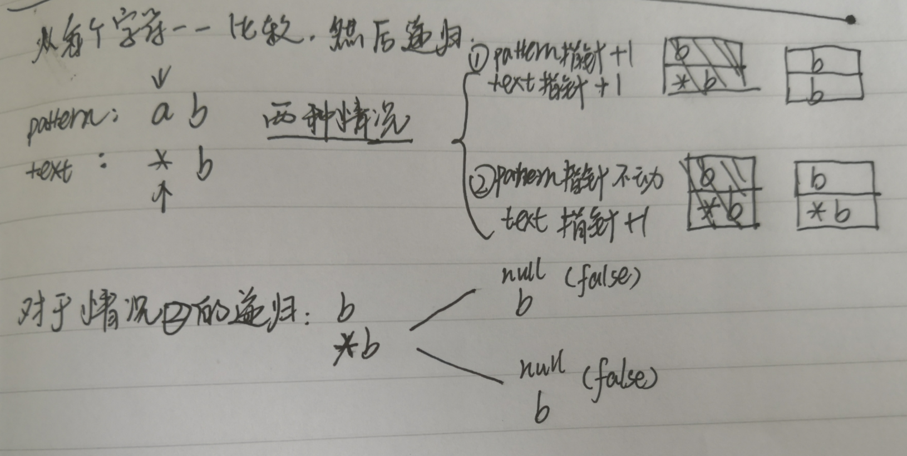
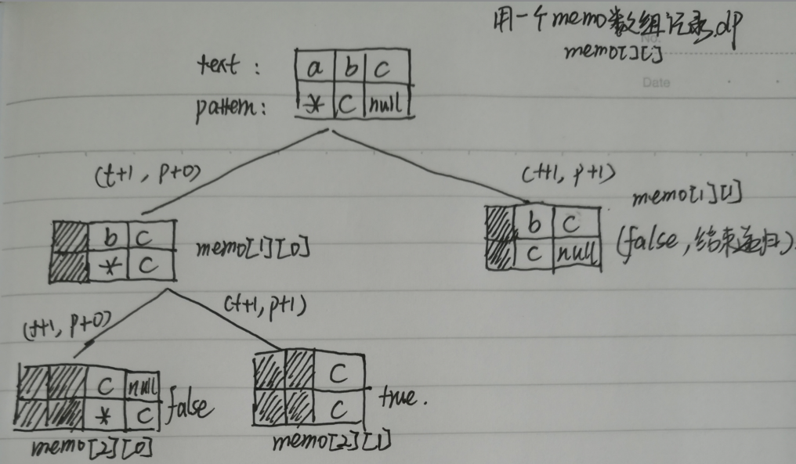
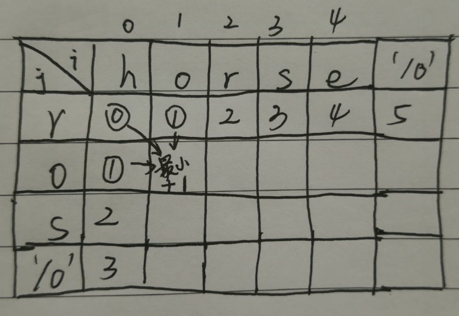

- [实现加减乘除](#%E5%AE%9E%E7%8E%B0%E5%8A%A0%E5%87%8F%E4%B9%98%E9%99%A4)
  - [leetcode43乘法运算](#leetcode43%E4%B9%98%E6%B3%95%E8%BF%90%E7%AE%97)
- [正则表达式](#%E6%AD%A3%E5%88%99%E8%A1%A8%E8%BE%BE%E5%BC%8F)
  - [leetcode28题](#leetcode28%E9%A2%98)
  - [leetcode 44题](#leetcode-44%E9%A2%98)
  - [leetcode72题](#leetcode72%E9%A2%98)
- [枚举类题型总结](#%E6%9E%9A%E4%B8%BE%E7%B1%BB%E9%A2%98%E5%9E%8B%E6%80%BB%E7%BB%93)

# 实现加减乘除
## leetcode43乘法运算 
[原题地址](https://leetcode.com/problems/multiply-strings/)

暴力思路：
1、先解决加法
2、再解决乘法（单数乘以多数）
3、综合

好的思路：
利用乘数与结果对应位置的关系
[详细解法](https://leetcode.com/problems/multiply-strings/discuss/17605/Easiest-JAVA-Solution-with-Graph-Explanation)
[代码](src/No43.java)


# 正则表达式

## leetcode28题

思路：

1. 首先要确定下一个字符（本字符指针+1）是不是'*'如果是则分两种情况
- 当text本字符与pattern的本字符相等时（text.charAt(t) == pattern.charAt(p)）,分三种情况
  - a* == a则左边指针p+2移动到末尾，右边指针t不动
  - a* == aaa则左边指针p不动，右边指针t+1移动到第二个a
  - a*b == ab则左边指针p+2移动到b，右边指针t+1移动到第二个a

- 当text本字符与pattern的本字符不相等时(text.charAt(t) != pattern.charAt(p)),只有一种情况
  - b*a == a则左边指针p+2，右边指针t不动

2. 如果下一个字符串不是*的话，直接比较本符串是否相等（text.charAt(t) == pattern.charAt(p))

[源代码](src/No28.java)

## leetcode 44题
[源代码](src/No44.java)
[原题地址](https://leetcode.com/problems/wildcard-matching/)

思路：

1. 如果当前字符为'*' 
  - pattern指针+1，text指针+1
  - pattern指针不动，text指针+1
2. 如果当前字符不为'*',如果当前两个字符相等则pattern和text同时+1，否则返回false




## leetcode72题

一个单词变换成另一个单词所需的最短步骤：

你可以有三种操作：替换字母；删除字母；；增加字母

例如

```
Input: word1 = "horse", word2 = "ros"
Output: 3
Explanation: 
horse -> rorse (replace 'h' with 'r')
rorse -> rose (remove 'r')
rose -> ros (remove 'e')

Input: word1 = "intention", word2 = "execution"
Output: 5
Explanation: 
intention -> inention (remove 't')
inention -> enention (replace 'i' with 'e')
enention -> exention (replace 'n' with 'x')
exention -> exection (replace 'n' with 'c')
exection -> execution (insert 'u')
```

分析方法：

情况1：```word1[i] == word2[j]```,则表示匹配成功不用增加步骤，则```f(i, j) = f(i - 1, j - 1)```

情况2：```word1[i] != word2[j]```，则```f(i, j) = 1 + min { f(i, j - 1), f(i - 1, j), f(i - 1, j - 1) }```

- ```f(i, j - 1)``` 代表插入操作
- ```f(i - 1, j)``` 代表删除操作
- ```f(i - 1, j - 1)``` 代表替换操作

基本样例：```f(0, k) = f(k, 0) = k```(应对word1=""或则word2=""的情况)



source code
```java
class No72 {
  //自顶向下
    public int minDistance(String word1, String word2) {
        return dp(word1,word2);
    }
    public int dp(String s1, String s2) {
        if (s1.isEmpty() && s2.isEmpty())
            return 0;
        if (s1.isEmpty()) {
            return s2.length();
        }
        if (s2.isEmpty())
            return s1.length();
        if (s1.charAt(0) == s2.charAt(0))
            return dp(s1.substring(1), s2.substring(1));
        else {
            int a1 = dp(s1.substring(1), s2);// 删除字符
            int a2 = dp(s1.substring(1), s2.substring(1));// 替换字符
            int a3 = dp(s1, s2.substring(1));// 增加字符
            return Math.min(a1, Math.min(a2, a3)) + 1;
        }
    }

    //自底向上
    public int minDistance1(String word1, String word2){
        int len1 = word1.length();
        int len2 = word2.length();
        int[][] memo = new int[len1+1][len2+1];
        //当word2 = ""的情况
        for(int i = 0;i<=len1;i++){
            memo[i][0] = i;
        }
        //当word1 = ""的情况
        for(int i = 0;i<=len2;i++){
            memo[0][i] = i;
        }
        for(int i = 0; i<len1;i++){
            for(int j = 0; j<len2;j++){
                if(word1.charAt(i) == word2.charAt(j))
                    memo[i+1][j+1] = memo[i][j];
                else{
                    int a = memo[i][j+1];
                    int b = memo[i][j];
                    int c = memo [i+1][j];
                    memo[i+1][j+1] = Math.min(a,Math.min(b,c));
                    memo[i+1][j+1]++;
                }
            }
        }
        return memo[len1][len2];
    }
  }
```


# 枚举类题型总结
[leetcode讨论区](https://leetcode.com/problems/permutations/discuss/18239/A-general-approach-to-backtracking-questions-in-Java-(Subsets-Permutations-Combination-Sum-Palindrome-Partioning))