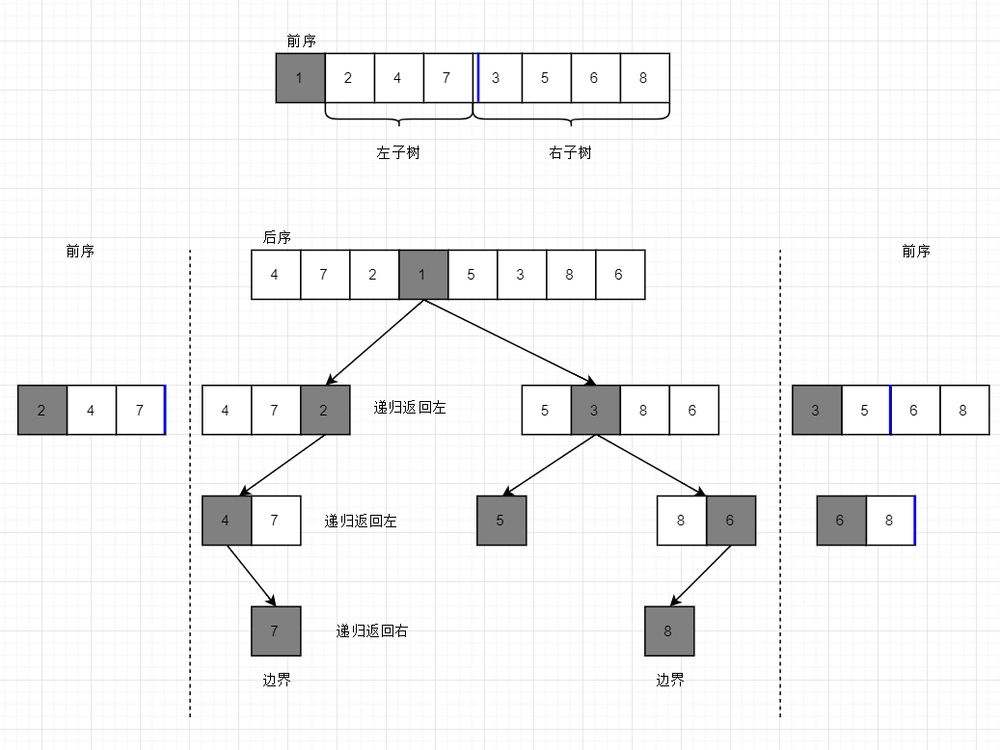

# 重建二叉树
题目：
> 输入某二叉树的前序遍历和后序遍历的结果，请重建该二叉树，假设输入的前序遍历的结果中都不含有重复的数字。例如：输入前序遍历序列{1,2,4,7,3,5,6,8}和中序遍历序列{4,7,2,1,5,3,8,6},则重建二叉树，并输出它的头节点。
节点定义如下：
```java
public class TreeNode {
	int value;
	TreeNode left;
	TreeNode right;

}
```

分析：
1. 前序遍历是先  根节点→左全子树→右全子树
2. 中序遍历是先  左全子树→根节点→右全子树
可以根据中序遍历特性，从根节点把序列分为左右两端，然后依此递归构建节点（类似快排的partition函数（算法第四版））
