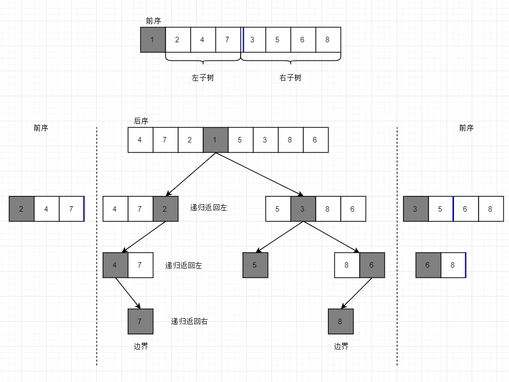

# 重建二叉树
题目：
> 输入某二叉树的前序遍历和后序遍历的结果，请重建该二叉树，假设输入的前序遍历的结果中都不含有重复的数字。例如：输入前序遍历序列{1,2,4,7,3,5,6,8}和中序遍历序列{4,7,2,1,5,3,8,6},则重建二叉树，并输出它的头节点。
节点定义如下：
```java
public class TreeNode {
	int value;
	TreeNode left;
	TreeNode right;

}
```

分析：
1. 前序遍历是先  根节点→左全子树→右全子树
2. 中序遍历是先  左全子树→根节点→右全子树
可以根据中序遍历特性，从根节点把序列分为左右两端，然后依此递归构建节点（类似快排的partition函数（算法第四版））


实现代码如下
```java
public class interview7 {

	public static TreeNode constructTree(int front[], int frontStart,
                int frontLength, int inner[], int innerStart, int innerLength) {

		TreeNode root = new TreeNode();
		root.value = front[frontStart];
		
		//校验输入是否有效，如果不做错误检查，可有可无
		if(frontLength == 0) {
			if(innerLength == 0 && front[frontStart] == inner[innerStart])
				return root;
			else System.out.println("erro");
				
		}


		// 寻找中序数组根节点索引
		int RootIndex = 0;
		for (int i = innerStart; i < innerStart + innerLength; i++)
			if (inner[i] == root.value) {
				RootIndex = i;
				break;
			}
		//确认左右树长度
		int leftlength = RootIndex - innerStart;
		int rightlength = innerLength -leftlength - 1;

		// 寻找左子树根节点
		if (leftlength > 0)
			root.left = constructTree(front, frontStart + 1, leftlength, inner, innerStart, leftlength);

		// 寻找右子树根节点
		if (rightlength > 0)
			root.right = constructTree(front, frontStart + leftlength + 1, rightlength, inner, RootIndex + 1, rightlength);

		return root;

	}

	public static void main(String[] args) {
		int a[] = { 1, 2, 4, 7, 3, 5, 6, 8 };//前序
		int b[] = { 4, 7, 2, 1, 5, 3, 8, 6 };//中序
		TreeNode ans = interview7.constructTree(a, 0, a.length, b, 0, b.length);
		PreIter.iter(ans);//前序遍历输出测试结果

	}

}

```